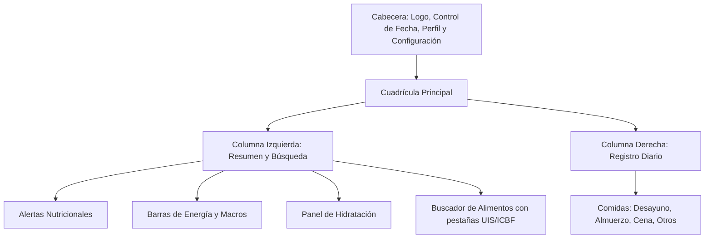

# Documentación de Interfaz de Usuario (Frontend) - NutriTrack Pro

Este documento describe detalladamente la estructura visual, estética, componentes y funciones interactivas que conforman el frontend de **NutriTrack Pro** (Control Nutricional UIS - Alta Precisión). La aplicación ha sido diseñada con un enfoque de alto impacto visual (rich aesthetics), modo oscuro inmersivo, y retroalimentación interactiva en tiempo real.

---

## 1. Diseño Estético y Sistema de Estilos

La interfaz de NutriTrack Pro implementa un sistema visual moderno, optimizado para la legibilidad de datos nutricionales complejos y una navegación intuitiva:

*   **Tema Oscuro Premium (Dark Mode):**
    *   **Fondo Base:** Gris pizarra oscuro (`bg-slate-900`) que reduce la fatiga visual.
    *   **Tarjetas y Contenedores:** Gris pizarra intermedio (`bg-slate-800`) con bordes sutiles en `slate-700` para generar profundidad.
    *   **Textos:** Contraste jerárquico que va desde el blanco puro para títulos principales hasta el gris apagado (`text-slate-400` / `text-slate-500`) para etiquetas secundarias o unidades de medida.
*   **Acentos de Color Funcionales:**
    *   **Verde Esmeralda (`emerald-500` / `emerald-400`):** Representa el estado óptimo, la salud y la marca principal de la aplicación.
    *   **Azul de Hidratación (`blue-500` / `blue-400`):** Utilizado exclusivamente para todos los elementos relacionados con la ingesta de agua y líquidos.
    *   **Amarillo Ámbar (`amber-500`):** Indica advertencias, excesos leves o requerimientos cercanos al límite.
    *   **Rojo/Rosa (`rose-500` / `rose-600`):** Indica déficit severo de nutrientes o excesos críticos por encima del Límite Superior Tolerable (UL).
*   **Micro-animaciones e Interacciones:**
    *   Efectos de hover con sutiles transiciones de color y escalado táctil (`active:scale-90`, `active:scale-95`).
    *   Animaciones de entrada para diálogos modales (`animate-in fade-in zoom-in-95 duration-300`).
    *   Estados de alerta parpadeantes (`animate-pulse`) para notificaciones críticas.
    *   Barras de progreso con transiciones fluidas de ancho (`transition-all duration-1000 ease-out`).

---

## 2. Estructura y Distribución de la Pantalla Principal

La interfaz se distribuye en una cuadrícula responsiva (Grid Layout) de 12 columnas en pantallas de escritorio, adaptándose a una sola columna en dispositivos móviles.

### A. Cabecera (Header)
Ubicada en la parte superior del layout. Contiene:
1.  **Identidad de Marca:** Logotipo acompañado del isotipo de actividad (pulso cardíaco) con el título `NutriTrack Pro` y el subtítulo `Control Nutricional UIS - Alta Precisión`.
2.  **Selector de Fecha Interactivo:**
    *   Botón izquierdo (`ChevronLeft`) para retroceder un día.
    *   Texto central que muestra la fecha actual seleccionada de forma amigable (ej. *15 de julio de 2026*).
    *   Botón derecho (`ChevronRight`) para avanzar un día.
3.  **Botón de Configuración de Perfil (Icono `User`):** Abre el modal para configurar los datos fisiológicos del usuario.
4.  **Botón de Modo Avanzado (Icono `Settings2`):** Activa/desactiva la visualización detallada de micronutrientes (vitaminas, minerales, fibra y grasas específicas).

---

## 3. Panel Lateral Izquierdo: Resumen y Búsqueda

Este panel consolida el estado nutricional actual del día y los mecanismos para añadir nuevos alimentos.

### A. Alertas Nutricionales Dinámicas
*   Un bloque de notificación visual en color ámbar con icono de advertencia (`AlertTriangle`) que parpadea dinámicamente si se detectan:
    *   **Excesos Críticos:** Superar el Límite Superior Tolerable (UL) de cualquier nutriente.
    *   **Déficits Importantes:** Estar por debajo del 30% del requerimiento diario recomendado (RDA) de un nutriente esencial.

### B. Barras de Progreso Principal (Energía y Macronutrientes)
*   **Energía:** Muestra las calorías actuales consumidas frente a la meta diaria personalizada (`kcal`).
*   **Macronutrientes Clave:** Tres barras de progreso dedicadas a:
    *   Proteína (g)
    *   Carbohidratos (g)
    *   Grasas (g)
*   *Mecánica de Colores de las Barras:*
    *   **Verde:** Consumo dentro del rango óptimo.
    *   **Amarillo:** Consumo en zona de advertencia (exceso leve o déficit menor).
    *   **Rojo:** Déficit severo o exceso crítico que vulnera los límites de salud recomendados.

### C. Módulo de Hidratación Avanzada
Diseñado para la gestión y visualización del balance hídrico del usuario:
*   **Mecánica de Semáforo de Hidratación:** La barra de progreso de Agua cambia de color según el estado:
    *   *Rojo:* Déficit de hidratación.
    *   *Ámbar:* Hidratación en progreso (cerca de la meta).
    *   *Verde:* Meta de hidratación diaria alcanzada.
    *   *Rojo Oscuro Vibrante (Pulse):* Alerta de sobrehidratación crítica (supera el 150% de la meta diaria).
*   **Botón de Ajuste Rápido (+250 ml):** Permite registrar de manera inmediata la ingesta de un vaso de agua.
*   **Botón de Sustracción (-250 ml):** Permite corregir o restar registros accidentales.
*   **Desglose del Agua:**
    *   *Líquidos directos:* Cantidad de agua bebida directamente (ml).
    *   *Alimentos:* Cantidad de agua aportada de forma indirecta por los alimentos sólidos registrados en el día.

### D. Modo Avanzado de Micronutrientes (Desplegable)
Al activarse, despliega barras de progreso adicionales organizadas en grupos específicos:
*   **Grasas Detalladas:** Saturada, Monoinsaturada, Poliinsaturada y Colesterol.
*   **Fibra:** Soluble, Insoluble y Total.
*   **Minerales:** Calcio, Fósforo, Sodio, Potasio y Magnesio.
*   **Oligoelementos:** Hierro, Zinc, Cobre, Manganeso y Selenio.
*   **Vitaminas:** A, C, D, E, K, B1, B2, B3, B5, B6, B9 y B12.

### E. Buscador de Alimentos de Alta Precisión
*   **Selector de Base de Datos:** Pestañas interactivas para cambiar la fuente de búsqueda:
    *   `UIS`: Base de datos de alimentos equivalentes diseñada por la UIS.
    *   `ICBF`: Tabla de Composición de Alimentos Colombianos del Instituto Colombiano de Bienestar Familiar.
*   **Barra de Búsqueda:** Entrada de texto predictivo que activa la búsqueda a partir de 2 caracteres.
*   **Desplegable de Resultados:** Muestra tarjetas de alimentos que coinciden con la búsqueda, detallando el nombre del alimento, su grupo nutricional, la cantidad base y el aporte calórico de referencia. Al hacer clic, abre el modal de porcionado.

---

## 4. Panel Derecho: Registro Cronológico (Diario)

Muestra de forma organizada y temporal todos los alimentos que el usuario ha consumido en el día seleccionado.

*   **Cabecera del Registro:** Indica la cantidad total de alimentos registrados en el día.
*   **Secciones por Tiempo de Comida:** Dividido en secciones claras:
    *   *Desayuno*
    *   *Almuerzo*
    *   *Cena*
    *   *Tiempos personalizados* (snacks, meriendas, etc.).
*   **Tarjetas de Alimento Registrado:** Cada registro muestra:
    *   Nombre del alimento y etiqueta de origen (Base de datos UIS o ICBF).
    *   Porción consumida expresada en gramos o medidas caseras (ej. *2 tazas*, *1.5 platos*, *150 gramos*).
    *   Aporte calórico neta destacado en color verde.
    *   *Desglose de Macros (Vista Desktop):* Valores específicos de Proteínas, Carbohidratos y Grasas consumidos en esa porción.
    *   **Botón de Eliminación (Icono `Trash2`):** Aparece de forma fluida al pasar el cursor sobre la tarjeta, permitiendo retirar el alimento del diario de forma instantánea.

---

## 5. Cuadros de Diálogo Modales (Modals)

La interfaz utiliza modales flotantes con un efecto de desenfoque de fondo (`backdrop-blur-md`) para mantener al usuario enfocado en la tarea actual.

### A. Modal de Configuración de Perfil Nutricional
Permite ajustar los requerimientos nutricionales específicos basados en fórmulas fisiológicas:
*   **Edad (Años):** Entrada numérica para calcular las metas por grupo etario.
*   **Género:** Selector con opciones (Hombre / Mujer).
*   **Peso (kg):** Entrada numérica para calcular metas de agua y distribución de macronutrientes.
*   **Nivel de Actividad Física:** Menú desplegable (Ligera, Moderada, Vigorosa).
*   **Ubicación (Ajuste por Clima):** Menú desplegable que permite seleccionar la ciudad de residencia del usuario. Esto calcula la temperatura promedio y el piso térmico para ajustar de forma dinámica los requerimientos de agua (hidratación adaptativa).
*   **Acciones:** Botón para "Cancelar" y botón principal para "Guardar Perfil".

### B. Modal de Porcionado y Añadido de Alimento
Se despliega al seleccionar un alimento del buscador:
*   **Cabecera Contextual:** Nombre completo del alimento y su procedencia.
*   **Selector de Tipo de Porción:**
    *   *Medida Casera:* Permite ingresar porciones basadas en unidades cotidianas del alimento (cucharadas, unidades, tazas) si está disponible.
    *   *Gramos:* Permite ingresar el peso exacto en gramos.
*   **Selector del Tiempo de Comida:** Botones rápidos para asignar el alimento a Desayuno, Almuerzo, Cena, u "Otro" (este último abre un campo de texto libre para introducir un tiempo personalizado).
*   **Control de Cantidad Extra Grande:** Un campo de entrada numérica estilizado con texto de gran tamaño para facilitar la edición del número de porciones o gramos.
*   **Cálculo en Tiempo Real:**
    *   *Macros Principales:* Muestra en tiempo real el total de calorías y proteínas que aportará la cantidad indicada.
    *   *Detalle de Nutrientes:* Muestra el impacto en Carbohidratos, Grasas, Hierro y Calcio calculados en base a la porción definida.
*   **Acciones:** Botón de "CERRAR" y botón destacado "Añadir al Diario" con sombra verde esmeralda.

---

## Resumen de Iconografía Utilizada (Lucide Icons)

La interfaz emplea iconos vectoriales coherentes y minimalistas para guiar visualmente al usuario:
*   `Activity`: Identifica la salud, el pulso y representa a NutriTrack Pro.
*   `ChevronLeft` / `ChevronRight`: Navegación cronológica de días.
*   `User`: Acceso a la configuración del perfil biométrico.
*   `Settings2`: Alterna el nivel de detalle de la información nutricional.
*   `Calculator`: Representa el resumen de cálculos matemáticos diarios.
*   `AlertTriangle`: Notificaciones sobre excesos y déficit nutricionales de riesgo.
*   `Droplets`: Módulo de control de hidratación.
*   `Search`: Barra de búsqueda de alimentos.
*   `Trash2`: Acción de eliminación de registros o decremento de hidratación.
*   `Info`: Estado de diario vacío y guía básica.
