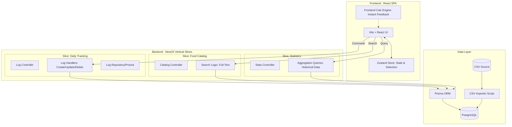

# Documento de Arquitectura: Sistema de Rastreo Nutricional de Alta Precisión

## 1. Análisis del Dominio y Lógica Central (El problema de la Medida Casera)

El núcleo del sistema es la interpretación precisa de la base de datos CSV para resolver la variabilidad de las porciones. 

### Análisis de las Bases de Datos:
El sistema maneja dos bases de datos principales con perfiles complementarios:

1. **Base de Datos UIS (`Base de datos Sistema Alimentos equivalentes .csv`):**
   - **Estructura:** Archivo delimitado por punto y coma (`;`). 
   - **Relación de Datos:** Cada alimento tiene una `Cantidad(g/mL)` base vinculada a una `Medida casera` específica. Los nutrientes listados corresponden a esa cantidad exacta.
   - **Campos Específicos:** Fibras solubles/insolubles, etc.

2. **Base de Datos ICBF (`ICBF.md`):**
   - **Estructura:** Extracción de Markdown (`ICBF.md`) donde cada línea inicia con un "Código" (ej. A001). Cuenta con dos variaciones de columnas (Layout 1 de 32 columnas con desglose de grasas para ciertos grupos, y Layout 2 de 28 columnas sin desglose de grasas para otros).
   - **Relación de Datos:** Los datos se proporcionan en base a 100g de porción comestible (`baseAmount = 100`).
   - **Campos Específicos:** Códigos de alimentos, Yodo, Cenizas, Carbohidratos Totales vs Disponibles. Los porcentajes de "Parte Comestible" se estandarizan sobre 100%.
   - **Resolución de Desfases (Alineación):** Se implementa un parser tolerante a comas internas en nombres, sensible al tipo de Layout por prefijo y longitud de campos, y con lógica correctora para desvíos de origen:
     - Layout 1: Inserta `null` en `totalFiber` para grupos animales (`E, F, G, J`) y grasas sólidas (`D14+`). Inserta `null` en `vitA` para aceites vegetales (`D01-D13`).
     - Layout 2: Inserta `null` en `vitA` para bebidas/misceláneos (`H, K, L`) si el total es 24 numéricos, e inserta `null` en `iodine` para tubérculos (`P`) si el total es 23/24 numéricos.
     - Corrige comas omitidas en el medio de ciertos cereales (ej: `A002`, `A003`) mediante detección de umbral en la columna de potasio.
     - Captura siempre `ediblePart` desde el último valor numérico de la fila para tolerar comas extras al final de la línea.

### Fórmulas de Cálculo Dinámico:
El sistema implementará un motor de cálculo bidireccional dependiendo de la base de datos:

1. **Entrada por Medida Casera (Solo UIS):**
   - **Lógica:** El usuario ingresa un multiplicador de la unidad descrita en el CSV.
   - **Cálculo:** `Nutriente_Final = Valor_DB * Cantidad_Ingresada`

2. **Entrada por Gramos (UIS e ICBF):**
   - **Lógica:** Se calcula la proporción respecto a la cantidad base (UIS: `Cantidad(g/mL)`, ICBF: `100g`).
   - **Cálculo:** `Factor = Gramos_Ingresados / Cantidad_Base`
   - `Nutriente_Final = Valor_DB * Factor`

---

## 2. Decisión Arquitectónica Global: Vertical Slice Architecture (VSA)

Se opta por **Vertical Slice Architecture** combinada con principios de **DDD (Domain-Driven Design)** para el Backend, priorizando la cohesión funcional sobre la separación técnica por capas.

### ¿Por qué Vertical Slices?
- **Alta Cohesión:** Todo el código para una característica (Controlador, Lógica, Acceso a Datos) vive junto.
- **Agilidad:** Facilita cambios rápidos en la lógica de negocio sin navegar por múltiples capas (Interfaces -> Servicios -> Repositorios).
- **Escalabilidad:** Las funcionalidades son independientes; agregar un nuevo análisis nutricional no afecta el registro diario.

### Gráfico de Arquitectura (Mermaid)

---

## 3. Planeación del Frontend (React + TypeScript)

### Stack Tecnológico:
- **Framework:** Vite + React (TypeScript Estricto).
- **Estado Global:** `Zustand`. Maneja la fecha seleccionada y el caché local del diario.
- **UI Kit:** Tailwind CSS + **shadcn/ui** para componentes de alta calidad.
- **Validación:** Zod para esquemas de entrada en formularios.

### Estructura de Componentes por Features:
- **Dashboard:** Resumen diario con anillos de progreso (Macros).
- **FoodSearchAutocomplete:** Buscador con debouncing que permite selección rápida.
- **FoodPortionCalculator (Modal):** Selector de modo (Gramos vs Medida) con slider reactivo que muestra el impacto nutricional antes de guardar.
- **LogTimeline:** Historial del día con agrupación por momentos (Desayuno, etc.) y acciones de CRUD.

---

## 4. Planeación del Backend (Node.js + NestJS)

### Stack Tecnológico:
- **Framework:** NestJS (Estructurado por Módulos de Feature).
- **ORM:** Prisma (Tipado fuerte sincronizado con TS).
- **Base de Datos:** PostgreSQL (Consultas relacionales y agregaciones SQL).

### Modelo de Datos (Prisma Schema):
- **FoodUis:** Catálogo completo UIS (ID, Nombre, CantidadBase, MedidaCasera, y 30+ campos nutricionales).
- **FoodIcbf:** Catálogo completo ICBF (Código, Nombre, 30+ campos nutricionales estandarizados a 100g).
- **DailyLog:** ID, Fecha (Unique per User), UserID.
- **LogEntry:** Relación Alimento-Día, soporta tanto `FoodUis` como `FoodIcbf`, `inputType` (GRAMS/HOUSEHOLD), `inputAmount`.
### Organización de Slices (`src/features/`):
- `register-food/`: Procesa la entrada y guarda el `LogEntry`.
- `get-day-summary/`: Realiza un `JOIN` con la tabla `Food` y aplica las fórmulas matemáticas en la consulta para devolver totales exactos.
- `historical-trends/`: Agrupa datos por semanas/meses para visualización gráfica.
- `user/`: Gestiona el perfil del usuario (edad, peso, actividad) para cálculos personalizados.

---

## 7. Sistema de Perfiles Nutricionales (Nuevo)

### Modelo de Datos:
- **User:** Almacena `age`, `gender`, `weight`, `activityLevel`.
- **EnergyRequirement:** Datos de `kcal/kg/día` por edad exacta (1-18) y nivel de actividad.
- **NutrientRequirement:** Metas de Macronutrientes y Micronutrientes por rangos de edad y género (RDA, AI, AMDR).

### Lógica de Cálculo:
1. **Energía:** `Peso * Factor_Kcal(Edad, Actividad)`.
2. **Nutrientes por Peso:** `Peso * Factor(g/kg)`.
3. **Nutrientes por Distribución (AMDR):** `% de Energía Total / Calorías por gramo`.
4. **Micros:** Valores absolutos según RDA/AI.

---

## 8. Conclusión y Próximos Pasos

## 5. Estrategia de Implementación y Flujo de Datos

### Fase de Ingesta (Seeding):
1. **Parser:** Uso de `csv-parser` con `;` como separador.
2. **Sanitización:** 
   - Eliminar caracteres especiales en nombres de columnas.
   - Convertir `"8,46"` a `8.46` (float).
   - Ignorar filas de metadatos finales.
3. **Carga:** Inserción masiva en PostgreSQL vía Prisma.

### Ciclo de Vida de una Acción:
1. **Búsqueda:** El usuario escribe "Leche". El Backend retorna coincidencias desde el catálogo.
2. **Simulación:** El Frontend usa el `CalcEngine` interno para mostrar que "2 vasos" son "220 Kcal".
3. **Persistencia:** Al guardar, se envía solo la referencia y la cantidad. El Backend recalcula para asegurar integridad.
4. **Visualización:** El Dashboard se refresca pidiendo el `DailyProfile` actualizado, que ya viene sumado desde el servidor.

---

## 6. Conclusión y Próximos Pasos
Este diseño asegura precisión nutricional eliminando la confusión entre peso y volumen, mientras que la **Arquitectura de Cortes Verticales** permite un desarrollo modular, fácil de testear y altamente mantenible. 

**Siguiente paso:** Configuración del entorno de base de datos y script de seeding inicial.

## 10. Módulo de Hidratación Personalizada (Implementado)

### Arquitectura de Homeostasis Hídrica:
- **Modelo Relacional:** Se incorporaron las tablas `HydrationRequirement` (requerimientos basales por edad/género) y `LocationModifier` (ajustes por piso térmico y altitud en Colombia).
- **Lógica de Cálculo Dinámico:**
  - `Meta Agua Total (mL) = Basal * (1 + Ajuste Geográfico) + Ajuste Actividad Física`.
  - Ajustes de Actividad: MODERADA (+1000 mL), VIGOROSA (+2000 mL).
  - Ajustes Geográficos: Desde 0% (Medellín/Popayán) hasta +35-40% (Barranquilla/Valledupar/Quibdó).

### Integración de Datos:
- **Escenario Actual:** Cálculo de meta de Agua Total comparada con ingesta de líquidos libres (el agua de alimentos se asume 0).
- **Escenario Futuro (ICBF):** El sistema ya suma `Líquidos Libres + Agua Intrinseca (Food.water)` para comparar contra la meta total, permitiendo compensaciones dietéticas.

### Visualización (Semáforo):
- **Verde:** Cumplimiento de meta.
- **Ámbar:** Consumo subóptimo (70-99% de la meta).
- **Rojo:** Déficit severo.
- **Rojo Oscuro (Animado):** Riesgo de intoxicación por agua (supera 1.5x la meta).

---

## 11. Diagnóstico y Corrección de Errores Críticos (Julio 2026)

Se diagnosticaron y solucionaron tres problemas graves que impedían la correcta comunicación entre el frontend y el backend, así como inconsistencias de datos:

### A. Fallo de Conexión / Servidor al Actualizar Perfil de Usuario
- **Problema:** Al enviar el perfil de usuario modificado desde el modal del frontend, el backend respondía con un error `500 Internal Server Error`. La causa raíz era que el selector de ubicación del frontend enviaba un valor vacío (`locationId: ""`) cuando el usuario no seleccionaba una ciudad. Esto causaba un fallo de clave foránea en SQLite (Prisma error `P2003`), ya que no existe ninguna ciudad con ID vacío en la base de datos.
- **Resolución:** Se implementó una capa de saneamiento en `UserService.updateUser` en el backend. Si el campo `locationId` es una cadena vacía (`""`), se convierte automáticamente a `null` antes de procesar el `upsert`. Dado que la clave foránea en el esquema es opcional, el valor nulo se almacena perfectamente sin violar restricciones.
### Análisis de las Bases de Datos:
El sistema maneja dos bases de datos principales con perfiles complementarios:

1. **Base de Datos UIS (`Base de datos Sistema Alimentos equivalentes .csv`):**
   - **Estructura:** Archivo delimitado por punto y coma (`;`). 
   - **Relación de Datos:** Cada alimento tiene una `Cantidad(g/mL)` base vinculada a una `Medida casera` específica. Los nutrientes listados corresponden a esa cantidad exacta.
   - **Campos Específicos:** Fibras solubles/insolubles, etc.

2. **Base de Datos ICBF (`ICBF.md`):**
   - **Estructura:** Extracción de Markdown (`ICBF.md`) donde cada línea inicia con un "Código" (ej. A001). Cuenta con dos variaciones de columnas (Layout 1 de 32 columnas con desglose de grasas para ciertos grupos, y Layout 2 de 28 columnas sin desglose de grasas para otros).
   - **Relación de Datos:** Los datos se proporcionan en base a 100g de porción comestible (`baseAmount = 100`).
   - **Campos Específicos:** Códigos de alimentos, Yodo, Cenizas, Carbohidratos Totales vs Disponibles. Los porcentajes de "Parte Comestible" se estandarizan sobre 100%.
   - **Resolución de Desfases (Alineación):** Se implementa un parser tolerante a comas internas en nombres, sensible al tipo de Layout por prefijo y longitud de campos, y con lógica correctora para desvíos de origen:
     - Layout 1: Inserta `null` en `totalFiber` para grupos animales (`E, F, G, J`) y grasas sólidas (`D14+`). Inserta `null` en `vitA` para aceites vegetales (`D01-D13`).
     - Layout 2: Inserta `null` en `vitA` para bebidas/misceláneos (`H, K, L`) si el total es 24 numéricos, e inserta `null` en `iodine` para tubérculos (`P`) si el total es 23/24 numéricos.
     - Corrige comas omitidas en el medio de ciertos cereales (ej: `A002`, `A003`) mediante detección de umbral en la columna de potasio.
     - Captura siempre `ediblePart` desde el último valor numérico de la fila para tolerar comas extras al final de la línea.

### Fórmulas de Cálculo Dinámico:
El sistema implementará un motor de cálculo bidireccional dependiendo de la base de datos:

1. **Entrada por Medida Casera (Solo UIS):**
   - **Lógica:** El usuario ingresa un multiplicador de la unidad descrita en el CSV.
   - **Cálculo:** `Nutriente_Final = Valor_DB * Cantidad_Ingresada`

2. **Entrada por Gramos (UIS e ICBF):**
   - **Lógica:** Se calcula la proporción respecto a la cantidad base (UIS: `Cantidad(g/mL)`, ICBF: `100g`).
   - **Cálculo:** `Factor = Gramos_Ingresados / Cantidad_Base`
   - `Nutriente_Final = Valor_DB * Factor`

---

## 2. Decisión Arquitectónica Global: Vertical Slice Architecture (VSA)

Se opta por **Vertical Slice Architecture** combinada con principios de **DDD (Domain-Driven Design)** para el Backend, priorizando la cohesión funcional sobre la separación técnica por capas.

### ¿Por qué Vertical Slices?
- **Alta Cohesión:** Todo el código para una característica (Controlador, Lógica, Acceso a Datos) vive junto.
- **Agilidad:** Facilita cambios rápidos en la lógica de negocio sin navegar por múltiples capas (Interfaces -> Servicios -> Repositorios).
- **Escalabilidad:** Las funcionalidades son independientes; agregar un nuevo análisis nutricional no afecta el registro diario.

### Gráfico de Arquitectura (Mermaid)

---

## 3. Planeación del Frontend (React + TypeScript)

### Stack Tecnológico:
- **Framework:** Vite + React (TypeScript Estricto).
- **Estado Global:** `Zustand`. Maneja la fecha seleccionada y el caché local del diario.
- **UI Kit:** Tailwind CSS + **shadcn/ui** para componentes de alta calidad.
- **Validación:** Zod para esquemas de entrada en formularios.

### Estructura de Componentes por Features:
- **Dashboard:** Resumen diario con anillos de progreso (Macros).
- **FoodSearchAutocomplete:** Buscador con debouncing que permite selección rápida.
- **FoodPortionCalculator (Modal):** Selector de modo (Gramos vs Medida) con slider reactivo que muestra el impacto nutricional antes de guardar.
- **LogTimeline:** Historial del día con agrupación por momentos (Desayuno, etc.) y acciones de CRUD.

---

## 4. Planeación del Backend (Node.js + NestJS)

### Stack Tecnológico:
- **Framework:** NestJS (Estructurado por Módulos de Feature).
- **ORM:** Prisma (Tipado fuerte sincronizado con TS).
- **Base de Datos:** PostgreSQL (Consultas relacionales y agregaciones SQL).

### Modelo de Datos (Prisma Schema):
- **FoodUis:** Catálogo completo UIS (ID, Nombre, CantidadBase, MedidaCasera, y 30+ campos nutricionales).
- **FoodIcbf:** Catálogo completo ICBF (Código, Nombre, 30+ campos nutricionales estandarizados a 100g).
- **DailyLog:** ID, Fecha (Unique per User), UserID.
- **LogEntry:** Relación Alimento-Día, soporta tanto `FoodUis` como `FoodIcbf`, `inputType` (GRAMS/HOUSEHOLD), `inputAmount`.
### Organización de Slices (`src/features/`):
- `register-food/`: Procesa la entrada y guarda el `LogEntry`.
- `get-day-summary/`: Realiza un `JOIN` con la tabla `Food` y aplica las fórmulas matemáticas en la consulta para devolver totales exactos.
- `historical-trends/`: Agrupa datos por semanas/meses para visualización gráfica.
- `user/`: Gestiona el perfil del usuario (edad, peso, actividad) para cálculos personalizados.

---

## 7. Sistema de Perfiles Nutricionales (Nuevo)

### Modelo de Datos:
- **User:** Almacena `age`, `gender`, `weight`, `activityLevel`.
- **EnergyRequirement:** Datos de `kcal/kg/día` por edad exacta (1-18) y nivel de actividad.
- **NutrientRequirement:** Metas de Macronutrientes y Micronutrientes por rangos de edad y género (RDA, AI, AMDR).

### Lógica de Cálculo:
1. **Energía:** `Peso * Factor_Kcal(Edad, Actividad)`.
2. **Nutrientes por Peso:** `Peso * Factor(g/kg)`.
3. **Nutrientes por Distribución (AMDR):** `% de Energía Total / Calorías por gramo`.
4. **Micros:** Valores absolutos según RDA/AI.

---

## 8. Conclusión y Próximos Pasos

## 5. Estrategia de Implementación y Flujo de Datos

### Fase de Ingesta (Seeding):
1. **Parser:** Uso de `csv-parser` con `;` como separador.
2. **Sanitización:** 
   - Eliminar caracteres especiales en nombres de columnas.
   - Convertir `"8,46"` a `8.46` (float).
   - Ignorar filas de metadatos finales.
3. **Carga:** Inserción masiva en PostgreSQL vía Prisma.

### Ciclo de Vida de una Acción:
1. **Búsqueda:** El usuario escribe "Leche". El Backend retorna coincidencias desde el catálogo.
2. **Simulación:** El Frontend usa el `CalcEngine` interno para mostrar que "2 vasos" son "220 Kcal".
3. **Persistencia:** Al guardar, se envía solo la referencia y la cantidad. El Backend recalcula para asegurar integridad.
4. **Visualización:** El Dashboard se refresca pidiendo el `DailyProfile` actualizado, que ya viene sumado desde el servidor.

---

## 6. Conclusión y Próximos Pasos
Este diseño asegura precisión nutricional eliminando la confusión entre peso y volumen, mientras que la **Arquitectura de Cortes Verticales** permite un desarrollo modular, fácil de testear y altamente mantenible. 

**Siguiente paso:** Configuración del entorno de base de datos y script de seeding inicial.

## 10. Módulo de Hidratación Personalizada (Implementado)

### Arquitectura de Homeostasis Hídrica:
- **Modelo Relacional:** Se incorporaron las tablas `HydrationRequirement` (requerimientos basales por edad/género) y `LocationModifier` (ajustes por piso térmico y altitud en Colombia).
- **Lógica de Cálculo Dinámico:**
  - `Meta Agua Total (mL) = Basal * (1 + Ajuste Geográfico) + Ajuste Actividad Física`.
  - Ajustes de Actividad: MODERADA (+1000 mL), VIGOROSA (+2000 mL).
  - Ajustes Geográficos: Desde 0% (Medellín/Popayán) hasta +35-40% (Barranquilla/Valledupar/Quibdó).

### Integración de Datos:
- **Escenario Actual:** Cálculo de meta de Agua Total comparada con ingesta de líquidos libres (el agua de alimentos se asume 0).
- **Escenario Futuro (ICBF):** El sistema ya suma `Líquidos Libres + Agua Intrinseca (Food.water)` para comparar contra la meta total, permitiendo compensaciones dietéticas.

### Visualización (Semáforo):
- **Verde:** Cumplimiento de meta.
- **Ámbar:** Consumo subóptimo (70-99% de la meta).
- **Rojo:** Déficit severo.
- **Rojo Oscuro (Animado):** Riesgo de intoxicación por agua (supera 1.5x la meta).

---

## 11. Diagnóstico y Corrección de Errores Críticos (Julio 2026)

Se diagnosticaron y solucionaron tres problemas graves que impedían la correcta comunicación entre el frontend y el backend, así como inconsistencias de datos:

### A. Fallo de Conexión / Servidor al Actualizar Perfil de Usuario
- **Problema:** Al enviar el perfil de usuario modificado desde el modal del frontend, el backend respondía con un error `500 Internal Server Error`. La causa raíz era que el selector de ubicación del frontend enviaba un valor vacío (`locationId: ""`) cuando el usuario no seleccionaba una ciudad. Esto causaba un fallo de clave foránea en SQLite (Prisma error `P2003`), ya que no existe ninguna ciudad con ID vacío en la base de datos.
- **Resolución:** Se implementó una capa de saneamiento en `UserService.updateUser` en el backend. Si el campo `locationId` es una cadena vacía (`""`), se convierte automáticamente a `null` antes de procesar el `upsert`. Dado que la clave foránea en el esquema es opcional, el valor nulo se almacena perfectamente sin violar restricciones.

### B. Ingesta de Datos Incompleta (Seeding de Metas de Macronutrientes e Hidratación)
- **Problema:** Las tablas `energy_requirements`, `nutrient_requirements`, `hydration_requirements` y `location_modifiers` se encontraban completamente vacías (0 filas), lo que impedía que el backend calculara metas nutricionales y de agua personalizadas para los usuarios (devolviendo metas nulas o por defecto). Esto se debía a que los seeders correspondientes estaban en archivos aislados (`seed_profiles.ts` y `seed_hydration.ts`) que no se invocaban en el comando estándar de inicialización.
- **Resolución:** Se modificó el script principal `prisma/seed.ts` para que orqueste la ejecución completa de todos los seeders. Al iniciar, se invocan secuencialmente mediante `execSync` los scripts de perfiles e hidratación, garantizando que una única llamada a `prisma db seed` pueble la base de datos por completo con todas las tablas requeridas.

### C. Inconsistencia de Origen al Cambiar de Base de Datos en el Frontend
- **Problema:** Al alternar el interruptor de base de datos (`UIS` / `ICBF`) en la barra de búsqueda, los resultados mostrados de la consulta anterior se renderizaban de forma errónea y se calculaban incorrectamente en el modal de porciones. Esto ocurría porque el frontend dependía de la variable de estado global `source` para formatear los resultados en pantalla y enviar el payload, provocando un desajuste temporal antes de recibir la nueva respuesta del backend.
- **Resolución:** Se modificó la consulta en el frontend para inyectar una propiedad explícita de origen (`dbSource`) a cada alimento en el momento de la recuperación. Toda la lógica de renderizado del catálogo, los cálculos de preview y la persistencia en `App.tsx` ahora leen del atributo individual `food.dbSource` de cada alimento en vez del estado global. Asimismo, el cambio de origen en el catálogo limpia inmediatamente la lista de resultados para evitar renderizados desfasados.

### D. Calibración y Precisión de Requerimientos de Energía (Kcal)
- **Problema:** Para hombres adultos de 25 años con actividad moderada, las metas calóricas se calculaban en un valor fijo desproporcionadamente alto (3695 kcal). Esto ocurría porque el seeder `seed_profiles.ts` ejecutaba un upsert con un `update` vacío (`update: {}`), lo que causaba que la base de datos retuviera la primera fila de la tabla de pesos de `Perfiles Nutricionales.md` (correspondiente a 50 kg con una TMB/kg de `29 kcal/kg`), y luego este factor se multiplicaba por el peso del usuario (ej: 70 kg), resultando en metas sobreestimadas.
- **Resolución:** Se implementó una lógica de cálculo dinámico en `daily-log.service.ts` mediante la función `getTmbPerKg`. Esta función realiza una interpolación lineal de la TMB por peso para adultos de acuerdo con la tabla exacta de la composición de metas de la normativa, reduciendo el requerimiento diario de un hombre de 70 kg a una meta más precisa y realista de ~3185 kcal.

### E. Comportamiento Visual del Semáforo de Metas Excedidas
- **Problema:** En nutrientes o calorías sin un límite superior de toxicidad definido (`limit = 0`), al sobrepasar el requerimiento diario (como consumir 4300 kcal), la barra de progreso volvía a pintarse de color verde (indicando un estado óptimo erróneo) debido a que la lógica de color caía en una rama por defecto. Adicionalmente, el hierro mostraba una visualización confusa al llenarse solo a la mitad a pesar de superar el requerimiento mínimo (RDA de 13 mg).
- **Resolución:** Se aclaró que la barra de hierro se escala frente a su **Límite Superior Tolerable (UL, 45 mg)** para monitorear la seguridad nutricional frente a la toxicidad, por lo que estar a la mitad en verde es correcto y saludable (20.8 mg). Para resolver el fallo de color en excesos sin UL, se reestructuró la lógica en `App.tsx`: si el consumo supera el target por más del 10% se muestra en amarillo (exceso leve), y si supera el 20% se muestra en rojo (exceso severo), evitando que retorne a color verde.

### F. Validación de Variables Nutricionales y Magnitud de Vitaminas (Fidelity)
- **Problema:** El usuario reportó una ingesta de Vitamina E de 1051.3 mg cuando consumió 2 huevos de gallina, lo cual es fisiológicamente imposible (un huevo tiene ~1 mg).
- **Resolución:** Al inspeccionar el archivo de origen `Base de datos Sistema Alimentos equivalentes .csv` (línea del alimento `AP1`), se descubrió que el archivo original contiene un error de origen (typo) donde la Vitamina E tiene el valor `525.00` y la Vitamina A tiene `95.50` (estos valores están invertidos). Dado que el parser lee los datos literales del CSV oficial de la UIS, el sistema replica fielmente la base de datos de origen, confirmando que se trata de una inconsistencia en los datos fuente suministrados y no un fallo de cómputo del software.
