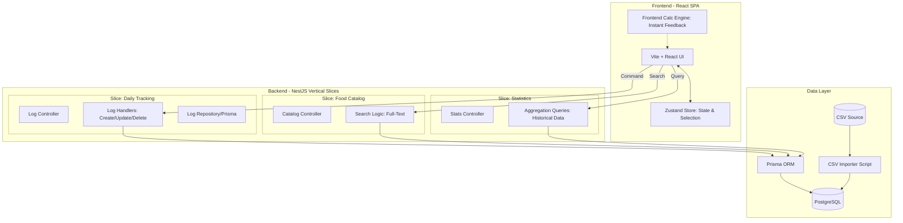

# Documento de Arquitectura: Sistema de Rastreo Nutricional de Alta Precisión

## 1. Análisis del Dominio y Lógica Central (El problema de la Medida Casera)

El núcleo del sistema es la interpretación precisa de la base de datos CSV para resolver la variabilidad de las porciones. 

### Análisis de la Base de Datos (`Base de datos Sistema Alimentos equivalentes .csv`):
- **Estructura:** Archivo delimitado por punto y coma (`;`). 
- **Encabezados:** Contiene metadatos en la primera fila y nombres de columnas técnicos en la segunda.
- **Limpieza de Datos:** Es crítico filtrar filas vacías o descriptivas (como las de "Promedio" si existieran en el set completo) y convertir los decimales (formato `,`) a punto (`.`) para compatibilidad con bases de datos numéricas.
- **Relación de Datos:** Cada alimento tiene una `Cantidad(g/mL)` base vinculada a una `Medida casera` específica. Los nutrientes listados corresponden a esa cantidad exacta.

### Fórmulas de Cálculo Dinámico:
El sistema implementará un motor de cálculo bidireccional:

1. **Entrada por Medida Casera (ej. 2 vasos):**
   - **Lógica:** El usuario ingresa un multiplicador de la unidad descrita en el CSV.
   - **Cálculo:** `Nutriente_Final = Valor_CSV * Cantidad_Ingresada`
   - *Ejemplo:* 2 vasos de leche (110 Kcal base) = $110 \times 2 = 220$ Kcal.

2. **Entrada por Gramos (ej. 50g):**
   - **Lógica:** Se calcula la proporción respecto a la `Cantidad(g/mL)` base del CSV.
   - **Cálculo:** `Factor = Gramos_Ingresados / Cantidad_Base_CSV`
   - `Nutriente_Final = Valor_CSV * Factor`
   - *Ejemplo:* 50g de leche (base 180g) = $50 / 180 \approx 0.277$. -> $110 \times 0.277 = 30.5$ Kcal.

---

## 2. Decisión Arquitectónica Global: Vertical Slice Architecture (VSA)

Se opta por **Vertical Slice Architecture** combinada con principios de **DDD (Domain-Driven Design)** para el Backend, priorizando la cohesión funcional sobre la separación técnica por capas.

### ¿Por qué Vertical Slices?
- **Alta Cohesión:** Todo el código para una característica (Controlador, Lógica, Acceso a Datos) vive junto.
- **Agilidad:** Facilita cambios rápidos en la lógica de negocio sin navegar por múltiples capas (Interfaces -> Servicios -> Repositorios).
- **Escalabilidad:** Las funcionalidades son independientes; agregar un nuevo análisis nutricional no afecta el registro diario.

### Gráfico de Arquitectura (Mermaid)

---

## 3. Planeación del Frontend (React + TypeScript)

### Stack Tecnológico:
- **Framework:** Vite + React (TypeScript Estricto).
- **Estado Global:** `Zustand`. Maneja la fecha seleccionada y el caché local del diario.
- **UI Kit:** Tailwind CSS + **shadcn/ui** para componentes de alta calidad.
- **Validación:** Zod para esquemas de entrada en formularios.

### Estructura de Componentes por Features:
- **Dashboard:** Resumen diario con anillos de progreso (Macros).
- **FoodSearchAutocomplete:** Buscador con debouncing que permite selección rápida.
- **FoodPortionCalculator (Modal):** Selector de modo (Gramos vs Medida) con slider reactivo que muestra el impacto nutricional antes de guardar.
- **LogTimeline:** Historial del día con agrupación por momentos (Desayuno, etc.) y acciones de CRUD.

---

## 4. Planeación del Backend (Node.js + NestJS)

### Stack Tecnológico:
- **Framework:** NestJS (Estructurado por Módulos de Feature).
- **ORM:** Prisma (Tipado fuerte sincronizado con TS).
- **Base de Datos:** PostgreSQL (Consultas relacionales y agregaciones SQL).

### Modelo de Datos (Prisma Schema):
- **Food:** Catálogo completo (ID, Nombre, CantidadBase, MedidaCasera, y 30+ campos nutricionales).
- **DailyLog:** ID, Fecha (Unique per User), UserID.
- **LogEntry:** Relación Alimento-Día, `inputType` (GRAMS/HOUSEHOLD), `inputAmount`.
### Organización de Slices (`src/features/`):
- `register-food/`: Procesa la entrada y guarda el `LogEntry`.
- `get-day-summary/`: Realiza un `JOIN` con la tabla `Food` y aplica las fórmulas matemáticas en la consulta para devolver totales exactos.
- `historical-trends/`: Agrupa datos por semanas/meses para visualización gráfica.
- `user/`: Gestiona el perfil del usuario (edad, peso, actividad) para cálculos personalizados.

---

## 7. Sistema de Perfiles Nutricionales (Nuevo)

### Modelo de Datos:
- **User:** Almacena `age`, `gender`, `weight`, `activityLevel`.
- **EnergyRequirement:** Datos de `kcal/kg/día` por edad exacta (1-18) y nivel de actividad.
- **NutrientRequirement:** Metas de Macronutrientes y Micronutrientes por rangos de edad y género (RDA, AI, AMDR).

### Lógica de Cálculo:
1. **Energía:** `Peso * Factor_Kcal(Edad, Actividad)`.
2. **Nutrientes por Peso:** `Peso * Factor(g/kg)`.
3. **Nutrientes por Distribución (AMDR):** `% de Energía Total / Calorías por gramo`.
4. **Micros:** Valores absolutos según RDA/AI.

---

## 8. Conclusión y Próximos Pasos

## 5. Estrategia de Implementación y Flujo de Datos

### Fase de Ingesta (Seeding):
1. **Parser:** Uso de `csv-parser` con `;` como separador.
2. **Sanitización:** 
   - Eliminar caracteres especiales en nombres de columnas.
   - Convertir `"8,46"` a `8.46` (float).
   - Ignorar filas de metadatos finales.
3. **Carga:** Inserción masiva en PostgreSQL vía Prisma.

### Ciclo de Vida de una Acción:
1. **Búsqueda:** El usuario escribe "Leche". El Backend retorna coincidencias desde el catálogo.
2. **Simulación:** El Frontend usa el `CalcEngine` interno para mostrar que "2 vasos" son "220 Kcal".
3. **Persistencia:** Al guardar, se envía solo la referencia y la cantidad. El Backend recalcula para asegurar integridad.
4. **Visualización:** El Dashboard se refresca pidiendo el `DailyProfile` actualizado, que ya viene sumado desde el servidor.

---

## 6. Conclusión y Próximos Pasos
Este diseño asegura precisión nutricional eliminando la confusión entre peso y volumen, mientras que la **Arquitectura de Cortes Verticales** permite un desarrollo modular, fácil de testear y altamente mantenible. 

**Siguiente paso:** Configuración del entorno de base de datos y script de seeding inicial.

## 9. Actualización Final: Lógica de Semáforo, Perfiles Adultos y Alertas Dinámicas
- **Completitud de Perfiles:** El flujo de datos ahora incluye todos los rangos de edad (infantes, adultos y mayores de 60 años), resolviendo el bug de perfiles faltantes mediante una extracción exhaustiva de los datos del CSV y Markdown (incluyendo RDA, AI, UL, AMDR_MIN, AMDR_MAX).
- **Semáforo Nutricional:** El Frontend utiliza estos umbrales para determinar la completitud de la barra de progreso y su color semántico (Rojo: déficit/exceso, Ámbar: aceptable, Verde: óptimo), logrando alta precisión.
- **Sistema de Alertas:** Se rediseñó el sistema de advertencias para que evalúe en tiempo real el consumo total del día. Ahora notifica proactivamente déficits severos (< 30% del RDA) o excesos peligrosos (> UL) mediante alertas visuales dinámicas.
