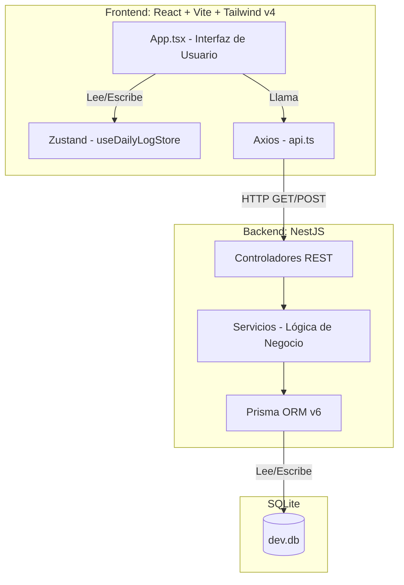

# Resumen del Proyecto: Sistema de Rastreo Nutricional de Alta Precisión

Este documento explica detalladamente el funcionamiento, la arquitectura y la integridad de los datos del sistema desarrollado.

## 1. Gestión de la Base de Datos e Integridad

### ¿Cómo se garantiza el uso de la base de datos real?
El sistema utiliza un proceso de **Seeding** (población inicial) automatizado. No se han inventado datos; se ha transformado el archivo CSV original en una base de datos estructurada.

*   **Archivo Fuente:** El sistema lee directamente el archivo `Base de datos Sistema Alimentos equivalentes .csv` ubicado en la raíz del proyecto.
*   **Proceso de Importación (`backend/prisma/seed.ts`):** 
    1.  El script abre el archivo CSV.
    2.  Limpia los caracteres corruptos (corregimos errores como `pia` por `piña` directamente en el archivo).
    3.  Convierte los valores numéricos (ej: `8,46` a `8.46`) para que sean procesables matemáticamente.
    4.  Vuelca los **486 alimentos** en una base de datos relacional.

### ¿Dónde encontrar y leer la base de datos?
La base de datos física es un archivo llamado **`dev.db`** ubicado en `backend/prisma/dev.db`. Es una base de datos **SQLite**, elegida por su portabilidad y rapidez para este prototipo.
*   Para leerla fuera de la app, puedes usar herramientas como [SQLite Browser](https://sqlitebrowser.org/) o la extensión "SQLite Viewer" en VS Code.

## 2. Tecnologías Principales

*   **Backend:** [NestJS](https://nestjs.com/) (Node.js) bajo una arquitectura de **Cortes Verticales (Vertical Slices)**. Esto significa que cada función (Diario, Catálogo) es independiente y contiene su propia lógica.
*   **ORM:** [Prisma](https://www.prisma.io/). Es el puente entre el código y la base de datos, garantizando que los nombres de las vitaminas y minerales coincidan exactamente con lo definido en el esquema.
*   **Frontend:** [React](https://react.dev/) con [Vite](https://vitejs.dev/) y [TypeScript](https://www.typescript.lang/).
*   **Estilos:** [Tailwind CSS v4](https://tailwindcss.com/). Proporciona la interfaz oscura y moderna con un rendimiento óptimo.
*   **Estado Global:** [Zustand](https://docs.pmnd.rs/zustand/). Maneja la fecha seleccionada y los datos del usuario de forma ligera.

## 3. Conexión Backend-Frontend

El frontend y el backend se comunican mediante una **API REST**:
*   El Backend corre en `http://localhost:3000`.
*   El Frontend corre en `http://localhost:5173`.
*   Cuando buscas un alimento o añades una porción, el frontend envía una solicitud al backend (vía `axios`), este realiza los cálculos matemáticos de precisión y devuelve el resultado final.

## 4. Garantía de Visualización Total

Se han mapeado **33 variables nutricionales** extraídas del CSV. El sistema no se limita a Macronutrientes; calcula y suma:
1.  **Energía:** Kcal.
2.  **Macros:** Proteínas, Carbohidratos, Grasas.
3.  **Grasas Detalladas:** Saturadas, Monoinsaturadas, Poliinsaturadas y Colesterol.
4.  **Fibras:** Soluble, Insoluble y Total.
5.  **Minerales:** Calcio, Fósforo, Sodio, Potasio, Magnesio.
6.  **Oligoelementos:** Hierro, Zinc, Cobre, Manganeso, Selenio.
7.  **Vitaminas:** A, C, D, E, K, B1, B2, B3, B5, B6, B9, B12.

**¿Cómo verlas todas?**
En la aplicación, haz clic en el icono de **Ajustes (⚙️)**. Esto activa el **Modo Avanzado**, que despliega un panel con el desglose exacto de cada uno de estos elementos basándose en la ingesta del día.

## 5. Solución de Errores Críticos (Logrados)

*   **Caracteres Especiales:** Se saneó el archivo CSV original para eliminar errores de codificación antiguos, asegurando que la `ñ` y las tildes se vean correctamente.
*   **Precisión de Input:** Se corrigió el error donde el `0` persistía al escribir. Ahora, al hacer foco en el campo de cantidad, el valor se selecciona automáticamente para una escritura limpia.
*   **Cálculo de Micros:** Se corrigió un error de acceso dinámico en el servidor; ahora todos los micronutrientes se suman y escalan proporcionalmente a la cantidad ingerida.
*   **Validación de Perfil de Usuario (Ubicación):** Se corrigió un error `500` en el backend al guardar el perfil debido a que se enviaba un ID de ubicación vacío (`locationId: ""`). El backend ahora normaliza cadenas vacías a `null` de forma segura.
*   **Orquestación de Seeding:** Se integró la inicialización de requerimientos nutricionales, hidratación y geografía en el script de seeding principal (`prisma/seed.ts`) para poblar completamente la base de datos en una sola ejecución.
*   **Sincronización de Bases de Datos:** Se resolvió el error de cálculo e incongruencia visual en el buscador al alternar la base de datos de origen (`UIS` y `ICBF`) inyectando el origen del alimento (`dbSource`) directamente en cada elemento del catálogo.
*   **Calibración de Energía (TMB/kg):** Se corrigió la sobreestimación calórica para adultos al reemplazar el valor fijo de TMB/kg (correspondiente al peso mínimo de 50 kg debido a una limitación del upsert inicial) por una interpolación lineal dinámica según el peso real del usuario. Esto reduce la meta de un hombre de 70 kg con actividad moderada de 3695 kcal a una cifra fisiológicamente adecuada de 3185 kcal.
*   **Ajuste del Semáforo ante Excesos sin Límite:** Se solucionó el error que hacía que la barra de calorías u otros nutrientes sin límite superior de toxicidad definido (`limit = 0`) volviera a pintarse de color verde cuando el consumo superaba el target diario. Ahora, superar el target en más de 10% activa el color ámbar (exceso leve), y más de 20% activa el color rojo (exceso severo).
*   **Diagnóstico de Inconsistencia de Origen (Vitamina E en Huevo):** Se investigó por qué 2 huevos de gallina reportaban 1051.3 mg de Vitamina E y se confirmó que el archivo fuente CSV oficial de la UIS tiene un error de origen (typo) donde los valores de Vitamina E (525.00) y Vitamina A (95.50) están invertidos para el registro `AP1` (Huevo de gallina entero). El sistema mantiene fidelidad estricta al CSV oficial de origen.

## 6. Personalización y Metas (Exhaustivo)

Se ha implementado un sistema de **Perfiles Nutricionales de Alta Precisión** que cubre más de 33 variables basadas en la normativa colombiana (1-18 años).

### ¿Cómo funciona?
1.  **Perfil del Usuario:** El usuario configura Edad, Género, Peso y Nivel de Actividad desde el icono 👤.
2.  **Cálculo Dinámico Completo:** El sistema calcula metas personalizadas para:
    *   **Energía:** Basado en Kcal/kg/día según edad exacta y actividad.
    *   **Macronutrientes:** Proteína (RDA y AMDR), Carbohidratos y Grasas Totales.
    *   **Grasas Detalladas:** Metas específicas para Saturadas, Poliinsaturadas y Monoinsaturadas (derivadas).
    *   **Fibra:** Meta de Fibra Total según Ingesta Aceptable (AI).
    *   **Vitaminas (12):** A, C, D, E, K y todo el complejo B (B1, B2, B3, B5, B6, B9, B12).
    *   **Minerales (10):** Calcio, Fósforo, Magnesio, Sodio, Potasio, Hierro, Zinc, Selenio y Cobre.
3.  **Barras de Progreso Visuales:** En el **Modo Avanzado (⚙️)**, cada nutriente cuenta con su propia barra de progreso que indica el porcentaje de cumplimiento de la meta diaria personalizada.
4.  **Normalización de Unidades:** El sistema maneja conversiones automáticas (ej: mcg a mg para Cobre) para asegurar que la comparación entre el consumo (Base de Datos UIS) y las metas (Perfiles) sea matemáticamente exacta.


## 6. Arquitectura del Sistema (Diagrama)




## 7. Conexión Backend y Frontend Profundizada

El sistema opera bajo un modelo **Cliente-Servidor** clásico utilizando una arquitectura **RESTful**. Todo fluye en milisegundos gracias a la separación de responsabilidades:

1.  **Frontend (El Cliente - React):** Es una Single Page Application (SPA). Cuando el usuario realiza una acción (por ejemplo, escribir "Manzana" en el buscador), el componente `App.tsx` detecta el evento `onChange`.
2.  **Capa de Red (Axios):** `App.tsx` delega la petición a una función limpia en `frontend/src/api/api.ts`. Esta función utiliza la librería `axios` para enviar una petición HTTP tipo GET al servidor local (ej: `http://localhost:3000/food-catalog/search?q=Manzana`).
3.  **Backend (El Servidor - NestJS):** El servidor NestJS, ejecutándose en el puerto 3000, intercepta esta petición HTTP. El decorador `@Get('search')` en el `FoodCatalogController` captura la ruta y extrae la palabra "Manzana" del `@Query('q')`.
4.  **Lógica de Negocio (Servicios):** El controlador le pasa la palabra "Manzana" al `FoodCatalogService`. Es aquí donde reside la lógica principal.
5.  **ORM (El Puente - Prisma):** El Servicio no habla SQL directamente, utiliza `PrismaClient`. Prisma traduce la intención de búsqueda a una consulta segura para SQLite: busca alimentos cuyo nombre contenga "Manzana" ignorando mayúsculas/minúsculas.
6.  **Respuesta al Frontend:** SQLite retorna los datos, Prisma se los entrega al Servicio, este al Controlador, quien los empaqueta como una respuesta JSON al Frontend. 
7.  **Actualización Reactiva:** Axios recibe el JSON en el Frontend. `App.tsx` guarda estos resultados usando `setSearchResults(res.data)`, y React automáticamente repinta la interfaz mostrando la lista debajo del buscador. Todo sin recargar la página.


## 8. Código Fuente Completo del Proyecto

A continuación se detalla todo el código fuente principal empleado para desarrollar este sistema, dividido por Backend y Frontend. Se han excluido archivos auto-generados pesados (como package-lock.json o migraciones SQL) para enfocar en la lógica desarrollada.


### --- BACKEND ---

### backend/src/app.controller.ts

```typescript
import { Controller, Get } from '@nestjs/common';
import { AppService } from './app.service';

@Controller()
export class AppController {
  constructor(private readonly appService: AppService) {}

  @Get()
  getHello(): string {
    return this.appService.getHello();
  }
}

```

### backend/src/app.module.ts

```typescript
import { Module } from '@nestjs/common';
import { AppController } from './app.controller';
import { AppService } from './app.service';
import { PrismaService } from './prisma/prisma.service';
import { FoodCatalogModule } from './features/food-catalog/food-catalog.module';
import { DailyLogModule } from './features/daily-log/daily-log.module';
import { UserModule } from './features/user/user.module';
import { HydrationModule } from './features/hydration/hydration.module';

@Module({
  imports: [FoodCatalogModule, DailyLogModule, UserModule, HydrationModule],
  controllers: [AppController],
  providers: [AppService, PrismaService],
})
export class AppModule {}

```

### backend/src/app.service.ts

```typescript
import { Injectable } from '@nestjs/common';

@Injectable()
export class AppService {
  getHello(): string {
    return 'Hello World!';
  }
}

```

### backend/src/features/daily-log/daily-log.controller.ts

```typescript
import { Controller, Post, Body, Get, Param, Delete, Put, Query } from '@nestjs/common';
import { DailyLogService } from './daily-log.service';
import { InputType } from '@prisma/client';

class AddEntryDto {
  date: string; // YYYY-MM-DD
  userId: string;
  foodUisId?: number;
  foodIcbfId?: number;
  mealType: string;
  inputType: InputType;
  inputAmount: number;
}

@Controller('daily-log')
export class DailyLogController {
  constructor(private readonly dailyLogService: DailyLogService) {}

  @Post('entry')
  async addEntry(@Body() dto: AddEntryDto) {
    return this.dailyLogService.addEntry(dto);
  }

  @Get(':userId/:date')
  async getDailyLog(
    @Param('userId') userId: string,
    @Param('date') date: string,
  ) {
    return this.dailyLogService.getDailySummary(userId, date);
  }

  @Delete('entry/:id')
  async deleteEntry(@Param('id') id: string) {
    return this.dailyLogService.deleteEntry(id);
  }
}

```

### backend/src/features/daily-log/daily-log.module.ts

```typescript
import { Module } from '@nestjs/common';
import { DailyLogController } from './daily-log.controller';
import { DailyLogService } from './daily-log.service';
import { PrismaService } from '../../prisma/prisma.service';

@Module({
  controllers: [DailyLogController],
  providers: [DailyLogService, PrismaService],
})
export class DailyLogModule {}

```

### backend/src/features/daily-log/daily-log.service.ts

```typescript
import { Injectable } from '@nestjs/common';
import { PrismaService } from '../../prisma/prisma.service';
import { InputType } from '@prisma/client';

const NUTRITION_KEYS = [
  'kcal', 'carbs', 'protein', 'fat', 
  'saturatedFat', 'monounsaturatedFat', 'polyunsaturatedFat', 'cholesterol',
  'solubleFiber', 'insolubleFiber', 'totalFiber',
  'calcium', 'phosphorus', 'sodium', 'potassium', 'magnesium',
  'iron', 'zinc', 'copper', 'manganese', 'selenium',
  'vitE', 'vitK', 'vitD', 'vitA',
  'vitB1', 'vitB2', 'vitB3', 'vitB5', 'vitB6', 'vitB9', 'vitB12', 'vitC', 'water'
];

@Injectable()
export class DailyLogService {
  constructor(private readonly prisma: PrismaService) {}


  async addEntry(dto: {
    date: string;
    userId: string;
    foodUisId?: number;
    foodIcbfId?: number;
    mealType: string;
    inputType: InputType;
    inputAmount: number;
  }) {
    let dailyLog = await this.prisma.dailyLog.findUnique({
      where: {
        date_userId: {
          date: new Date(dto.date),
          userId: dto.userId,
        },
      },
    });

    if (!dailyLog) {
      dailyLog = await this.prisma.dailyLog.create({
        data: {
          date: new Date(dto.date),
          userId: dto.userId,
        },
      });
    }

    return this.prisma.logEntry.create({
      data: {
        dailyLogId: dailyLog.id,
        foodUisId: dto.foodUisId,
        foodIcbfId: dto.foodIcbfId,
        mealType: dto.mealType,
        inputType: dto.inputType,
        inputAmount: dto.inputAmount,
      },
      include: {
        foodUis: true,
        foodIcbf: true,
      },
    });
  }

  async getDailySummary(userId: string, dateStr: string) {
    const date = new Date(dateStr);
    
    const [dailyLog, user] = await Promise.all([
      this.prisma.dailyLog.findUnique({
        where: {
          date_userId: {
            date,
            userId,
          },
        },
        include: {
          entries: {
            include: {
              foodUis: true,
              foodIcbf: true,
            },
          },
        },
      }),
      this.prisma.user.findUnique({
        where: { id: userId }
      })
    ]);

    const emptyTotals = this.getEmptyTotals();

    if (!dailyLog) {
      return {
        entries: [],
        totals: emptyTotals,
        targets: await this.calculateTargets(user),
        user
      };
    }

    const calculatedEntries = dailyLog.entries.map((entry) => {
      const isUIS = !!entry.foodUis;
      const food: any = isUIS ? entry.foodUis : entry.foodIcbf;
      const baseAmount = isUIS ? food.baseAmount : 100;

      const factor =
        entry.inputType === InputType.HOUSEHOLD
          ? entry.inputAmount
          : entry.inputAmount / baseAmount;

      const calculated: any = {};
      NUTRITION_KEYS.forEach(key => {
        const val = food[key] ?? 0;
        calculated[key] = val * factor;
      });

      return {
        ...entry,
        food,
        source: isUIS ? 'UIS' : 'ICBF',
        calculated,
      };
    });

    const totals = calculatedEntries.reduce(
      (acc, curr) => {
        NUTRITION_KEYS.forEach(key => {
          acc[key] = (acc[key] || 0) + (curr.calculated[key] || 0);
        });
        return acc;
      },
      { ...emptyTotals }
    );

    return {
      id: dailyLog.id,
      date: dailyLog.date,
      entries: calculatedEntries,
      totals: {
        ...totals,
        waterIntake_ml: dailyLog.waterIntake_ml,
        totalWater_ml: (totals.water || 0) + dailyLog.waterIntake_ml,
      },
      targets: await this.calculateTargets(user),
      user
    };
  }

  private async calculateTargets(user: any) {
    console.log(`[DailyLogService] calculateTargets called for user:`, user);
    if (!user) return null;

    const [energyReq, nutrientReqs, hydrationReq, userLocation] = await Promise.all([
      this.prisma.energyRequirement.findFirst({
        where: { 
          age: user.age,
          gender: user.gender
        }
      }),
      this.prisma.nutrientRequirement.findMany({
        where: {
          minAge: { lte: user.age },
          maxAge: { gte: user.age },
          OR: [
            { gender: user.gender },
            { gender: 'BOTH' }
          ]
        }
      }),
      this.prisma.hydrationRequirement.findFirst({
        where: {
          minAge: { lte: user.age },
          maxAge: { gte: user.age },
          gender: { in: [user.gender, 'BOTH'] },
        },
      }),
      user.locationId ? this.prisma.locationModifier.findUnique({
        where: { id: user.locationId }
      }) : Promise.resolve(null)
    ]);

    console.log(`[DailyLogService] Found energyReq:`, energyReq);
    console.log(`[DailyLogService] Found ${nutrientReqs.length} nutrientReqs`);

    const targets: any = { kcal: { target: 2000 } };
    
    // Calcular Energía
    if (energyReq) {
      let kcalPerKg = 0;
      if (user.age < 18) {
        kcalPerKg = (user.activityLevel === 'LIGERA' ? energyReq.light :
                    user.activityLevel === 'VIGOROSA' ? energyReq.vigorous :
                    energyReq.moderate) ?? energyReq.moderate;
      } else {
        const tmb = getTmbPerKg(user.age, user.gender, user.weight);
        const factor = user.activityLevel === 'LIGERA' ? 1.55 : 
                       user.activityLevel === 'VIGOROSA' ? 2.12 : 
                       1.82;
        kcalPerKg = tmb * factor;
      }
      console.log(`[DailyLogService] Energy calculation: age=${user.age}, level=${user.activityLevel}, kcalPerKg=${kcalPerKg}, weight=${user.weight}`);
      targets.kcal.target = kcalPerKg * user.weight;
    }

    // Calcular Hidratación
    if (hydrationReq) {
      const geoFactor = userLocation?.adjustmentFactor ?? 0;
      let activityAdjustment = 0;
      const activityLevel = user.activityLevel.toUpperCase();
      if (activityLevel === 'MODERADA') activityAdjustment = 1000;
      else if (activityLevel === 'VIGOROSA') activityAdjustment = 2000;

      targets.totalWater = {
        target: hydrationReq.totalWater_ml * (1 + geoFactor) + activityAdjustment,
        food_target: hydrationReq.foodWaterTarget_ml,
        fluid_target: hydrationReq.freeFluidTarget_ml
      };
    }

    // Calcular Nutrientes Detallados
    nutrientReqs.forEach(req => {
      let targetValue = 0;
      if (req.unit === 'g/kg/day') {
        targetValue = req.value * user.weight;
      } else if (req.unit === '%') {
        const caloriesPerGram = (req.nutrient === 'fat' || req.nutrient.toLowerCase().includes('fat')) ? 9 : 4;
        const totalKcal = targets.kcal.target;
        targetValue = (totalKcal * (req.value / 100)) / caloriesPerGram;
      } else {
        targetValue = req.value;
      }

      if (!targets[req.nutrient]) targets[req.nutrient] = {};
      targets[req.nutrient][req.type.toLowerCase()] = targetValue;
    });

    if (targets['fat'] && targets['polyunsaturatedFat'] && targets['saturatedFat']) {
      const fatMax = targets['fat'].amdr_max || targets['fat'].target || 0;
      const polyMax = targets['polyunsaturatedFat'].amdr_max || 0;
      const polyMin = targets['polyunsaturatedFat'].amdr_min || 0;
      const satMax = targets['saturatedFat'].amdr_max || targets['saturatedFat'].ul || 0;

      if (fatMax > 0) {
         targets['monounsaturatedFat'] = {
            amdr_min: Math.max(0, (targets['fat'].amdr_min || 0) - polyMax - satMax),
            amdr_max: Math.max(0, fatMax - polyMin)
         };
      }
    }

    console.log(`[DailyLogService] Final targets kcal:`, targets.kcal);
    console.log(`[DailyLogService] Final targets protein:`, targets.protein);
    
    return targets;
  }

  async deleteEntry(id: string) {
    return this.prisma.logEntry.delete({
      where: { id },
    });
  }

  private getEmptyTotals() {
    const totals: any = {};
    NUTRITION_KEYS.forEach(key => totals[key] = 0);
    return totals;
  }
}

function getTmbPerKg(age: number, gender: string, weight: number): number {
  if (age < 18) return 0;
  if (gender === 'M') {
    if (age >= 18 && age < 30) {
      if (weight <= 50) return 29;
      if (weight >= 90) return 23;
      if (weight < 70) return 29 - ((weight - 50) / 20) * 4;
      return 25 - ((weight - 70) / 20) * 2;
    } else if (age >= 30 && age < 60) {
      if (weight <= 50) return 29;
      if (weight >= 90) return 21;
      if (weight < 80) return 29 - ((weight - 50) / 30) * 7;
      return 22 - ((weight - 80) / 10) * 1;
    } else {
      if (weight <= 50) return 23;
      if (weight >= 90) return 18;
      if (weight < 60) return 23 - (weight - 50) * 0.1;
      if (weight < 70) return 22 - (weight - 60) * 0.2;
      return 20 - ((weight - 70) / 20) * 2;
    }
  } else {
    if (age >= 18 && age < 30) {
      if (weight <= 45) return 26;
      if (weight >= 85) return 21;
      if (weight < 65) return 26 - ((weight - 45) / 20) * 4;
      if (weight < 75) return 22 - ((weight - 65) / 10) * 1;
      return 21;
    } else if (age >= 30 && age < 60) {
      if (weight <= 45) return 27;
      if (weight >= 85) return 18;
      if (weight < 75) return 27 - ((weight - 45) / 30) * 8;
      return 19 - ((weight - 75) / 10) * 1;
    } else {
      if (weight <= 45) return 24;
      if (weight >= 85) return 17;
      if (weight < 70) return 24 - ((weight - 45) / 25) * 6;
      return 18 - ((weight - 70) / 15) * 1;
    }
  }
}


```

### backend/src/features/food-catalog/food-catalog.controller.ts

```typescript
import { Controller, Get, Query } from '@nestjs/common';
import { FoodCatalogService } from './food-catalog.service';

@Controller('foods')
export class FoodCatalogController {
  constructor(private readonly foodCatalogService: FoodCatalogService) {}

  @Get('search')
  async search(@Query('q') query: string, @Query('source') source: string) {
    return this.foodCatalogService.searchFoods(query, source);
  }

  @Get(':id')
  async getById(@Query('id') id: string, @Query('source') source: string) {
    return this.foodCatalogService.getFoodById(Number(id), source);
  }
}

```

### backend/src/features/food-catalog/food-catalog.module.ts

```typescript
import { Module } from '@nestjs/common';
import { FoodCatalogController } from './food-catalog.controller';
import { FoodCatalogService } from './food-catalog.service';
import { PrismaService } from '../../prisma/prisma.service';

@Module({
  controllers: [FoodCatalogController],
  providers: [FoodCatalogService, PrismaService],
})
export class FoodCatalogModule {}

```

### backend/src/features/food-catalog/food-catalog.service.ts

```typescript
import { Injectable } from '@nestjs/common';
import { PrismaService } from '../../prisma/prisma.service';

@Injectable()
export class FoodCatalogService {
  constructor(private readonly prisma: PrismaService) {}

  async searchFoods(query: string, source: string = 'UIS') {
    if (!query || query.length < 2) return [];

    if (source === 'ICBF') {
      return this.prisma.foodIcbf.findMany({
        where: {
          name: {
            contains: query,
          },
        },
        take: 20,
      });
    }

    return this.prisma.foodUis.findMany({
      where: {
        name: {
          contains: query,
        },
      },
      take: 20,
    });
  }

  async getFoodById(id: number, source: string = 'UIS') {
    if (source === 'ICBF') {
      return this.prisma.foodIcbf.findUnique({
        where: { id },
      });
    }
    
    return this.prisma.foodUis.findUnique({
      where: { id },
    });
  }
}

```

### backend/src/features/hydration/hydration.controller.ts

```typescript
import { Controller, Get, Post, Body, Param, Query } from '@nestjs/common';
import { HydrationService } from './hydration.service';

@Controller('hydration')
export class HydrationController {
  constructor(private readonly hydrationService: HydrationService) {}

  @Get('goal/:userId')
  async getGoal(@Param('userId') userId: string) {
    return this.hydrationService.getHydrationGoal(userId);
  }

  @Get('locations')
  async getLocations() {
    return this.hydrationService.getAllLocations();
  }

  @Post('intake')
  async updateIntake(
    @Body() dto: { userId: string; date: string; amount_ml: number },
  ) {
    return this.hydrationService.updateWaterIntake(dto.userId, dto.date, dto.amount_ml);
  }
}

```

### backend/src/features/hydration/hydration.module.ts

```typescript
import { Module } from '@nestjs/common';
import { HydrationController } from './hydration.controller';
import { HydrationService } from './hydration.service';
import { PrismaService } from '../../prisma/prisma.service';

@Module({
  controllers: [HydrationController],
  providers: [HydrationService, PrismaService],
})
export class HydrationModule {}

```

### backend/src/features/hydration/hydration.service.ts

```typescript
import { Injectable, NotFoundException } from '@nestjs/common';
import { PrismaService } from '../../prisma/prisma.service';

@Injectable()
export class HydrationService {
  constructor(private readonly prisma: PrismaService) {}

  async getHydrationGoal(userId: string) {
    const user = await this.prisma.user.findUnique({
      where: { id: userId },
      include: { location: true },
    });

    if (!user) {
      throw new NotFoundException(`User with ID ${userId} not found`);
    }

    const req = await this.prisma.hydrationRequirement.findFirst({
      where: {
        minAge: { lte: user.age },
        maxAge: { gte: user.age },
        gender: { in: [user.gender, 'BOTH'] },
      },
    });

    if (!req) {
      throw new NotFoundException(`No hydration requirements found for age ${user.age} and gender ${user.gender}`);
    }

    const geoFactor = user.location?.adjustmentFactor ?? 0;

    let activityAdjustment = 0;
    const activityLevel = user.activityLevel.toUpperCase();
    if (activityLevel === 'MODERADA') {
      activityAdjustment = 1000;
    } else if (activityLevel === 'VIGOROSA') {
      activityAdjustment = 2000;
    }

    const calculatedTotalGoal = req.totalWater_ml * (1 + geoFactor) + activityAdjustment;

    return {
      userId: user.id,
      basalTotalWater_ml: req.totalWater_ml,
      geoAdjustment_ml: req.totalWater_ml * geoFactor,
      activityAdjustment_ml: activityAdjustment,
      calculatedTotalGoal_ml: calculatedTotalGoal,
      foodWaterTarget_ml: req.foodWaterTarget_ml,
      freeFluidTarget_ml: req.freeFluidTarget_ml,
    };
  }

  async updateWaterIntake(userId: string, date: string, amount_ml: number) {
    const dateObj = new Date(date);
    
    let dailyLog = await this.prisma.dailyLog.findUnique({
      where: {
        date_userId: {
          date: dateObj,
          userId: userId,
        },
      },
    });

    if (!dailyLog) {
      dailyLog = await this.prisma.dailyLog.create({
        data: {
          date: dateObj,
          userId: userId,
          waterIntake_ml: amount_ml,
        },
      });
    } else {
      dailyLog = await this.prisma.dailyLog.update({
        where: { id: dailyLog.id },
        data: { waterIntake_ml: amount_ml },
      });
    }

    return dailyLog;
  }

  async getAllLocations() {
    return this.prisma.locationModifier.findMany({
      orderBy: { city: 'asc' },
    });
  }
}

```

### backend/src/features/user/user.controller.ts

```typescript
import { Controller, Get, Post, Body, Param } from '@nestjs/common';
import { UserService } from './user.service';

class UpdateUserDto {
  name?: string;
  age: number;
  gender: string;
  weight: number;
  activityLevel: string;
  locationId?: string;
}

@Controller('users')
export class UserController {
  constructor(private readonly userService: UserService) {}

  @Get(':id')
  async getUser(@Param('id') id: string) {
    console.log(`[UserController] Getting user ${id}`);
    return this.userService.getUser(id);
  }

  @Post(':id')
  async updateUser(@Param('id') id: string, @Body() dto: UpdateUserDto) {
    console.log(`[UserController] Updating user ${id} with data:`, dto);
    const result = await this.userService.updateUser(id, dto);
    console.log(`[UserController] Update result:`, result);
    return result;
  }
}

```

### backend/src/features/user/user.module.ts

```typescript
import { Module } from '@nestjs/common';
import { UserController } from './user.controller';
import { UserService } from './user.service';
import { PrismaService } from '../../prisma/prisma.service';

@Module({
  controllers: [UserController],
  providers: [UserService, PrismaService],
})
export class UserModule {}

```

### backend/src/features/user/user.service.ts

```typescript
import { Injectable } from '@nestjs/common';
import { PrismaService } from '../../prisma/prisma.service';

@Injectable()
export class UserService {
  constructor(private readonly prisma: PrismaService) {}

  async getUser(id: string) {
    return this.prisma.user.findUnique({
      where: { id },
    });
  }

  async updateUser(id: string, data: any) {
    const cleanData = { ...data };
    if (cleanData.locationId === '') {
      cleanData.locationId = null;
    }
    return this.prisma.user.upsert({
      where: { id },
      update: cleanData,
      create: {
        id,
        ...cleanData,
      },
    });
  }
}

```

### backend/src/main.ts

```typescript
import { NestFactory } from '@nestjs/core';
import { AppModule } from './app.module';

async function bootstrap() {
  const app = await NestFactory.create(AppModule);
  app.enableCors();
  await app.listen(process.env.PORT ?? 3000);
}
bootstrap();

```

### backend/src/prisma/prisma.service.ts

```typescript
import { Injectable, OnModuleInit, OnModuleDestroy } from '@nestjs/common';
import { PrismaClient } from '@prisma/client';

@Injectable()
export class PrismaService extends PrismaClient implements OnModuleInit, OnModuleDestroy {
  async onModuleInit() {
    await this.$connect();
  }

  async onModuleDestroy() {
    await this.$disconnect();
  }
}

```

### backend/prisma/schema.prisma

```graphql
// This is your Prisma schema file,
// learn more about it in the docs: https://pris.ly/d/prisma-schema

generator client {
  provider = "prisma-client-js"
}

datasource db {
  provider = "sqlite"
  url      = env("DATABASE_URL")
}

model FoodUis {
  id                Int      @id @default(autoincrement())
  group             String
  externalId        String?  // El campo '#' del CSV
  name              String
  baseAmount        Float    // Cantidad(g/mL)
  householdMeasure  String   // Medida casera
  
  // Macronutrientes
  kcal              Float
  carbs             Float    // CHO(g)
  protein           Float    // Proteina(g)
  fat               Float    // Grasa(g)
  
  // Grasas detalladas
  saturatedFat      Float?   // A.G.S(g)
  monounsaturatedFat Float?  // A.G.M(g)
  polyunsaturatedFat Float?  // A.G.P(g)
  cholesterol       Float?   // Colesterol (mg)
  
  // Fibra
  solubleFiber      Float?
  insolubleFiber    Float?
  totalFiber        Float?
  
  // Macrominerales
  calcium           Float?
  phosphorus        Float?
  sodium            Float?
  potassium         Float?
  magnesium         Float?
  
  // Oligoelementos
  iron              Float?
  zinc              Float?
  copper            Float?
  manganese         Float?
  selenium          Float?
  
  // Vitaminas Liposolubles
  vitE              Float?
  vitK              Float?
  vitD              Float?
  vitA              Float?
  
  // Vitaminas Hidrosolubles
  vitB1             Float?
  vitB2             Float?
  vitB3             Float?
  vitB5             Float?
  vitB6             Float?
  vitB9             Float?
  vitB12            Float?
  vitC              Float?

  water             Float?   // Contenido de agua (g o mL por baseAmount) - FUTURO ICBF

  logEntries        LogEntry[]

  @@map("foods_uis")
}

model FoodIcbf {
  id                Int      @id @default(autoincrement())
  code              String   @unique  // "Código"
  name              String            // "Nombre del Alimento"
  analyzedPart      String?           // "Parte Analizada"
  
  water             Float?   // Humedad (g)
  kcal              Float?   // Energía (Kcal)
  energy_kj         Float?   // Energía (kJ)
  protein           Float?   // Proteína (g)
  fat               Float?   // Lípidos (g)
  carbsTotal        Float?   // Carbohidratos Totales (g)
  carbs             Float?   // Carbohidratos Disponibles (g)
  totalFiber        Float?   // Fibra Dietaria (g)
  ash               Float?   // Cenizas (g)
  
  calcium           Float?   // Calcio (mg)
  iron              Float?   // Hierro (mg)
  sodium            Float?   // Sodio (mg)
  phosphorus        Float?   // Fósforo (mg)
  iodine            Float?   // Yodo (mg)
  zinc              Float?   // Zinc (mg)
  magnesium         Float?   // Magnesio (mg)
  potassium         Float?   // Potasio (mg)
  
  vitB1             Float?   // Tiamina (mg)
  vitB2             Float?   // Riboflavina (mg)
  vitB3             Float?   // Niacina (mg)
  vitB9             Float?   // Folatos (mcg)
  vitB12            Float?   // Vitamina B12 (mcg)
  vitC              Float?   // Vitamina C (mg)
  vitA              Float?   // Vitamina A (ER)
  
  saturatedFat      Float?   // Grasa Saturada (g)
  monounsaturatedFat Float?  // Grasa Monoinsaturada (g)
  polyunsaturatedFat Float?  // Grasa Poliinsaturada (g)
  cholesterol       Float?   // Colesterol (mg)
  
  ediblePart        Float?   // Parte Comestible (%)

  logEntries        LogEntry[]

  @@map("foods_icbf")
}

model User {
  id            String     @id @default(uuid())
  name          String?
  age           Int
  gender        String     // "M" | "F"
  weight        Float
  activityLevel String     @default("MODERADA") // "LIGERA", "MODERADA", "VIGOROSA"
  dailyLogs     DailyLog[]
  locationId    String?
  location      LocationModifier? @relation(fields: [locationId], references: [id])

  @@map("users")
}

model DailyLog {
  id             String     @id @default(uuid())
  date           DateTime
  userId         String     // Vinculado a tabla User
  user           User       @relation(fields: [userId], references: [id])
  entries        LogEntry[]
  waterIntake_ml Float      @default(0) // Ingesta de líquidos libres (agua pura)

  @@unique([date, userId])
  @@map("daily_logs")
}

model EnergyRequirement {
  id        Int      @id @default(autoincrement())
  age       Int
  gender    String   // "M" | "F"
  light     Float?   // Kcal/kg/día
  moderate  Float
  vigorous  Float?

  @@unique([age, gender])
  @@map("energy_requirements")
}

model NutrientRequirement {
  id           Int      @id @default(autoincrement())
  minAge       Int
  maxAge       Int
  gender       String   // "M", "F", "BOTH"
  nutrient     String   // Coincide con campos del modelo Food (ej: "protein", "carbs")
  value        Float
  unit         String   // "g/kg/day", "g/day", "%", "mg/day", etc.
  type         String   // "RDA", "AI", "AMDR_MIN", "AMDR_MAX"

  @@map("nutrient_requirements")
}

model LogEntry {
  id          String    @id @default(uuid())
  dailyLogId  String
  dailyLog    DailyLog  @relation(fields: [dailyLogId], references: [id])
  
  foodUisId   Int?
  foodUis     FoodUis?  @relation(fields: [foodUisId], references: [id])
  
  foodIcbfId  Int?
  foodIcbf    FoodIcbf? @relation(fields: [foodIcbfId], references: [id])
  
  mealType    String    @default("Almuerzo") // Desayuno, Almuerzo, Cena, Snack, etc.
  inputType   InputType
  inputAmount Float     // Cantidad ingresada por el usuario (ej: 2.5 vasos o 150 gramos)
  
  createdAt   DateTime  @default(now())

  @@map("log_entries")
}

model HydrationRequirement {
  id                 Int    @id @default(autoincrement())
  minAge             Int
  maxAge             Int
  gender             String // "M", "F", "BOTH"
  totalWater_ml      Float
  foodWaterTarget_ml Float
  freeFluidTarget_ml Float

  @@map("hydration_requirements")
}

model LocationModifier {
  id               String @id @default(uuid())
  city             String @unique
  department       String
  altitude         Int
  thermalFloor     String
  adjustmentFactor Float // Factor de ajuste (ej: 0.30 para +30%)
  users            User[]

  @@map("location_modifiers")
}

enum InputType {
  GRAMS
  HOUSEHOLD
}

```

### backend/prisma/seed.ts

```typescript
import { PrismaClient } from '@prisma/client';
import 'dotenv/config';
import * as fs from 'fs';
import * as path from 'path';
import csv = require('csv-parser');
import { execSync } from 'child_process';

// Use a type-safe but flexible client to avoid IDE sync issues
const prisma = new PrismaClient() as any;

const parseCommaFloat = (val: string): number => {
  if (!val || val.trim() === '') return 0;
  const cleaned = val.replace(',', '.');
  const parsed = parseFloat(cleaned);
  return isNaN(parsed) ? 0 : parsed;
};

const parseICBFFloat = (val: string): number | null => {
  if (!val || val.trim() === '') return null;
  const cleaned = val.replace(',', '.');
  const parsed = parseFloat(cleaned);
  return isNaN(parsed) ? null : parsed;
};

async function parseUIS() {
  const csvFilePath = path.resolve(__dirname, '../../Base de datos Sistema Alimentos equivalentes .csv');
  const results: any[] = [];
  
  return new Promise<void>((resolve, reject) => {
    fs.createReadStream(csvFilePath)
      .pipe(csv({
        separator: ';',
        skipLines: 1,
        headers: [
          'group', 'externalId', 'name', 'baseAmount', 'householdMeasure',
          'kcal', 'carbs', 'protein', 'fat', 'saturatedFat', 'monounsaturatedFat',
          'polyunsaturatedFat', 'cholesterol', 'solubleFiber', 'insolubleFiber',
          'totalFiber', 'calcium', 'phosphorus', 'sodium', 'potassium', 'magnesium',
          'iron', 'zinc', 'copper', 'manganese', 'selenium', 'vitE', 'vitK',
          'vitD', 'vitA', 'vitB1', 'vitB2', 'vitB3', 'vitB5', 'vitB6', 'vitB9',
          'vitB12', 'vitC', 'approved'
        ]
      }))
      .on('data', (data: any) => {
        if (data.group === 'Grupo alimentario' || !data.name || data.name.trim() === '') return;

        results.push({
          group: data.group,
          externalId: data.externalId,
          name: data.name.trim(),
          baseAmount: parseCommaFloat(data.baseAmount),
          householdMeasure: data.householdMeasure?.trim() || '',
          kcal: parseCommaFloat(data.kcal),
          carbs: parseCommaFloat(data.carbs),
          protein: parseCommaFloat(data.protein),
          fat: parseCommaFloat(data.fat),
          saturatedFat: parseCommaFloat(data.saturatedFat),
          monounsaturatedFat: parseCommaFloat(data.monounsaturatedFat),
          polyunsaturatedFat: parseCommaFloat(data.polyunsaturatedFat),
          cholesterol: parseCommaFloat(data.cholesterol),
          solubleFiber: parseCommaFloat(data.solubleFiber),
          insolubleFiber: parseCommaFloat(data.insolubleFiber),
          totalFiber: parseCommaFloat(data.totalFiber),
          calcium: parseCommaFloat(data.calcium),
          phosphorus: parseCommaFloat(data.phosphorus),
          sodium: parseCommaFloat(data.sodium),
          potassium: parseCommaFloat(data.potassium),
          magnesium: parseCommaFloat(data.magnesium),
          iron: parseCommaFloat(data.iron),
          zinc: parseCommaFloat(data.zinc),
          copper: parseCommaFloat(data.copper),
          manganese: parseCommaFloat(data.manganese),
          selenium: parseCommaFloat(data.selenium),
          vitE: parseCommaFloat(data.vitE),
          vitK: parseCommaFloat(data.vitK),
          vitD: parseCommaFloat(data.vitD),
          vitA: parseCommaFloat(data.vitA),
          vitB1: parseCommaFloat(data.vitB1),
          vitB2: parseCommaFloat(data.vitB2),
          vitB3: parseCommaFloat(data.vitB3),
          vitB5: parseCommaFloat(data.vitB5),
          vitB6: parseCommaFloat(data.vitB6),
          vitB9: parseCommaFloat(data.vitB9),
          vitB12: parseCommaFloat(data.vitB12),
          vitC: parseCommaFloat(data.vitC)
        });
      })
      .on('end', async () => {
        console.log(`Parsed ${results.length} UIS foods. Seeding...`);
        for (const food of results) {
          try {
            await prisma.foodUis.create({ data: food });
          } catch (err) {
            console.error(`Error creating foodUis ${food.name}:`, err);
          }
        }
        resolve();
      })
      .on('error', reject);
  });
}

async function parseICBF() {
  const mdFilePath = path.resolve(__dirname, '../../ICBF.md');
  const content = fs.readFileSync(mdFilePath, 'utf8');
  
  const results: any[] = [];
  
  // Filter out header lines to avoid merging them into preceding rows
  const lines = content.split('\n').filter(line => line.trim() !== '' && !line.startsWith('Código,'));
  const cleanContent = lines.join('\n');

  const matches = cleanContent.match(/[A-Z]\d{3},.+?(?=(?:[A-Z]\d{3},)|$)/gs);
  
  if (!matches) {
    console.log("No ICBF records found.");
    return;
  }

  const NUTRITION_COLUMNS_LAYOUT1 = [
    'water', 'kcal', 'energy_kj', 'protein', 'fat', 'carbsTotal', 'carbs',
    'totalFiber', 'ash', 'calcium', 'iron', 'sodium', 'phosphorus', 'iodine',
    'zinc', 'magnesium', 'potassium', 'vitB1', 'vitB2', 'vitB3', 'vitB9',
    'vitB12', 'vitC', 'vitA', 'saturatedFat', 'monounsaturatedFat',
    'polyunsaturatedFat', 'cholesterol', 'ediblePart'
  ];

  const NUTRITION_COLUMNS_LAYOUT2 = [
    'water', 'kcal', 'energy_kj', 'protein', 'fat', 'carbsTotal', 'carbs',
    'totalFiber', 'ash', 'calcium', 'iron', 'sodium', 'phosphorus', 'iodine',
    'zinc', 'magnesium', 'potassium', 'vitB1', 'vitB2', 'vitB3', 'vitB9',
    'vitB12', 'vitC', 'vitA', 'ediblePart'
  ];

  for (let rawLine of matches) {
    const line = rawLine.replace(/\r?\n/g, '').trim();
    const cols = line.match(/(?:"([^"]*)"|([^,]*))(?:,|$)/g);
    if (!cols) continue;
    
    const values = cols.map(m => m.replace(/,$/, '').replace(/^\"|\"$/g, '').trim());
    if (values.length > 0 && values[values.length - 1] === '') {
      values.pop();
    }

    const code = values[0];
    if (!code || code === 'Código') continue;

    // Detectar el primer índice numérico (Humedad)
    let hIdx = -1;
    for (let i = 2; i < values.length; i++) {
      const val = values[i];
      if (val !== '' && val !== '-' && !isNaN(parseFloat(val.replace(',', '.')))) {
        hIdx = i;
        break;
      }
    }

    if (hIdx === -1) {
      console.warn(`Warning: No numeric fields found for ${code}`);
      continue;
    }

    // Reconstruir nombre y parte analizada resolviendo comas internas no citadas
    const name = hIdx > 2 ? values.slice(1, hIdx - 1).join(', ') : values[1];
    const analyzedPart = hIdx > 2 ? values[hIdx - 1] : "";

    const prefix = code.charAt(0);
    
    // 1. Determine dynamic layout
    const isLayout1Default = ['A', 'D', 'E', 'F', 'G', 'J', 'N', 'R', 'S'].includes(prefix);
    const numericValues = values.slice(hIdx);
    const parsedNums = numericValues.map(v => parseICBFFloat(v));

    let isLayout1 = isLayout1Default;
    // Upgradear Layout 2 a Layout 1 si tiene detalles de grasas (largo numérico >= 28)
    if (!isLayout1Default && parsedNums.length >= 28) {
      isLayout1 = true;
    }

    const layoutColumns = isLayout1 ? NUTRITION_COLUMNS_LAYOUT1 : NUTRITION_COLUMNS_LAYOUT2;

    // 2. Apply shift corrections
    if (isLayout1) {
      // Para grupos de origen animal (E, F, G, J) y grasas sólidas (D014-D020), la columna totalFiber (índice 7) siempre está omitida en origen
      const isSolidFat = prefix === 'D' && parseInt(code.substring(1)) >= 14;
      if (['E', 'F', 'G', 'J'].includes(prefix) || isSolidFat) {
        parsedNums.splice(7, 0, null);
      }
      // Para los aceites vegetales líquidos (D001-D013), la columna vitA (índice 23) siempre está omitida en origen
      const isLiquidOil = prefix === 'D' && parseInt(code.substring(1)) < 14;
      if (isLiquidOil) {
        parsedNums.splice(23, 0, null);
      }

      // Corregir comas omitidas en el medio de ciertos cereales (como A002, A003)
      // Si potasio (índice 16) tiene un valor muy bajo (ej: < 1), es en realidad Tiamina desfasada
      if (parsedNums.length > 16 && parsedNums[16] !== null && parsedNums[16] < 1.0 && parsedNums[16] > 0) {
        parsedNums.splice(16, 0, null);
      }
    } else {
      // Layout 2
      if (parsedNums.length === 24) {
        if (prefix === 'P') {
          // Yodo (index 13) is missing
          parsedNums.splice(13, 0, null);
        }
      } else if (parsedNums.length === 23 && prefix === 'P') {
        // P has some foods with 23 columns (missing Yodo at 13 and VitA at 23)
        parsedNums.splice(13, 0, null);
        parsedNums.splice(23, 0, null);
      }
    }

    const foodRecord: any = {
      code,
      name,
      analyzedPart,
      water: null, kcal: null, energy_kj: null, protein: null, fat: null,
      carbsTotal: null, carbs: null, totalFiber: null, ash: null,
      calcium: null, iron: null, sodium: null, phosphorus: null,
      iodine: null, zinc: null, magnesium: null, potassium: null,
      vitB1: null, vitB2: null, vitB3: null, vitB9: null, vitB12: null,
      vitC: null, vitA: null, saturatedFat: null, monounsaturatedFat: null,
      polyunsaturatedFat: null, cholesterol: null, ediblePart: null
    };

    // Mapear valores secuencialmente
    for (let i = 0; i < parsedNums.length && i < layoutColumns.length; i++) {
      const colName = layoutColumns[i];
      foodRecord[colName] = parsedNums[i];
    }

    // Si el arreglo es más largo que el layout, la parte comestible está desplazada al final
    if (parsedNums.length > layoutColumns.length) {
      let lastVal = null;
      for (let j = parsedNums.length - 1; j >= 0; j--) {
        if (parsedNums[j] !== null) {
          lastVal = parsedNums[j];
          break;
        }
      }
      if (lastVal !== null) {
        foodRecord.ediblePart = lastVal;
      }
    }

    // Por defecto, la parte comestible es 100 si no está en la fila
    if (foodRecord.ediblePart === null) {
      foodRecord.ediblePart = 100;
    }

    // Normalizar la parte comestible a formato porcentual 0-100%
    if (foodRecord.ediblePart !== null) {
      if (foodRecord.ediblePart <= 1 && foodRecord.ediblePart > 0) {
        foodRecord.ediblePart = foodRecord.ediblePart * 100;
      }
      if (foodRecord.ediblePart > 100) {
        foodRecord.ediblePart = 100;
      }
    }

    results.push(foodRecord);
  }

  console.log(`Parsed ${results.length} ICBF foods. Seeding...`);
  for (const food of results) {
    try {
      await prisma.foodIcbf.create({ data: food });
    } catch (err) {
      console.error(`Error creating foodIcbf ${food.name}:`, err);
    }
  }
}

async function main() {
  await prisma.logEntry.deleteMany({});
  await prisma.foodUis.deleteMany({});
  await prisma.foodIcbf.deleteMany({});

  await parseUIS();
  await parseICBF();

  console.log('Running comprehensive profiles seeding...');
  execSync(`npx ts-node "${path.resolve(__dirname, 'seed_profiles.ts')}"`, { stdio: 'inherit' });

  console.log('Running hydration seeding...');
  execSync(`npx ts-node "${path.resolve(__dirname, 'seed_hydration.ts')}"`, { stdio: 'inherit' });

  console.log('Seeding finished successfully with clean data.');
}

main()
  .catch((e) => {
    console.error(e);
    process.exit(1);
  })
  .finally(async () => {
    await prisma.$disconnect();
  });
```

### backend/prisma/seed_hydration.ts

```typescript
import { PrismaClient } from '@prisma/client';

const prisma = new PrismaClient();

const hydrationRequirements = [
  { minAge: 0, maxAge: 0, gender: 'BOTH', totalWater_ml: 700, foodWaterTarget_ml: 0, freeFluidTarget_ml: 700 }, // 0-6 months (0.5 year represented as 0 here, or handled specially)
  { minAge: 1, maxAge: 1, gender: 'BOTH', totalWater_ml: 900, foodWaterTarget_ml: 260, freeFluidTarget_ml: 640 }, // 6-12 months
  { minAge: 1, maxAge: 3, gender: 'BOTH', totalWater_ml: 1350, foodWaterTarget_ml: 350, freeFluidTarget_ml: 1000 },
  { minAge: 4, maxAge: 8, gender: 'BOTH', totalWater_ml: 1650, foodWaterTarget_ml: 410, freeFluidTarget_ml: 1240 },
  { minAge: 9, maxAge: 13, gender: 'M', totalWater_ml: 2250, foodWaterTarget_ml: 610, freeFluidTarget_ml: 1640 },
  { minAge: 9, maxAge: 13, gender: 'F', totalWater_ml: 2000, foodWaterTarget_ml: 540, freeFluidTarget_ml: 1460 },
  { minAge: 14, maxAge: 18, gender: 'M', totalWater_ml: 2900, foodWaterTarget_ml: 650, freeFluidTarget_ml: 2250 },
  { minAge: 14, maxAge: 18, gender: 'F', totalWater_ml: 2150, foodWaterTarget_ml: 550, freeFluidTarget_ml: 1600 },
  { minAge: 19, maxAge: 70, gender: 'M', totalWater_ml: 3100, foodWaterTarget_ml: 600, freeFluidTarget_ml: 2500 },
  { minAge: 19, maxAge: 70, gender: 'F', totalWater_ml: 2350, foodWaterTarget_ml: 450, freeFluidTarget_ml: 1900 },
  { minAge: 71, maxAge: 120, gender: 'M', totalWater_ml: 3100, foodWaterTarget_ml: 600, freeFluidTarget_ml: 2500 },
  { minAge: 71, maxAge: 120, gender: 'F', totalWater_ml: 2350, foodWaterTarget_ml: 450, freeFluidTarget_ml: 1900 },
];

const locationModifiers = [
  { city: 'Bogotá', department: 'Cundinamarca', altitude: 2582, thermalFloor: 'Frío', adjustmentFactor: 0.175 },
  { city: 'Medellín', department: 'Antioquia', altitude: 1495, thermalFloor: 'Templado', adjustmentFactor: 0.0 },
  { city: 'Arauca', department: 'Arauca', altitude: 125, thermalFloor: 'Cálido', adjustmentFactor: 0.20 },
  { city: 'Barranquilla', department: 'Atlántico', altitude: 5, thermalFloor: 'Cálido', adjustmentFactor: 0.30 },
  { city: 'Cartagena de Indias', department: 'Bolívar', altitude: 2, thermalFloor: 'Cálido', adjustmentFactor: 0.30 },
  { city: 'Tunja', department: 'Boyacá', altitude: 2820, thermalFloor: 'Frío', adjustmentFactor: 0.25 },
  { city: 'Manizales', department: 'Caldas', altitude: 2200, thermalFloor: 'Frío', adjustmentFactor: 0.125 },
  { city: 'Florencia', department: 'Caquetá', altitude: 242, thermalFloor: 'Cálido', adjustmentFactor: 0.15 },
  { city: 'Yopal', department: 'Casanare', altitude: 350, thermalFloor: 'Cálido', adjustmentFactor: 0.20 },
  { city: 'Popayán', department: 'Cauca', altitude: 1760, thermalFloor: 'Templado', adjustmentFactor: 0.0 },
  { city: 'Valledupar', department: 'Cesar', altitude: 168, thermalFloor: 'Cálido', adjustmentFactor: 0.325 },
  { city: 'Quibdó', department: 'Chocó', altitude: 53, thermalFloor: 'Cálido', adjustmentFactor: 0.35 },
  { city: 'Montería', department: 'Córdoba', altitude: 18, thermalFloor: 'Cálido', adjustmentFactor: 0.25 },
  { city: 'Inírida', department: 'Guainía', altitude: 95, thermalFloor: 'Cálido', adjustmentFactor: 0.25 },
  { city: 'San José del Guaviare', department: 'Guaviare', altitude: 175, thermalFloor: 'Cálido', adjustmentFactor: 0.25 },
  { city: 'Neiva', department: 'Huila', altitude: 442, thermalFloor: 'Cálido', adjustmentFactor: 0.30 },
  { city: 'Riohacha', department: 'La Guajira', altitude: 5, thermalFloor: 'Cálido', adjustmentFactor: 0.30 },
  { city: 'Santa Marta', department: 'Magdalena', altitude: 2, thermalFloor: 'Cálido', adjustmentFactor: 0.30 },
  { city: 'Villavicencio', department: 'Meta', altitude: 467, thermalFloor: 'Cálido', adjustmentFactor: 0.20 },
  { city: 'Pasto', department: 'Nariño', altitude: 2527, thermalFloor: 'Frío', adjustmentFactor: 0.20 },
  { city: 'Cúcuta', department: 'Norte de Santander', altitude: 320, thermalFloor: 'Cálido', adjustmentFactor: 0.30 },
  { city: 'Mocoa', department: 'Putumayo', altitude: 604, thermalFloor: 'Cálido-Templado', adjustmentFactor: 0.15 },
  { city: 'Armenia', department: 'Quindío', altitude: 1551, thermalFloor: 'Templado', adjustmentFactor: 0.0 },
  { city: 'Pereira', department: 'Risaralda', altitude: 1411, thermalFloor: 'Templado', adjustmentFactor: 0.0 },
  { city: 'San Andrés', department: 'San Andrés', altitude: 2, thermalFloor: 'Cálido', adjustmentFactor: 0.30 },
  { city: 'Bucaramanga', department: 'Santander', altitude: 959, thermalFloor: 'Templado-Cálido', adjustmentFactor: 0.05 },
  { city: 'Sincelejo', department: 'Sucre', altitude: 213, thermalFloor: 'Cálido', adjustmentFactor: 0.20 },
  { city: 'Ibagué', department: 'Tolima', altitude: 1285, thermalFloor: 'Templado', adjustmentFactor: 0.0 },
  { city: 'Cali', department: 'Valle del Cauca', altitude: 995, thermalFloor: 'Cálido', adjustmentFactor: 0.20 },
  { city: 'Mitú', department: 'Vaupés', altitude: 183, thermalFloor: 'Cálido', adjustmentFactor: 0.25 },
  { city: 'Puerto Carreño', department: 'Vichada', altitude: 51, thermalFloor: 'Cálido', adjustmentFactor: 0.325 },
];

async function main() {
  console.log('Starting hydration seeding...');

  await prisma.hydrationRequirement.deleteMany();
  await prisma.locationModifier.deleteMany();

  for (const req of hydrationRequirements) {
    await prisma.hydrationRequirement.create({ data: req });
  }

  for (const loc of locationModifiers) {
    await prisma.locationModifier.create({ data: loc });
  }

  console.log('Hydration seeding finished.');
}

main()
  .catch((e) => {
    console.error(e);
    process.exit(1);
  })
  .finally(async () => {
    await prisma.$disconnect();
  });

```

### backend/prisma/seed_profiles.ts

```typescript
import { PrismaClient } from '@prisma/client';
import * as fs from 'fs';
import * as path from 'path';

const prisma = new PrismaClient();

async function main() {
  console.log('Starting comprehensive profiles seeding...');

  // 1. Crear usuario por defecto (opcional, pero útil para pruebas)
  const defaultUserId = 'default-user';
  await prisma.user.upsert({
    where: { id: defaultUserId },
    update: {},
    create: {
      id: defaultUserId,
      name: 'Usuario Prototipo',
      age: 30,
      gender: 'M',
      weight: 75,
      activityLevel: 'MODERADA'
    }
  });
  console.log('Default user verified (30 years old)');

  // 2. Limpiar tablas de requerimientos
  await prisma.energyRequirement.deleteMany({});
  await prisma.nutrientRequirement.deleteMany({});

  const profilesPath = path.resolve(__dirname, '../../Perfiles Nutricionales.md');
  const content = fs.readFileSync(profilesPath, 'utf-8');

  const parseVal = (v: string, alreadyDecimal: boolean = false) => {
    if (!v || v.trim() === '-' || v.trim() === '') return null;
    if (alreadyDecimal) return parseFloat(v.trim());
    // Handle cases like "1.100" or "2,500" or "1,2"
    let clean = v.trim().replace(/\./g, '');
    clean = clean.replace(',', '.');
    const parsed = parseFloat(clean);
    return isNaN(parsed) ? null : parsed;
  };

  const parseAgeRange = (text: string): { min: number; max: number; gender: string } => {
    const t = text.toLowerCase();
    let gender = 'BOTH';
    if (t.includes('hombres') && t.includes('mujeres')) gender = 'BOTH';
    else if (t.includes('hombres')) gender = 'M';
    else if (t.includes('mujeres')) gender = 'F';

    // Matches patterns like "1-2", "18 a 29,9", "Mayor de 70", "> 70"
    const rangeMatch = text.match(/(\d+)\s*[-a]\s*(\d+)/);
    if (rangeMatch) {
      return { min: parseInt(rangeMatch[1]), max: parseInt(rangeMatch[2]), gender };
    }

    const overMatch = text.match(/(?:mayor|mayor de|>)\s*(\d+)/i);
    if (overMatch) {
      return { min: parseInt(overMatch[1]), max: 120, gender };
    }

    const singleMatch = text.match(/(\d+)/);
    if (singleMatch) {
      const val = parseInt(singleMatch[1]);
      return { min: val, max: val, gender };
    }

    return { min: 0, max: 120, gender };
  };

  // --- PARSEAR ENERGIA ---
  // Energía niños 1-18
  const energyKidsMatch = content.match(/Perfil Energia niños y niñas 1-18 años[\s\S]+?EDAD.*?([\s\S]+?)(?=REQUERIMIENTO)/);
  if (energyKidsMatch) {
    const lines = energyKidsMatch[1].trim().split('\n');
    for (let i = 0; i < lines.length; i++) {
      const parts = lines[i].split(';');
      if (parts.length < 7) continue;
      const { min } = parseAgeRange(parts[0]);
      await prisma.energyRequirement.create({
        data: { age: min, gender: 'M', moderate: parseVal(parts[3]) || 0, light: parseVal(parts[1]), vigorous: parseVal(parts[5]) }
      });
      await prisma.energyRequirement.create({
        data: { age: min, gender: 'F', moderate: parseVal(parts[4]) || 0, light: parseVal(parts[2]), vigorous: parseVal(parts[6]) }
      });
    }
  }

  // Energía Adultos (Tablas por peso sin tags csv)
  const adultEnergyRegex = /Requerimiento promedio de energía para (hombres|mujeres) de (\d+) a ([\d,]+) años[\s\S]+?Peso Promedio.*?\n([\s\S]+?)(?=Requerimiento|~~~|$)/g;
  let m;
  while ((m = adultEnergyRegex.exec(content)) !== null) {
    const gender = m[1] === 'hombres' ? 'M' : 'F';
    const minAge = parseInt(m[2]);
    const maxAge = parseInt(m[3].replace(',', '.'));
    const lines = m[4].trim().split('\n');
    for (let i = 0; i < lines.length; i++) {
      const parts = lines[i].split(';');
      if (parts.length < 8) continue;
      for (let age = minAge; age <= (maxAge > 100 ? 100 : maxAge); age++) {
        const tmbKg = parseVal(parts[1]); // TMB/kg
        if (tmbKg) {
          await prisma.energyRequirement.upsert({
            where: { age_gender: { age, gender } },
            update: {},
            create: {
              age, gender,
              light: tmbKg * 1.5,
              moderate: tmbKg * 1.82,
              vigorous: tmbKg * 2.12
            }
          });
        }
      }
    }
  }
  
  // Caso "60 años y más"
  const seniorEnergyRegex = /Requerimiento promedio de energía para (hombres|mujeres) de 60 años y más[\s\S]+?Peso Promedio.*?\n([\s\S]+?)(?=Requerimiento|~~~|##|$)/g;
  while ((m = seniorEnergyRegex.exec(content)) !== null) {
    const gender = m[1] === 'hombres' ? 'M' : 'F';
    const lines = m[2].trim().split('\n');
    for (let age = 60; age <= 100; age++) {
      const parts = lines[Math.floor(lines.length / 2)].split(';');
      const tmbKg = parseVal(parts[1]);
      if (tmbKg) {
        await prisma.energyRequirement.upsert({
          where: { age_gender: { age, gender } },
          update: {},
          create: { age, gender, light: tmbKg * 1.5, moderate: tmbKg * 1.82, vigorous: tmbKg * 2.12 }
        });
      }
    }
  }

  // --- PARSEAR NUTRIENTES (GENERAL) ---
  const sections = [
    { title: '## Proteina', nutrient: 'protein' },
    { title: '## CARBOHIDRATOS', nutrient: 'carbs' },
    { title: '## FIBRA', nutrient: 'totalFiber' },
    { title: '## Vitaminas Liposolubles', type: 'multi' },
    { title: '## Macrominerales', type: 'multi_macro' },
    { title: '## Microminerales', type: 'multi_micro' }
  ];

  for (const section of sections) {
    const regex = new RegExp(`${section.title}\\s+~~~\\s*(?:csv)?\\s+([\\s\\S]+?)\\s+~~~`);
    const match = content.match(regex);
    if (!match) continue;

    const lines = match[1].trim().split('\n');
    const separator = match[1].includes(';') ? ';' : ',';

    for (let i = 1; i < lines.length; i++) {
      let line = lines[i];
      if (separator === ',') line = line.replace(/(\d),(\d)/g, '$1.$2');
      const parts = line.split(separator);
      if (parts.length < 3) continue;

      const { min, max, gender } = parseAgeRange(parts[0] + ' ' + parts[1]);

      if (section.nutrient === 'protein') {
        const rda = parseVal(parts[2]);
        if (rda) await prisma.nutrientRequirement.create({ data: { minAge: min, maxAge: max, gender, nutrient: 'protein', value: rda, unit: 'g/kg/day', type: 'RDA' } });
        const amdr = parts[3]?.split('-');
        if (amdr?.length === 2) {
          await prisma.nutrientRequirement.create({ data: { minAge: min, maxAge: max, gender, nutrient: 'protein', value: parseVal(amdr[0]) || 0, unit: '%', type: 'AMDR_MIN' } });
          await prisma.nutrientRequirement.create({ data: { minAge: min, maxAge: max, gender, nutrient: 'protein', value: parseVal(amdr[1]) || 0, unit: '%', type: 'AMDR_MAX' } });
        }
      } else if (section.nutrient === 'carbs') {
        const rda = parseVal(parts[2]);
        if (rda) await prisma.nutrientRequirement.create({ data: { minAge: min, maxAge: max, gender, nutrient: 'carbs', value: rda, unit: 'g/day', type: 'RDA' } });
        const amdr = parts[3]?.split('-');
        if (amdr?.length === 2) {
          await prisma.nutrientRequirement.create({ data: { minAge: min, maxAge: max, gender, nutrient: 'carbs', value: parseVal(amdr[0]) || 0, unit: '%', type: 'AMDR_MIN' } });
          await prisma.nutrientRequirement.create({ data: { minAge: min, maxAge: max, gender, nutrient: 'carbs', value: parseVal(amdr[1]) || 0, unit: '%', type: 'AMDR_MAX' } });
        }
      } else if (section.nutrient === 'totalFiber') {
        const valM = parseVal(parts[2]);
        const valF = parseVal(parts[3]);
        if (valM) await prisma.nutrientRequirement.create({ data: { minAge: min, maxAge: max, gender: 'M', nutrient: 'totalFiber', value: valM, unit: 'g/day', type: 'AI' } });
        if (valF) await prisma.nutrientRequirement.create({ data: { minAge: min, maxAge: max, gender: 'F', nutrient: 'totalFiber', value: valF, unit: 'g/day', type: 'AI' } });
      } else if (section.type === 'multi') {
        const map = [
          { n: 'vitA', t: 'RDA', u: 'mcg/day', idx: 2 }, { n: 'vitA', t: 'UL', u: 'mcg/day', idx: 3 },
          { n: 'vitD', t: 'RDA', u: 'UI/day', idx: 4 }, { n: 'vitD', t: 'UL', u: 'UI/day', idx: 5 },
          { n: 'vitE', t: 'AI', u: 'mg/day', idx: 6 }, { n: 'vitE', t: 'UL', u: 'mg/day', idx: 7 },
          { n: 'vitK', t: 'AI', u: 'mcg/day', idx: 8 }
        ];
        for (const item of map) {
          const val = parseVal(parts[item.idx]);
          if (val) await prisma.nutrientRequirement.create({ data: { minAge: min, maxAge: max, gender, nutrient: item.n, value: val, unit: item.u, type: item.t } });
        }
      } else if (section.type === 'multi_macro') {
        const map = [
          { n: 'calcium', t: 'RDA', idx: 2 }, { n: 'calcium', t: 'UL', idx: 3 },
          { n: 'phosphorus', t: 'RDA', idx: 4 }, { n: 'phosphorus', t: 'UL', idx: 5 },
          { n: 'magnesium', t: 'RDA', idx: 6 }, { n: 'magnesium', t: 'UL', idx: 7 },
          { n: 'sodium', t: 'AI', idx: 8 }, { n: 'sodium', t: 'UL', idx: 9 },
          { n: 'potassium', t: 'AI', idx: 10 }
        ];
        for (const item of map) {
          const val = parseVal(parts[item.idx]);
          if (val) await prisma.nutrientRequirement.create({ data: { minAge: min, maxAge: max, gender, nutrient: item.n, value: val, unit: 'mg/day', type: item.t } });
        }
      } else if (section.type === 'multi_micro') {
        const map = [
          { n: 'iron', t: 'RDA', idx: 2 }, { n: 'iron', t: 'UL', idx: 3 },
          { n: 'zinc', t: 'RDA', idx: 4 }, { n: 'zinc', t: 'UL', idx: 5 },
          { n: 'selenium', t: 'RDA', idx: 8 }, { n: 'selenium', t: 'UL', idx: 9 },
          { n: 'copper', t: 'RDA', idx: 10, scale: 0.001 }, { n: 'copper', t: 'UL', idx: 11, scale: 0.001 }
        ];
        for (const item of map) {
          let val = parseVal(parts[item.idx]);
          if (val) {
            if (item.scale) val *= item.scale;
            await prisma.nutrientRequirement.create({ data: { minAge: min, maxAge: max, gender, nutrient: item.n, value: val, unit: item.n === 'selenium' ? 'mcg/day' : 'mg/day', type: item.t } });
          }
        }
      }
    }
  }

  // --- PARSEAR VITAMINAS HIDROSOLUBLES (CON PRECISIÓN DE 18 COLUMNAS POR DECIMALES) ---
  const vitHidroMatch = content.match(/## Vitaminas Hidrosolubles\s+~~~\s*csv\s+([\s\S]+?)\s+~~~/);
  if (vitHidroMatch) {
    const lines = vitHidroMatch[1].trim().split('\n');
    for (let i = 1; i < lines.length; i++) {
      const parts = lines[i].split(',');
      if (parts.length < 18) continue;
      
      const { min, max, gender } = parseAgeRange(parts[0] + ' ' + parts[1]);
      const reqs = [
        { nutrient: 'vitC', val: parts[2], type: 'RDA', unit: 'mg/day', isDec: false },
        { nutrient: 'vitC', val: parts[3], type: 'UL', unit: 'mg/day', isDec: false },
        { nutrient: 'vitB1', val: parts[4] + '.' + parts[5], type: 'RDA', unit: 'mg/day', isDec: true },
        { nutrient: 'vitB2', val: parts[6] + '.' + parts[7], type: 'RDA', unit: 'mg/day', isDec: true },
        { nutrient: 'vitB3', val: parts[8], type: 'RDA', unit: 'mg/day', isDec: false },
        { nutrient: 'vitB3', val: parts[9], type: 'UL', unit: 'mg/day', isDec: false },
        { nutrient: 'vitB6', val: parts[10] + '.' + parts[11], type: 'RDA', unit: 'mg/day', isDec: true },
        { nutrient: 'vitB6', val: parts[12], type: 'UL', unit: 'mg/day', isDec: false },
        { nutrient: 'vitB9', val: parts[13], type: 'RDA', unit: 'mcg/day', isDec: false },
        { nutrient: 'vitB9', val: parts[14], type: 'UL', unit: 'mcg/day', isDec: false },
        { nutrient: 'vitB12', val: parts[15] + '.' + parts[16], type: 'RDA', unit: 'mcg/day', isDec: true },
        { nutrient: 'vitB5', val: parts[17], type: 'AI', unit: 'mg/day', isDec: false }
      ];

      for (const req of reqs) {
        const val = parseVal(req.val, req.isDec);
        if (val !== null && val > 0) {
          await prisma.nutrientRequirement.create({ data: { minAge: min, maxAge: max, gender, nutrient: req.nutrient, value: val, unit: req.unit, type: req.type } });
        }
      }
    }
  }

  // --- PARSEAR GRASAS (CASO ESPECIAL) ---
  const fatsMatch = content.match(/## Grasas\s+~~~\s*csv\s+([\s\S]+?)\s+~~~/);
  if (fatsMatch) {
    const lines = fatsMatch[1].trim().split('\n');
    const ranges = [
      { min: 1, max: 3, totalIdx: 1, polyIdx: 1 }, 
      { min: 4, max: 18, totalIdx: 2, polyIdx: 2 },
      { min: 19, max: 120, totalIdx: 3, polyIdx: 3 }
    ];
    for (const r of ranges) {
      for (const line of lines) {
        const parts = line.split(';');
        const nutrientStr = parts[0].toLowerCase();
        let nutrient = null;
        if (nutrientStr.includes('grasa total')) nutrient = 'fat';
        else if (nutrientStr.includes('poliinsaturados n-6')) nutrient = 'polyunsaturatedFat';
        else if (nutrientStr.includes('saturados')) nutrient = 'saturatedFat';
        else if (nutrientStr.includes('colesterol')) nutrient = 'cholesterol';

        if (nutrient) {
          const valStr = nutrient === 'cholesterol' ? parts[3] : parts[nutrient === 'fat' ? r.totalIdx : r.polyIdx];
          if (!valStr || valStr.trim() === '-' || valStr.trim() === '') continue;

          if (nutrient === 'cholesterol') {
            const val = parseVal(valStr.replace('<', '').replace('mg', ''));
            if (val) await prisma.nutrientRequirement.create({ data: { minAge: r.min, maxAge: r.max, gender: 'BOTH', nutrient: 'cholesterol', value: val, unit: 'mg/day', type: 'UL' } });
          } else {
            const clean = valStr.replace('<', '').trim();
            if (clean.includes('-')) {
              const [minV, maxV] = clean.split('-').map(v => parseVal(v));
              if (minV !== null) await prisma.nutrientRequirement.create({ data: { minAge: r.min, maxAge: r.max, gender: 'BOTH', nutrient, value: minV, unit: '%', type: 'AMDR_MIN' } });
              if (maxV !== null) await prisma.nutrientRequirement.create({ data: { minAge: r.min, maxAge: r.max, gender: 'BOTH', nutrient, value: maxV, unit: '%', type: 'AMDR_MAX' } });
            } else {
              const val = parseVal(clean);
              if (val !== null) await prisma.nutrientRequirement.create({ data: { minAge: r.min, maxAge: r.max, gender: 'BOTH', nutrient, value: val, unit: '%', type: 'AMDR_MAX' } });
            }
          }
        }
      }
    }
  }

  console.log('Profiles seeding finished successfully!');
}

main()
  .catch((e) => {
    console.error(e);
    process.exit(1);
  })
  .finally(async () => {
    await prisma.$disconnect();
  });
```

### backend/prisma/seed_test.ts

```typescript
import * as fs from 'fs';
import * as path from 'path';

async function main() {
  const csvFilePath = path.resolve(__dirname, '../../Base de datos Sistema Alimentos equivalentes .csv');
  const content = fs.readFileSync(csvFilePath, 'utf8');
  const lines = content.split('\n');
  console.log('--- CSV Headers Row 2 ---');
  console.log(lines[1]);
}

main();


```

### backend/package.json

```json
{
  "name": "backend",
  "version": "0.0.1",
  "description": "",
  "author": "",
  "private": true,
  "license": "UNLICENSED",
  "scripts": {
    "build": "nest build",
    "format": "prettier --write \"src/**/*.ts\" \"test/**/*.ts\"",
    "start": "nest start",
    "start:dev": "nest start --watch",
    "start:debug": "nest start --debug --watch",
    "start:prod": "node dist/main",
    "lint": "eslint \"{src,apps,libs,test}/**/*.ts\" --fix",
    "test": "jest",
    "test:watch": "jest --watch",
    "test:cov": "jest --coverage",
    "test:debug": "node --inspect-brk -r tsconfig-paths/register -r ts-node/register node_modules/.bin/jest --runInBand",
    "test:e2e": "jest --config ./test/jest-e2e.json"
  },
  "dependencies": {
    "@nestjs/common": "^11.0.1",
    "@nestjs/core": "^11.0.1",
    "@nestjs/platform-express": "^11.0.1",
    "@prisma/client": "^6.19.3",
    "csv-parser": "^3.2.1",
    "iconv-lite": "^0.7.2",
    "prisma": "^6.19.3",
    "reflect-metadata": "^0.2.2",
    "rxjs": "^7.8.1"
  },
  "devDependencies": {
    "@eslint/eslintrc": "^3.2.0",
    "@eslint/js": "^9.18.0",
    "@nestjs/cli": "^11.0.0",
    "@nestjs/schematics": "^11.0.0",
    "@nestjs/testing": "^11.0.1",
    "@types/express": "^5.0.0",
    "@types/jest": "^30.0.0",
    "@types/node": "^24.0.0",
    "@types/supertest": "^7.0.0",
    "eslint": "^9.18.0",
    "eslint-config-prettier": "^10.0.1",
    "eslint-plugin-prettier": "^5.2.2",
    "globals": "^17.0.0",
    "jest": "^30.0.0",
    "prettier": "^3.4.2",
    "source-map-support": "^0.5.21",
    "supertest": "^7.0.0",
    "ts-jest": "^29.2.5",
    "ts-loader": "^9.5.2",
    "ts-node": "^10.9.2",
    "tsconfig-paths": "^4.2.0",
    "typescript": "^5.7.3",
    "typescript-eslint": "^8.20.0"
  },
  "jest": {
    "moduleFileExtensions": [
      "js",
      "json",
      "ts"
    ],
    "rootDir": "src",
    "testRegex": ".*\\.spec\\.ts$",
    "transform": {
      "^.+\\.(t|j)s$": "ts-jest"
    },
    "collectCoverageFrom": [
      "**/*.(t|j)s"
    ],
    "coverageDirectory": "../coverage",
    "testEnvironment": "node"
  },
  "prisma": {
    "seed": "ts-node prisma/seed.ts"
  }
}

```

### --- FRONTEND ---

### frontend/src/api/api.ts

```typescript
import axios from 'axios';

const api = axios.create({
  baseURL: import.meta.env.VITE_API_URL || 'http://localhost:3000',
});

export const foodApi = {
  search: (query: string, source: string = 'UIS') => api.get(`/foods/search?q=${query}&source=${source}`),
  getById: (id: number, source: string = 'UIS') => api.get(`/foods/${id}?source=${source}`),
};

export const logApi = {
  getSummary: (userId: string, date: string) => api.get(`/daily-log/${userId}/${date}`),
  addEntry: (data: any) => api.post('/daily-log/entry', data),
  deleteEntry: (id: string) => api.delete(`/daily-log/entry/${id}`),
};

export const hydrationApi = {
  getGoal: (userId: string) => api.get(`/hydration/goal/${userId}`),
  getLocations: () => api.get('/hydration/locations'),
  updateIntake: (data: { userId: string; date: string; amount_ml: number }) => api.post('/hydration/intake', data),
};

export const userApi = {
  getUser: (id: string) => api.get(`/users/${id}`),
  updateUser: (id: string, data: any) => api.post(`/users/${id}`, data),
};

export default api;

```

### frontend/src/App.css

```css
.counter {
  font-size: 16px;
  padding: 5px 10px;
  border-radius: 5px;
  color: var(--accent);
  background: var(--accent-bg);
  border: 2px solid transparent;
  transition: border-color 0.3s;
  margin-bottom: 24px;

  &:hover {
    border-color: var(--accent-border);
  }
  &:focus-visible {
    outline: 2px solid var(--accent);
    outline-offset: 2px;
  }
}

.hero {
  position: relative;

  .base,
  .framework,
  .vite {
    inset-inline: 0;
    margin: 0 auto;
  }

  .base {
    width: 170px;
    position: relative;
    z-index: 0;
  }

  .framework,
  .vite {
    position: absolute;
  }

  .framework {
    z-index: 1;
    top: 34px;
    height: 28px;
    transform: perspective(2000px) rotateZ(300deg) rotateX(44deg) rotateY(39deg)
      scale(1.4);
  }

  .vite {
    z-index: 0;
    top: 107px;
    height: 26px;
    width: auto;
    transform: perspective(2000px) rotateZ(300deg) rotateX(40deg) rotateY(39deg)
      scale(0.8);
  }
}

#center {
  display: flex;
  flex-direction: column;
  gap: 25px;
  place-content: center;
  place-items: center;
  flex-grow: 1;

  @media (max-width: 1024px) {
    padding: 32px 20px 24px;
    gap: 18px;
  }
}

#next-steps {
  display: flex;
  border-top: 1px solid var(--border);
  text-align: left;

  & > div {
    flex: 1 1 0;
    padding: 32px;
    @media (max-width: 1024px) {
      padding: 24px 20px;
    }
  }

  .icon {
    margin-bottom: 16px;
    width: 22px;
    height: 22px;
  }

  @media (max-width: 1024px) {
    flex-direction: column;
    text-align: center;
  }
}

#docs {
  border-right: 1px solid var(--border);

  @media (max-width: 1024px) {
    border-right: none;
    border-bottom: 1px solid var(--border);
  }
}

#next-steps ul {
  list-style: none;
  padding: 0;
  display: flex;
  gap: 8px;
  margin: 32px 0 0;

  .logo {
    height: 18px;
  }

  a {
    color: var(--text-h);
    font-size: 16px;
    border-radius: 6px;
    background: var(--social-bg);
    display: flex;
    padding: 6px 12px;
    align-items: center;
    gap: 8px;
    text-decoration: none;
    transition: box-shadow 0.3s;

    &:hover {
      box-shadow: var(--shadow);
    }
    .button-icon {
      height: 18px;
      width: 18px;
    }
  }

  @media (max-width: 1024px) {
    margin-top: 20px;
    flex-wrap: wrap;
    justify-content: center;

    li {
      flex: 1 1 calc(50% - 8px);
    }

    a {
      width: 100%;
      justify-content: center;
      box-sizing: border-box;
    }
  }
}

#spacer {
  height: 88px;
  border-top: 1px solid var(--border);
  @media (max-width: 1024px) {
    height: 48px;
  }
}

.ticks {
  position: relative;
  width: 100%;

  &::before,
  &::after {
    content: '';
    position: absolute;
    top: -4.5px;
    border: 5px solid transparent;
  }

  &::before {
    left: 0;
    border-left-color: var(--border);
  }
  &::after {
    right: 0;
    border-right-color: var(--border);
  }
}

```

### frontend/src/App.tsx

```typescript
import React, { useEffect, useState } from 'react';
import { format } from 'date-fns';
import { useDailyLogStore } from './store/useDailyLogStore';
import { logApi, foodApi, hydrationApi, userApi } from './api/api';
import { Search, Trash2, ChevronLeft, ChevronRight, Calculator, Activity, Settings2, Info, Droplets, AlertTriangle, User } from 'lucide-react';

const NUTRIENT_GROUPS = [

  { 
    title: 'Grasas Detalladas', 
    fields: [
      { key: 'saturatedFat', label: 'Sat.', unit: 'g' },
      { key: 'monounsaturatedFat', label: 'Mono.', unit: 'g' },
      { key: 'polyunsaturatedFat', label: 'Poli.', unit: 'g' },
      { key: 'cholesterol', label: 'Colest.', unit: 'mg' }
    ]
  },
  { 
    title: 'Fibra', 
    fields: [
      { key: 'solubleFiber', label: 'Soluble', unit: 'g' },
      { key: 'insolubleFiber', label: 'Insoluble', unit: 'g' },
      { key: 'totalFiber', label: 'Total', unit: 'g' }
    ]
  },
  { 
    title: 'Minerales', 
    fields: [
      { key: 'calcium', label: 'Calcio', unit: 'mg' },
      { key: 'phosphorus', label: 'Fósforo', unit: 'mg' },
      { key: 'sodium', label: 'Sodio', unit: 'mg' },
      { key: 'potassium', label: 'Potasio', unit: 'mg' },
      { key: 'magnesium', label: 'Magnesio', unit: 'mg' }
    ]
  },
  { 
    title: 'Oligoelementos', 
    fields: [
      { key: 'iron', label: 'Hierro', unit: 'mg' },
      { key: 'zinc', label: 'Zinc', unit: 'mg' },
      { key: 'copper', label: 'Cobre', unit: 'mg' },
      { key: 'manganese', label: 'Manganeso', unit: 'mg' },
      { key: 'selenium', label: 'Selenio', unit: 'mcg' }
    ]
  },
  { 
    title: 'Vitaminas', 
    fields: [
      { key: 'vitA', label: 'Vit. A', unit: 'mcg' },
      { key: 'vitC', label: 'Vit. C', unit: 'mg' },
      { key: 'vitD', label: 'Vit. D', unit: 'UI' },
      { key: 'vitE', label: 'Vit. E', unit: 'mg' },
      { key: 'vitK', label: 'Vit. K', unit: 'mcg' },
      { key: 'vitB1', label: 'B1', unit: 'mg' },
      { key: 'vitB2', label: 'B2', unit: 'mg' },
      { key: 'vitB3', label: 'B3', unit: 'mg' },
      { key: 'vitB5', label: 'B5', unit: 'mg' },
      { key: 'vitB6', label: 'B6', unit: 'mg' },
      { key: 'vitB9', label: 'B9', unit: 'mcg' },
      { key: 'vitB12', label: 'B12', unit: 'mcg' }
    ]
  }
];

const App: React.FC = () => {
  const { 
    selectedDate, setSelectedDate, userId, userProfile, setUserProfile, targets, setTargets,
    currentFluid_ml, currentFoodWater_ml, hydrationGoal_ml, setHydrationData 
  } = useDailyLogStore();
  const [summary, setSummary] = useState<any>(null);
  const [searchQuery, setSearchQuery] = useState('');
  const [searchResults, setSearchResults] = useState<any[]>([]);
  const [source, setSource] = useState<'UIS' | 'ICBF'>('UIS');
  const [showModal, setShowModal] = useState(false);
  const [showAdvanced, setShowAdvanced] = useState(false);
  const [showProfileModal, setShowProfileModal] = useState(false);
  const [selectedFood, setSelectedFood] = useState<any>(null);
  const [inputType, setInputType] = useState<'GRAMS' | 'HOUSEHOLD'>('HOUSEHOLD');
  const [inputAmount, setInputAmount] = useState<string>('1');
  const [mealType, setMealType] = useState('Desayuno');
  const [customMealType, setCustomMealType] = useState('');
  const [isCustomMeal, setIsCustomMeal] = useState(false);
  const [locations, setLocations] = useState<any[]>([]);

  // Formulario de perfil
  const [profileForm, setProfileForm] = useState({
    age: 10,
    gender: 'M',
    weight: 32,
    activityLevel: 'MODERADA',
    locationId: ''
  });

  const fetchSummary = async () => {
    try {
      console.log(`[Frontend] Fetching summary for date: ${selectedDate}, userId: ${userId}`);
      const dateStr = format(selectedDate, 'yyyy-MM-dd');
      const res = await logApi.getSummary(userId, dateStr);
      console.log(`[Frontend] Received summary response:`, res.data);
      setSummary(res.data);
      if (res.data.user) setUserProfile(res.data.user);
      if (res.data.targets) setTargets(res.data.targets);

      // Actualizar datos de hidratación en el store
      if (res.data) {
        setHydrationData(
          res.data.totals?.waterIntake_ml || 0,
          res.data.totals?.water || 0,
          res.data.targets?.totalWater?.target || 2000
        );
      }
    } catch (err) {
      console.error(err);
    }
  };

  const fetchLocations = async () => {
    try {
      const res = await hydrationApi.getLocations();
      setLocations(res.data);
    } catch (err) {
      console.error(err);
    }
  };

  const handleUpdateIntake = async (amount: number) => {
    try {
      const newAmount = Math.max(0, currentFluid_ml + amount);
      await hydrationApi.updateIntake({
        userId,
        date: format(selectedDate, 'yyyy-MM-dd'),
        amount_ml: newAmount,
      });
      fetchSummary();
    } catch (err) {
      console.error(err);
    }
  };

  useEffect(() => {
    fetchSummary();
    fetchLocations();
  }, [selectedDate, userId]);

  useEffect(() => {
    if (userProfile) {
      setProfileForm({
        age: userProfile.age,
        gender: userProfile.gender,
        weight: userProfile.weight,
        activityLevel: userProfile.activityLevel,
        locationId: userProfile.locationId || ''
      });
    }
  }, [userProfile]);

  const handleUpdateProfile = async () => {
    try {
      console.log(`[Frontend] Updating profile with data:`, profileForm);
      await userApi.updateUser(userId, profileForm);
      console.log(`[Frontend] Profile update successful. Refetching summary...`);
      setShowProfileModal(false);
      fetchSummary();
    } catch (err) {
      console.error(err);
    }
  };

  const handleSearch = async (q: string, src: string = source) => {
    setSearchQuery(q);
    if (q.length >= 2) {
      const res = await foodApi.search(q, src);
      const foods = res.data.map((f: any) => ({ ...f, dbSource: src }));
      setSearchResults(foods);
    } else {
      setSearchResults([]);
    }
  };

  useEffect(() => {
    setSearchResults([]);
    if (searchQuery.length >= 2) {
      handleSearch(searchQuery, source);
    }
  }, [source]);

  const handleAddEntry = async () => {
    try {
      const amountNum = Number(inputAmount) || 0;
      if (amountNum <= 0) return;

      const finalMealType = isCustomMeal && customMealType.trim() !== '' ? customMealType.trim() : mealType;

      const payload: any = {
        date: format(selectedDate, 'yyyy-MM-dd'),
        userId,
        mealType: finalMealType,
        inputType,
        inputAmount: amountNum,
      };

      if (selectedFood.dbSource === 'ICBF') {
        payload.foodIcbfId = selectedFood.id;
      } else {
        payload.foodUisId = selectedFood.id;
      }

      await logApi.addEntry(payload);
      setShowModal(false);
      setSelectedFood(null);
      setSearchQuery('');
      setSearchResults([]);
      setCustomMealType('');
      setIsCustomMeal(false);
      fetchSummary();
    } catch (err) {
      console.error(err);
    }
  };

  const handleDelete = async (id: string) => {
    try {
      await logApi.deleteEntry(id);
      fetchSummary();
    } catch (err) {
      console.error(err);
    }
  };

  const changeDate = (days: number) => {
    const newDate = new Date(selectedDate);
    newDate.setDate(newDate.getDate() + days);
    setSelectedDate(newDate);
  };

  const calculatePreview = (field: string) => {
    if (!selectedFood) return 0;
    const amountNum = Number(inputAmount) || 0;
    const baseValue = selectedFood[field] || 0;
    const baseAmount = selectedFood.dbSource === 'ICBF' ? 100 : selectedFood.baseAmount;
    const factor = inputType === 'HOUSEHOLD' 
      ? amountNum 
      : amountNum / baseAmount;
    return baseValue * factor;
  };

  const ProgressBar = ({ label, current, bounds, unit, isHydration }: any) => {
    let percentage = 0;
    let color = 'bg-slate-700';
    let targetDisplay = 'Sin Meta';

    if (bounds) {
       const rda = bounds.rda || bounds.ai || bounds.target || 0;
       const amdrMin = bounds.amdr_min || 0;
       const amdrMax = bounds.amdr_max || 0;
       const ul = bounds.ul || 0;
       
       let target = amdrMin > 0 ? amdrMin : rda;
       let limit = amdrMax > 0 ? amdrMax : ul;

       let maxScale = 0;
       if (target > 0) maxScale = limit > 0 ? limit : target * 1.2;
       else if (limit > 0) maxScale = limit;
       
       if (maxScale > 0) {
          percentage = Math.min((current / maxScale) * 100, 100);
          
          if (amdrMin > 0 && amdrMax > 0) targetDisplay = `/ ${amdrMin.toFixed(0)}-${amdrMax.toFixed(0)}${unit}`;
          else if (target > 0) targetDisplay = `/ ${target.toFixed(target < 1 ? 2 : 0)}${unit}`;
          else if (limit > 0) targetDisplay = `< ${limit.toFixed(limit < 1 ? 2 : 0)}${unit}`;

          if (isHydration) {
            // Mecánica del Semáforo de Hidratación
            if (limit > 0 && current >= limit) color = 'bg-rose-950 border border-rose-500 animate-pulse'; // Rojo Oscuro Alerta Crítica
            else if (target > 0 && current >= target) color = 'bg-emerald-500'; // Verde
            else if (target > 0 && current >= target * 0.7) color = 'bg-amber-500'; // Ámbar
            else color = 'bg-rose-500'; // Rojo
          } else if (target > 0) {
             if (amdrMin > 0 || amdrMax > 0) {
                 if (rda > 0 && current < rda) color = 'bg-rose-500'; 
                 else if (current >= rda && current < amdrMin) color = 'bg-amber-500'; 
                 else if (current >= amdrMin && current <= (limit > 0 ? limit : Infinity)) color = 'bg-emerald-500'; 
                 else if (limit > 0 && current > limit) color = 'bg-rose-600'; 
                 else color = 'bg-emerald-500';
             } else {
                  if (current < target) {
                      color = current >= target * 0.8 ? 'bg-amber-500' : 'bg-rose-500';
                  } else {
                      if (limit > 0 && current > limit) {
                          color = 'bg-rose-600';
                      } else if (current > target * 1.2) {
                          color = 'bg-rose-500'; // Exceso severo
                      } else if (current > target * 1.1) {
                          color = 'bg-amber-500'; // Exceso leve
                      } else {
                          color = 'bg-emerald-500'; // Óptimo
                      }
                  }
             }
          } else if (limit > 0) {
             if (current > limit) color = 'bg-rose-600';
             else if (current > limit * 0.8) color = 'bg-amber-500';
             else color = 'bg-emerald-500';
          }
       }
    }

    return (
      <div className="space-y-1.5">
        <div className="flex justify-between text-[10px] font-bold uppercase tracking-wider">
          <span className="text-slate-400">{label}</span>
          <span className="text-slate-200">
            {current?.toFixed(current < 1 && current > 0 ? 2 : 1)}{unit}
            {targetDisplay !== 'Sin Meta' && <span className="ml-1 opacity-70 text-slate-400">{targetDisplay}</span>}
          </span>
        </div>
        {targetDisplay !== 'Sin Meta' && (
          <div className="h-2 w-full bg-slate-700/50 rounded-full overflow-hidden border border-slate-600/30 relative">
            <div
              className={`h-full ${color} transition-all duration-1000 ease-out shadow-[0_0_10px_rgba(0,0,0,0.2)]`}
              style={{ width: `${percentage}%` }}
            />
          </div>
        )}
      </div>
    );
  };

  // Compute alerts dynamically
  const activeTargets = summary?.targets || targets;
  const criticalAlerts: string[] = [];

  if (summary?.totals && activeTargets) {
    for (const group of NUTRIENT_GROUPS) {
      for (const field of group.fields) {
        const bounds = activeTargets[field.key];
        const current = summary.totals[field.key] || 0;
        if (bounds) {
          const rda = bounds.rda || bounds.ai || 0;
          const ul = bounds.ul || 0;
          if (ul > 0 && current > ul) {
            criticalAlerts.push(`Exceso crítico de ${field.label} (supera límite superior)`);
          } else if (rda > 0 && current < rda * 0.3) {
            criticalAlerts.push(`Déficit importante de ${field.label} (< 30% del requerimiento)`);
          }
        }
      }
    }
  }

  return (
    <div className="min-h-screen bg-slate-900 text-slate-100 font-sans p-4 md:p-8 transition-colors duration-500">
      <header className="max-w-6xl mx-auto mb-8 flex flex-col md:flex-row md:items-center justify-between gap-4">
        <div className="flex items-center gap-3">
          <div className="bg-emerald-500 p-2 rounded-xl">
            <Activity className="text-white" size={28} />
          </div>
          <div>
            <h1 className="text-3xl font-bold text-white">NutriTrack <span className="text-emerald-400">Pro</span></h1>
            <p className="text-slate-400 text-sm">Control Nutricional UIS - Alta Precisión</p>
          </div>
        </div>
        
        <div className="flex items-center gap-2">
          <div className="flex items-center gap-2 bg-slate-800 p-1.5 rounded-xl border border-slate-700 shadow-inner">
            <button onClick={() => changeDate(-1)} className="p-2 hover:bg-slate-700 rounded-lg transition-all active:scale-90 text-emerald-400">
              <ChevronLeft size={22} />
            </button>
            <span className="font-bold px-4 min-w-[140px] text-center text-slate-200">
              {format(selectedDate, 'PPP')}
            </span>
            <button onClick={() => changeDate(1)} className="p-2 hover:bg-slate-700 rounded-lg transition-all active:scale-90 text-emerald-400">
              <ChevronRight size={22} />
            </button>
          </div>
          
          <div className="flex gap-2">
            <button 
              onClick={() => setShowProfileModal(true)}
              className="p-3 bg-slate-800 border border-slate-700 text-slate-400 hover:border-emerald-500 hover:text-emerald-400 rounded-xl transition-all"
              title="Perfil Nutricional"
            >
              <User size={22} />
            </button>
            <button 
              onClick={() => setShowAdvanced(!showAdvanced)}
              className={`p-3 rounded-xl border transition-all ${showAdvanced ? 'bg-emerald-500 border-emerald-400 text-white shadow-lg shadow-emerald-500/20' : 'bg-slate-800 border-slate-700 text-slate-400 hover:border-slate-500'}`}
              title="Modo Avanzado"
            >
              <Settings2 size={22} />
            </button>
          </div>
        </div>
      </header>

      <main className="max-w-6xl mx-auto grid grid-cols-1 lg:grid-cols-12 gap-8">
        {/* Lado Izquierdo: Resumen */}
        <section className="lg:col-span-4 space-y-6">
          <div className="bg-slate-800 p-6 rounded-3xl border border-slate-700 shadow-2xl relative overflow-hidden group">
            <div className="absolute top-0 right-0 p-4 opacity-10 group-hover:opacity-20 transition-opacity">
              <Calculator size={80} />
            </div>

            <h2 className="text-xl font-bold mb-6 flex items-center gap-2 text-slate-200">
              Resumen del Día
            </h2>
            
            <div className="space-y-5 relative z-10">
              {/* Alertas Dinámicas de Exceso o Déficit */}
              {criticalAlerts.length > 0 && (
                <div className="bg-amber-500/10 border border-amber-500/20 p-4 rounded-2xl flex items-start gap-3 animate-pulse">
                  <AlertTriangle className="text-amber-500 shrink-0" size={20} />
                  <div className="space-y-1">
                    {criticalAlerts.slice(0, 2).map((alert, idx) => (
                      <p key={idx} className="text-[10px] text-amber-200 font-bold uppercase leading-tight">
                        {alert}
                      </p>
                    ))}
                    {criticalAlerts.length > 2 && (
                      <p className="text-[10px] text-amber-500/70 font-bold uppercase leading-tight">+ {criticalAlerts.length - 2} alertas más</p>
                    )}
                  </div>
                </div>
              )}

              <div className="bg-slate-900/50 p-5 rounded-2xl border border-slate-700/50">
                <ProgressBar 
                  label="Energía" 
                  current={summary?.totals?.kcal || 0} 
                  bounds={activeTargets?.kcal} 
                  unit=" kcal" 
                />
              </div>
              
              <div className="bg-slate-900/30 p-5 rounded-2xl border border-slate-700/30 space-y-4">
                <ProgressBar 
                  label="Proteína" 
                  current={summary?.totals?.protein || 0} 
                  bounds={activeTargets?.protein} 
                  unit="g" 
                />
                <ProgressBar 
                  label="Carbohidratos" 
                  current={summary?.totals?.carbs || 0} 
                  bounds={activeTargets?.carbs} 
                  unit="g" 
                />
                <ProgressBar 
                  label="Grasas" 
                  current={summary?.totals?.fat || 0} 
                  bounds={activeTargets?.fat} 
                  unit="g" 
                />
              </div>

              {/* Nueva Sección de Hidratación */}
              <div className="bg-slate-900/40 p-5 rounded-2xl border border-blue-500/20 space-y-4">
                 <div className="flex justify-between items-center mb-1">
                    <h3 className="text-xs font-bold text-slate-200 flex items-center gap-2">
                       <Droplets className="text-blue-400" size={16} /> Hidratación
                    </h3>
                    <div className="flex items-center gap-1">
                       <button onClick={() => handleUpdateIntake(-250)} className="p-1 hover:bg-slate-700 rounded-lg text-blue-400 text-xs">
                         <Trash2 size={12} className="rotate-45" />
                       </button>
                       <button 
                         onClick={() => handleUpdateIntake(250)} 
                         className="bg-blue-500/20 hover:bg-blue-500/40 text-blue-400 px-2 py-1 rounded-lg text-[10px] font-bold border border-blue-500/30 transition-all"
                       >
                         + 250ml
                       </button>
                    </div>
                 </div>

                 <ProgressBar 
                    label="Agua Total" 
                    current={currentFluid_ml + currentFoodWater_ml} 
                    bounds={{ target: hydrationGoal_ml, ul: hydrationGoal_ml * 1.5 }} 
                    unit=" ml" 
                    isHydration={true}
                 />

                 <div className="grid grid-cols-2 gap-3 mt-2">
                    <div className="text-center p-2 bg-slate-800/50 rounded-xl border border-slate-700/50">
                       <div className="text-[9px] uppercase font-bold text-slate-500 mb-0.5">Líquidos</div>
                       <div className="text-xs font-black text-blue-400">{currentFluid_ml} <span className="text-[8px] font-normal">ml</span></div>
                    </div>
                    <div className="text-center p-2 bg-slate-800/50 rounded-xl border border-slate-700/50">
                       <div className="text-[9px] uppercase font-bold text-slate-500 mb-0.5">Alimentos</div>
                       <div className="text-xs font-black text-emerald-400">{currentFoodWater_ml.toFixed(0)} <span className="text-[8px] font-normal">ml</span></div>
                    </div>
                 </div>
              </div>

              {showAdvanced && (
                <div className="pt-4 mt-4 border-t border-slate-700 space-y-6 animate-in slide-in-from-top-4 duration-300 overflow-y-auto max-h-[60vh] pr-2 custom-scrollbar">
                  {NUTRIENT_GROUPS.map(group => (
                    <div key={group.title} className="bg-slate-900/30 p-5 rounded-2xl border border-slate-700/30">
                      <h3 className="text-[10px] uppercase font-black text-emerald-500/70 mb-4 tracking-widest">{group.title}</h3>
                      <div className="space-y-4">
                        {group.fields.map(f => (
                          <ProgressBar 
                            key={f.key}
                            label={f.label}
                            current={summary?.totals?.[f.key] || 0}
                            bounds={activeTargets?.[f.key]}
                            unit={` ${f.unit}`}
                          />
                        ))}
                      </div>
                    </div>
                  ))}
                </div>
              )}
            </div>
          </div>

          {/* Buscador */}
          <div className="relative group">
            <div className="flex items-center bg-slate-800 border-2 border-slate-700 rounded-2xl px-3 py-2 group-focus-within:border-emerald-500/50 group-focus-within:ring-4 ring-emerald-500/10 transition-all shadow-lg">
              <div className="flex bg-slate-900 rounded-xl overflow-hidden border border-slate-700 mr-2 shrink-0">
                <button
                  onClick={() => setSource('UIS')}
                  className={`px-3 py-1.5 text-[10px] font-bold tracking-wider transition-colors ${source === 'UIS' ? 'bg-emerald-500 text-white' : 'text-slate-500 hover:text-slate-300'}`}
                >
                  UIS
                </button>
                <button
                  onClick={() => setSource('ICBF')}
                  className={`px-3 py-1.5 text-[10px] font-bold tracking-wider transition-colors ${source === 'ICBF' ? 'bg-emerald-500 text-white' : 'text-slate-500 hover:text-slate-300'}`}
                >
                  ICBF
                </button>
              </div>
              <Search className="text-slate-500 group-focus-within:text-emerald-400" size={18} />
              <input
                type="text"
                placeholder="¿Qué comiste hoy?"
                className="bg-transparent border-none focus:outline-none ml-2 w-full text-slate-100 placeholder:text-slate-600 font-medium text-base"
                value={searchQuery}
                onChange={(e) => handleSearch(e.target.value)}
              />
            </div>

            {searchResults.length > 0 && (
              <div className="absolute top-full left-0 right-0 mt-3 bg-slate-800 border border-slate-700 rounded-2xl shadow-2xl z-20 max-h-80 overflow-y-auto overflow-x-hidden backdrop-blur-xl divide-y divide-slate-700/50">
                {searchResults.map((food: any) => (
                  <button
                    key={`${food.dbSource}-${food.id}`}
                    className="w-full text-left p-4 hover:bg-slate-750 transition-colors group/item flex justify-between items-center"
                    onClick={() => {
                      setSelectedFood(food);
                      if (food.dbSource === 'ICBF') {
                        setInputType('GRAMS');
                      } else {
                        setInputType('HOUSEHOLD');
                      }
                      setShowModal(true);
                    }}
                  >
                    <div className="flex-1 pr-4">
                      <div className="font-bold text-slate-200 group-hover/item:text-emerald-400 transition-colors">{food.name}</div>
                      <div className="text-[10px] text-slate-500 font-bold uppercase mt-1 tracking-wider">
                        {food.dbSource === 'ICBF' ? `ICBF (${food.code})` : food.group} • {food.dbSource === 'ICBF' ? '100' : food.baseAmount}g = {food.kcal} kcal
                      </div>
                    </div>
                    <div className="bg-slate-700 p-2 rounded-lg text-slate-400 group-hover/item:bg-emerald-500 group-hover/item:text-white transition-all">
                      <Trash2 size={16} className="rotate-45" />
                    </div>
                  </button>
                ))}
              </div>
            )}
          </div>
        </section>

        {/* Lado Derecho: Timeline */}
        <section className="lg:col-span-8">
          <div className="bg-slate-800 rounded-[2rem] border border-slate-700 overflow-hidden shadow-2xl min-h-[500px] flex flex-col">
            <div className="p-8 border-b border-slate-700 flex justify-between items-center bg-slate-800/50">
              <h2 className="text-2xl font-black text-white tracking-tight">Registro Cronológico</h2>
              <div className="bg-emerald-500/10 text-emerald-400 px-3 py-1 rounded-full text-xs font-bold border border-emerald-500/20 uppercase tracking-widest">
                {summary?.entries?.length || 0} Alimentos
              </div>
            </div>
            
            <div className="flex-1 p-2 overflow-y-auto max-h-[70vh] custom-scrollbar">
              {summary?.entries?.length === 0 ? (
                <div className="h-full flex flex-col items-center justify-center text-slate-600 space-y-4 opacity-50 p-12">
                  <Info size={48} />
                  <p className="text-center font-medium max-w-[200px]">Tu diario está vacío. Busca un alimento para comenzar.</p>
                </div>
              ) : (
                <div className="grid gap-6 p-2">
                  {Array.from(new Set(['Desayuno', 'Almuerzo', 'Cena', ...Object.keys(
                    summary?.entries?.reduce((acc: any, e: any) => { acc[e.mealType || 'Almuerzo'] = true; return acc; }, {}) || {}
                  )])).map((mealName: any) => {
                    const mealEntries = summary?.entries?.filter((e: any) => (e.mealType || 'Almuerzo') === mealName) || [];
                    if (mealEntries.length === 0 && !['Desayuno', 'Almuerzo', 'Cena'].includes(mealName)) return null;

                    return (
                      <div key={mealName} className="space-y-3">
                        <div className="flex items-center gap-3">
                          <h3 className="text-sm font-black text-emerald-500/80 uppercase tracking-widest">{mealName}</h3>
                          <div className="h-px flex-1 bg-slate-700/50"></div>
                        </div>
                        {mealEntries.length === 0 ? (
                          <div className="text-xs text-slate-500 italic pl-4">Sin registros</div>
                        ) : (
                          <div className="grid gap-2">
                            {mealEntries.map((entry: any) => (
                              <div key={entry.id} className="p-5 flex items-center justify-between hover:bg-slate-750/50 rounded-2xl transition-all group relative border border-transparent hover:border-slate-600/50">
                                <div className="flex-1">
                                  <div className="flex items-center gap-2">
                                    <h3 className="font-bold text-slate-100 text-lg leading-tight">{entry.food.name}</h3>
                                    <span className="text-[10px] text-slate-500 font-black px-1.5 py-0.5 rounded bg-slate-900 uppercase">
                                      {entry.source === 'ICBF' ? 'ICBF' : entry.food.group}
                                    </span>
                                  </div>
                                  <div className="text-sm text-slate-400 mt-1 font-medium">
                                    {entry.inputAmount} <span className="text-slate-500 text-xs font-bold uppercase">{entry.inputType === 'HOUSEHOLD' ? entry.food.householdMeasure : 'gramos'}</span>
                                  </div>
                                </div>
                                
                                <div className="flex items-center gap-8">
                                  <div className="text-right">
                                    <div className="text-xl font-black text-emerald-400 leading-none">{entry.calculated.kcal.toFixed(0)}</div>
                                    <div className="text-[10px] text-slate-500 font-bold uppercase mt-1">kcal</div>
                                  </div>

                                  <div className="hidden md:flex gap-4 border-l border-slate-700 pl-8">
                                    <div className="text-center min-w-[40px]">
                                      <div className="text-xs font-bold text-blue-400">{entry.calculated.protein.toFixed(1)}g</div>
                                      <div className="text-[8px] text-slate-600 font-black uppercase">Prot</div>
                                    </div>
                                    <div className="text-center min-w-[40px]">
                                      <div className="text-xs font-bold text-amber-400">{entry.calculated.carbs.toFixed(1)}g</div>
                                      <div className="text-[8px] text-slate-600 font-black uppercase:">Carb</div>
                                    </div>
                                    <div className="text-center min-w-[40px]">
                                      <div className="text-xs font-bold text-rose-400">{entry.calculated.fat.toFixed(1)}g</div>
                                      <div className="text-[8px] text-slate-600 font-black uppercase">Gras</div>
                                    </div>
                                  </div>

                                  <button 
                                    onClick={() => handleDelete(entry.id)}
                                    className="p-3 bg-rose-500/10 text-rose-500 hover:bg-rose-500 hover:text-white rounded-xl transition-all opacity-0 group-hover:opacity-100 active:scale-90"
                                  >
                                    <Trash2 size={18} />
                                  </button>
                                </div>
                              </div>
                            ))}
                          </div>
                        )}
                      </div>
                    );
                  })}
                </div>
              )}
            </div>
          </div>
        </section>
      </main>

      {/* Modal de Perfil */}
      {showProfileModal && (
        <div className="fixed inset-0 bg-slate-950/80 backdrop-blur-md flex items-center justify-center p-4 z-50 animate-in fade-in duration-300">
          <div className="bg-slate-800 border border-slate-700 rounded-[2.5rem] w-full max-w-md shadow-2xl overflow-hidden animate-in zoom-in-95 duration-300">
            <div className="p-8 border-b border-slate-700 bg-gradient-to-br from-emerald-500/20 to-transparent">
              <h2 className="text-2xl font-black text-white">Configurar Perfil</h2>
              <p className="text-slate-400 text-sm mt-1 text-balance">Personaliza tus metas nutricionales según tu edad y condición.</p>
            </div>

            <div className="p-8 space-y-6">
              <div className="grid grid-cols-2 gap-4">
                <div className="space-y-2">
                  <label className="text-[10px] font-black text-slate-500 uppercase tracking-widest px-1">Edad</label>
                  <input 
                    type="number" 
                    className="w-full bg-slate-900 border border-slate-700 rounded-xl p-3 text-white focus:border-emerald-500 outline-none transition-all"
                    value={profileForm.age}
                    onChange={(e) => setProfileForm({...profileForm, age: parseInt(e.target.value)})}
                  />
                </div>
                <div className="space-y-2">
                  <label className="text-[10px] font-black text-slate-500 uppercase tracking-widest px-1">Género</label>
                  <select 
                    className="w-full bg-slate-900 border border-slate-700 rounded-xl p-3 text-white focus:border-emerald-500 outline-none transition-all"
                    value={profileForm.gender}
                    onChange={(e) => setProfileForm({...profileForm, gender: e.target.value})}
                  >
                    <option value="M">Hombre</option>
                    <option value="F">Mujer</option>
                  </select>
                </div>
              </div>

              <div className="space-y-2">
                <label className="text-[10px] font-black text-slate-500 uppercase tracking-widest px-1">Peso (kg)</label>
                <input 
                  type="number" 
                  className="w-full bg-slate-900 border border-slate-700 rounded-xl p-3 text-white focus:border-emerald-500 outline-none transition-all"
                  value={profileForm.weight}
                  onChange={(e) => setProfileForm({...profileForm, weight: parseFloat(e.target.value)})}
                />
              </div>

              <div className="space-y-2">
                <label className="text-[10px] font-black text-slate-500 uppercase tracking-widest px-1">Actividad Física</label>
                <select 
                  className="w-full bg-slate-900 border border-slate-700 rounded-xl p-3 text-white focus:border-emerald-500 outline-none transition-all"
                  value={profileForm.activityLevel}
                  onChange={(e) => setProfileForm({...profileForm, activityLevel: e.target.value})}
                >
                  <option value="LIGERA">Ligera</option>
                  <option value="MODERADA">Moderada</option>
                  <option value="VIGOROSA">Vigorosa</option>
                </select>
              </div>

              <div className="space-y-2">
                <label className="text-[10px] font-black text-slate-500 uppercase tracking-widest px-1">Ubicación (Ajuste por Clima)</label>
                <select 
                  className="w-full bg-slate-900 border border-slate-700 rounded-xl p-3 text-white focus:border-emerald-500 outline-none transition-all"
                  value={profileForm.locationId}
                  onChange={(e) => setProfileForm({...profileForm, locationId: e.target.value})}
                >
                  <option value="">Seleccionar Ciudad...</option>
                  {locations.map(loc => (
                    <option key={loc.id} value={loc.id}>
                      {loc.city} ({loc.thermalFloor})
                    </option>
                  ))}
                </select>
              </div>
            </div>

            <div className="p-8 pt-0 flex gap-3">
              <button 
                onClick={() => setShowProfileModal(false)}
                className="flex-1 py-3 bg-slate-700 text-slate-300 rounded-xl font-bold hover:bg-slate-600 transition-all"
              >
                Cancelar
              </button>
              <button 
                onClick={handleUpdateProfile}
                className="flex-[2] py-3 bg-emerald-500 text-white rounded-xl font-black hover:bg-emerald-400 transition-all uppercase tracking-wider"
              >
                Guardar Perfil
              </button>
            </div>
          </div>
        </div>
      )}

      {/* Modal Moderno de Porción */}
      {showModal && selectedFood && (
        <div className="fixed inset-0 bg-slate-950/80 backdrop-blur-md flex items-center justify-center p-4 z-50 animate-in fade-in duration-300">
          <div className="bg-slate-800 border border-slate-700 rounded-[2.5rem] w-full max-w-lg shadow-[0_0_50px_rgba(0,0,0,0.5)] overflow-hidden animate-in zoom-in-95 slide-in-from-bottom-10 duration-300 max-h-[90vh] flex flex-col">
            <div className="p-8 border-b border-slate-700 bg-gradient-to-br from-emerald-500/20 to-transparent relative shrink-0">
              <div className="bg-emerald-500 w-12 h-1 rounded-full mb-4 opacity-50"></div>
              <h2 className="text-3xl font-black text-white leading-tight">{selectedFood.name}</h2>
              <p className="text-emerald-400/80 text-sm font-bold uppercase tracking-widest mt-1">
                {selectedFood.dbSource === 'ICBF' ? 'ICBF' : selectedFood.group} • {selectedFood.dbSource === 'ICBF' ? '100' : selectedFood.baseAmount}g Base
              </p>
            </div>
            
            <div className="p-8 space-y-8 overflow-y-auto custom-scrollbar flex-1">
              <div className="flex bg-slate-900 p-1.5 rounded-2xl border border-slate-700 shadow-inner shrink-0">
                {selectedFood.dbSource !== 'ICBF' && (
                  <button
                    className={`flex-1 py-3 rounded-xl text-xs font-black uppercase tracking-widest transition-all ${inputType === 'HOUSEHOLD' ? 'bg-emerald-500 text-white shadow-lg' : 'text-slate-500 hover:text-slate-300'}`}
                    onClick={() => setInputType('HOUSEHOLD')}
                  >
                    Medida Casera
                  </button>
                )}
                <button
                  className={`flex-1 py-3 rounded-xl text-xs font-black uppercase tracking-widest transition-all ${inputType === 'GRAMS' ? 'bg-emerald-500 text-white shadow-lg' : 'text-slate-500 hover:text-slate-300'}`}
                  onClick={() => setInputType('GRAMS')}
                >
                  Gramos
                </button>
              </div>

              <div className="space-y-4 shrink-0">
                <label className="text-xs font-black text-slate-500 uppercase tracking-widest px-1">Tiempo de Comida</label>
                <div className="grid grid-cols-2 gap-2">
                  {['Desayuno', 'Almuerzo', 'Cena', 'Otro'].map(m => (
                    <button
                      key={m}
                      className={`py-3 rounded-xl text-xs font-bold uppercase transition-all ${(!isCustomMeal && mealType === m) || (m === 'Otro' && isCustomMeal) ? 'bg-emerald-500 text-white shadow-lg' : 'bg-slate-900 border border-slate-700 text-slate-400 hover:border-slate-500'}`}
                      onClick={() => {
                        if (m === 'Otro') setIsCustomMeal(true);
                        else {
                          setIsCustomMeal(false);
                          setMealType(m);
                        }
                      }}
                    >
                      {m}
                    </button>
                  ))}
                </div>
                {isCustomMeal && (
                  <input
                    type="text"
                    placeholder="Ej. Media mañana, Snack, Postre"
                    className="w-full bg-slate-900 border border-slate-700 rounded-xl p-3 text-white focus:border-emerald-500 outline-none transition-all mt-2"
                    value={customMealType}
                    onChange={(e) => setCustomMealType(e.target.value)}
                  />
                )}
              </div>

              <div className="space-y-4 shrink-0 mt-6">
                <div className="flex justify-between items-center px-1">
                  <label className="text-xs font-black text-slate-500 uppercase tracking-widest">
                    {inputType === 'HOUSEHOLD' ? 'Cantidad de raciones' : 'Peso exacto'}
                  </label>
                  <span className="text-[10px] font-bold text-slate-600 italic">
                    {inputType === 'HOUSEHOLD' ? `Base: ${selectedFood.householdMeasure}` : 'Unidad: gramos'}
                  </span>
                </div>
                <input
                  type="number"
                  step="0.1"
                  className="w-full bg-slate-900 border-2 border-slate-700 rounded-3xl p-6 text-5xl font-black text-center text-emerald-400 focus:outline-none focus:border-emerald-500 transition-all shadow-inner"
                  value={inputAmount}
                  onChange={(e) => setInputAmount(e.target.value)}
                  onFocus={(e) => e.target.select()}
                />
              </div>

              <div className="grid grid-cols-2 gap-4 shrink-0">
                <div className="bg-slate-900/80 p-5 rounded-3xl border border-slate-700/50 text-center">
                  <div className="text-4xl font-black text-white leading-none">
                    {calculatePreview('kcal').toFixed(0)}
                  </div>
                  <div className="text-[10px] text-slate-500 font-bold uppercase mt-2 tracking-widest">Calorías Totales</div>
                </div>
                <div className="bg-slate-900/80 p-5 rounded-3xl border border-slate-700/50 text-center">
                  <div className="text-4xl font-black text-white leading-none">
                    {calculatePreview('protein').toFixed(1)}<span className="text-sm">g</span>
                  </div>
                  <div className="text-[10px] text-slate-500 font-bold uppercase mt-2 tracking-widest">Proteína Neta</div>
                </div>
              </div>

              {/* Vista previa de micros en el modal */}
              <div className="pt-4 border-t border-slate-700">
                <h3 className="text-[10px] uppercase font-black text-slate-500 mb-4 tracking-widest">Aporte Nutricional Detallado</h3>
                <div className="grid grid-cols-2 gap-4 text-xs">
                  <div className="flex justify-between border-b border-slate-700/50 pb-1">
                    <span className="text-slate-500">Carbohidratos</span>
                    <span className="font-bold text-slate-300">{calculatePreview('carbs').toFixed(1)}g</span>
                  </div>
                  <div className="flex justify-between border-b border-slate-700/50 pb-1">
                    <span className="text-slate-500">Grasas</span>
                    <span className="font-bold text-slate-300">{calculatePreview('fat').toFixed(1)}g</span>
                  </div>
                  <div className="flex justify-between border-b border-slate-700/50 pb-1">
                    <span className="text-slate-500">Hierro</span>
                    <span className="font-bold text-slate-300">{calculatePreview('iron').toFixed(2)}mg</span>
                  </div>
                  <div className="flex justify-between border-b border-slate-700/50 pb-1">
                    <span className="text-slate-500">Calcio</span>
                    <span className="font-bold text-slate-300">{calculatePreview('calcium').toFixed(1)}mg</span>
                  </div>
                </div>
              </div>
            </div>

            <div className="p-8 pt-4 flex gap-4 shrink-0 bg-slate-800/80 backdrop-blur-sm border-t border-slate-700">
              <button
                className="flex-1 py-4 bg-slate-700 hover:bg-slate-600 text-slate-300 rounded-2xl font-bold transition-all active:scale-95"
                onClick={() => setShowModal(false)}
              >
                CERRAR
              </button>
              <button
                className="flex-[2] py-4 bg-emerald-500 hover:bg-emerald-400 text-white rounded-2xl font-black shadow-[0_10px_20px_rgba(16,185,129,0.2)] transition-all active:scale-95 uppercase tracking-wider"
                onClick={handleAddEntry}
              >
                Añadir al Diario
              </button>
            </div>
          </div>
        </div>
      )}
    </div>
  );
};

export default App;

```

### frontend/src/index.css

```css
@import "tailwindcss";

:root {
  font-family: Inter, system-ui, Avenir, Helvetica, Arial, sans-serif;
  line-height: 1.5;
  font-weight: 400;

  color-scheme: light dark;
  color: rgba(255, 255, 255, 0.87);
  background-color: #0f172a; /* Slate-900 */

  font-synthesis: none;
  text-rendering: optimizeLegibility;
  -webkit-font-smoothing: antialiased;
  -moz-osx-font-smoothing: grayscale;
}

body {
  margin: 0;
  min-width: 320px;
  min-height: 100vh;
}

```

### frontend/src/main.tsx

```typescript
import { StrictMode } from 'react'
import { createRoot } from 'react-dom/client'
import './index.css'
import App from './App.tsx'

createRoot(document.getElementById('root')!).render(
  <StrictMode>
    <App />
  </StrictMode>,
)

```

### frontend/src/store/useDailyLogStore.ts

```typescript
import { create } from 'zustand';

interface UserProfile {
  id: string;
  name?: string;
  age: number;
  gender: string;
  weight: number;
  activityLevel: string;
  locationId?: string;
}

interface DailyLogState {
  selectedDate: Date;
  setSelectedDate: (date: Date) => void;
  userId: string;
  setUserId: (userId: string) => void;
  userProfile: UserProfile | null;
  setUserProfile: (profile: UserProfile) => void;
  targets: any | null;
  setTargets: (targets: any) => void;
  // Hidratación
  currentFluid_ml: number;
  currentFoodWater_ml: number;
  hydrationGoal_ml: number;
  setHydrationData: (fluid: number, food: number, goal: number) => void;
}

export const useDailyLogStore = create<DailyLogState>((set) => ({
  selectedDate: new Date(),
  setSelectedDate: (date) => set({ selectedDate: date }),
  userId: 'default-user',
  setUserId: (userId) => set({ userId }),
  userProfile: null,
  setUserProfile: (profile) => set({ userProfile: profile }),
  targets: null,
  setTargets: (targets) => set({ targets }),
  currentFluid_ml: 0,
  currentFoodWater_ml: 0,
  hydrationGoal_ml: 2000,
  setHydrationData: (fluid, food, goal) => set({
    currentFluid_ml: fluid,
    currentFoodWater_ml: food,
    hydrationGoal_ml: goal
  }),
}));

```

### frontend/index.html

```html
<!doctype html>
<html lang="en">
  <head>
    <meta charset="UTF-8" />
    <link rel="icon" type="image/svg+xml" href="/favicon.svg" />
    <meta name="viewport" content="width=device-width, initial-scale=1.0" />
    <title>frontend</title>
  </head>
  <body>
    <div id="root"></div>
    <script type="module" src="/src/main.tsx"></script>
  </body>
</html>

```

### frontend/package.json

```json
{
  "name": "frontend",
  "private": true,
  "version": "0.0.0",
  "type": "module",
  "scripts": {
    "dev": "vite",
    "build": "tsc -b && vite build",
    "lint": "eslint .",
    "preview": "vite preview"
  },
  "dependencies": {
    "@tailwindcss/postcss": "^4.3.0",
    "@tailwindcss/vite": "^4.3.0",
    "axios": "^1.16.0",
    "clsx": "^2.1.1",
    "date-fns": "^4.1.0",
    "lucide-react": "^1.14.0",
    "react": "^19.2.5",
    "react-dom": "^19.2.5",
    "tailwind-merge": "^3.5.0",
    "zustand": "^5.0.13"
  },
  "devDependencies": {
    "@eslint/js": "^10.0.1",
    "@types/node": "^24.12.2",
    "@types/react": "^19.2.14",
    "@types/react-dom": "^19.2.3",
    "@vitejs/plugin-react": "^6.0.1",
    "autoprefixer": "^10.5.0",
    "eslint": "^10.2.1",
    "eslint-plugin-react-hooks": "^7.1.1",
    "eslint-plugin-react-refresh": "^0.5.2",
    "globals": "^17.5.0",
    "postcss": "^8.5.14",
    "tailwindcss": "^4.3.0",
    "typescript": "~6.0.2",
    "typescript-eslint": "^8.58.2",
    "vite": "^8.0.10"
  }
}

```

### frontend/vite.config.ts

```typescript
import { defineConfig } from 'vite'
import react from '@vitejs/plugin-react'
import tailwindcss from '@tailwindcss/vite'

// https://vite.dev/config/
export default defineConfig({
  plugins: [
    react(),
    tailwindcss(),
  ],
})

```
