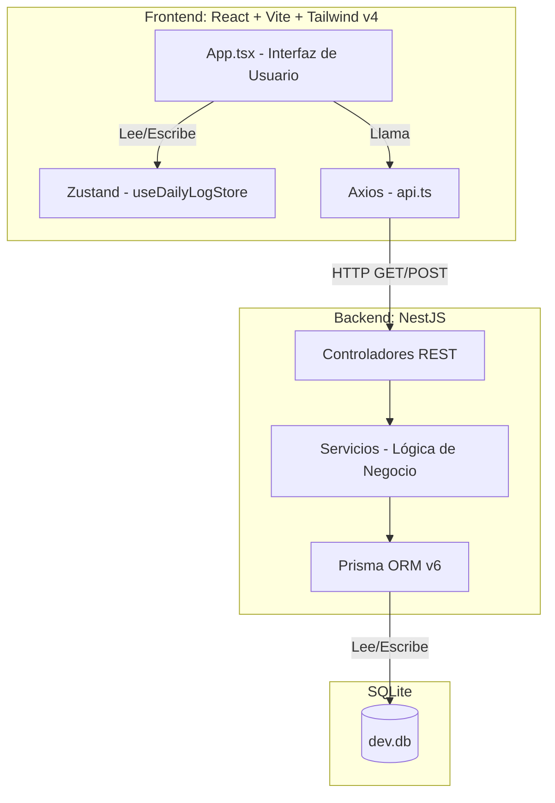

# Resumen del Proyecto: Sistema de Rastreo Nutricional de Alta Precisión

Este documento explica detalladamente el funcionamiento, la arquitectura y la integridad de los datos del sistema desarrollado.

## 1. Gestión de la Base de Datos e Integridad

### ¿Cómo se garantiza el uso de la base de datos real?
El sistema utiliza un proceso de **Seeding** (población inicial) automatizado. No se han inventado datos; se ha transformado el archivo CSV original en una base de datos estructurada.

*   **Archivo Fuente:** El sistema lee directamente el archivo `Base de datos Sistema Alimentos equivalentes .csv` ubicado en la raíz del proyecto.
*   **Proceso de Importación (`backend/prisma/seed.ts`):** 
    1.  El script abre el archivo CSV.
    2.  Limpia los caracteres corruptos (corregimos errores como `pia` por `piña` directamente en el archivo).
    3.  Convierte los valores numéricos (ej: `8,46` a `8.46`) para que sean procesables matemáticamente.
    4.  Vuelca los **486 alimentos** en una base de datos relacional.

### ¿Dónde encontrar y leer la base de datos?
La base de datos física es un archivo llamado **`dev.db`** ubicado en `backend/prisma/dev.db`. Es una base de datos **SQLite**, elegida por su portabilidad y rapidez para este prototipo.
*   Para leerla fuera de la app, puedes usar herramientas como [SQLite Browser](https://sqlitebrowser.org/) o la extensión "SQLite Viewer" en VS Code.

## 2. Tecnologías Principales

*   **Backend:** [NestJS](https://nestjs.com/) (Node.js) bajo una arquitectura de **Cortes Verticales (Vertical Slices)**. Esto significa que cada función (Diario, Catálogo) es independiente y contiene su propia lógica.
*   **ORM:** [Prisma](https://www.prisma.io/). Es el puente entre el código y la base de datos, garantizando que los nombres de las vitaminas y minerales coincidan exactamente con lo definido en el esquema.
*   **Frontend:** [React](https://react.dev/) con [Vite](https://vitejs.dev/) y [TypeScript](https://www.typescript.lang/).
*   **Estilos:** [Tailwind CSS v4](https://tailwindcss.com/). Proporciona la interfaz oscura y moderna con un rendimiento óptimo.
*   **Estado Global:** [Zustand](https://docs.pmnd.rs/zustand/). Maneja la fecha seleccionada y los datos del usuario de forma ligera.

## 3. Conexión Backend-Frontend

El frontend y el backend se comunican mediante una **API REST**:
*   El Backend corre en `http://localhost:3000`.
*   El Frontend corre en `http://localhost:5173`.
*   Cuando buscas un alimento o añades una porción, el frontend envía una solicitud al backend (vía `axios`), este realiza los cálculos matemáticos de precisión y devuelve el resultado final.

## 4. Garantía de Visualización Total

Se han mapeado **33 variables nutricionales** extraídas del CSV. El sistema no se limita a Macronutrientes; calcula y suma:
1.  **Energía:** Kcal.
2.  **Macros:** Proteínas, Carbohidratos, Grasas.
3.  **Grasas Detalladas:** Saturadas, Monoinsaturadas, Poliinsaturadas y Colesterol.
4.  **Fibras:** Soluble, Insoluble y Total.
5.  **Minerales:** Calcio, Fósforo, Sodio, Potasio, Magnesio.
6.  **Oligoelementos:** Hierro, Zinc, Cobre, Manganeso, Selenio.
7.  **Vitaminas:** A, C, D, E, K, B1, B2, B3, B5, B6, B9, B12.

**¿Cómo verlas todas?**
En la aplicación, haz clic en el icono de **Ajustes (⚙️)**. Esto activa el **Modo Avanzado**, que despliega un panel con el desglose exacto de cada uno de estos elementos basándose en la ingesta del día.

## 5. Solución de Errores Críticos (Logrados)

*   **Caracteres Especiales:** Se saneó el archivo CSV original para eliminar errores de codificación antiguos, asegurando que la `ñ` y las tildes se vean correctamente.
*   **Precisión de Input:** Se corrigió el error donde el `0` persistía al escribir. Ahora, al hacer foco en el campo de cantidad, el valor se selecciona automáticamente para una escritura limpia.
*   **Cálculo de Micros:** Se corrigió un error de acceso dinámico en el servidor; ahora todos los micronutrientes se suman y escalan proporcionalmente a la cantidad ingerida.

## 6. Personalización y Metas (Exhaustivo)

Se ha implementado un sistema de **Perfiles Nutricionales de Alta Precisión** que cubre más de 33 variables basadas en la normativa colombiana (1-18 años).

### ¿Cómo funciona?
1.  **Perfil del Usuario:** El usuario configura Edad, Género, Peso y Nivel de Actividad desde el icono 👤.
2.  **Cálculo Dinámico Completo:** El sistema calcula metas personalizadas para:
    *   **Energía:** Basado en Kcal/kg/día según edad exacta y actividad.
    *   **Macronutrientes:** Proteína (RDA y AMDR), Carbohidratos y Grasas Totales.
    *   **Grasas Detalladas:** Metas específicas para Saturadas, Poliinsaturadas y Monoinsaturadas (derivadas).
    *   **Fibra:** Meta de Fibra Total según Ingesta Aceptable (AI).
    *   **Vitaminas (12):** A, C, D, E, K y todo el complejo B (B1, B2, B3, B5, B6, B9, B12).
    *   **Minerales (10):** Calcio, Fósforo, Magnesio, Sodio, Potasio, Hierro, Zinc, Selenio y Cobre.
3.  **Barras de Progreso Visuales:** En el **Modo Avanzado (⚙️)**, cada nutriente cuenta con su propia barra de progreso que indica el porcentaje de cumplimiento de la meta diaria personalizada.
4.  **Normalización de Unidades:** El sistema maneja conversiones automáticas (ej: mcg a mg para Cobre) para asegurar que la comparación entre el consumo (Base de Datos UIS) y las metas (Perfiles) sea matemáticamente exacta.

## 7. Arquitectura del Sistema (Diagrama)




## 7. Conexión Backend y Frontend Profundizada

El sistema opera bajo un modelo **Cliente-Servidor** clásico utilizando una arquitectura **RESTful**. Todo fluye en milisegundos gracias a la separación de responsabilidades:

1.  **Frontend (El Cliente - React):** Es una Single Page Application (SPA). Cuando el usuario realiza una acción (por ejemplo, escribir "Manzana" en el buscador), el componente `App.tsx` detecta el evento `onChange`.
2.  **Capa de Red (Axios):** `App.tsx` delega la petición a una función limpia en `frontend/src/api/api.ts`. Esta función utiliza la librería `axios` para enviar una petición HTTP tipo GET al servidor local (ej: `http://localhost:3000/food-catalog/search?q=Manzana`).
3.  **Backend (El Servidor - NestJS):** El servidor NestJS, ejecutándose en el puerto 3000, intercepta esta petición HTTP. El decorador `@Get('search')` en el `FoodCatalogController` captura la ruta y extrae la palabra "Manzana" del `@Query('q')`.
4.  **Lógica de Negocio (Servicios):** El controlador le pasa la palabra "Manzana" al `FoodCatalogService`. Es aquí donde reside la lógica principal.
5.  **ORM (El Puente - Prisma):** El Servicio no habla SQL directamente, utiliza `PrismaClient`. Prisma traduce la intención de búsqueda a una consulta segura para SQLite: busca alimentos cuyo nombre contenga "Manzana" ignorando mayúsculas/minúsculas.
6.  **Respuesta al Frontend:** SQLite retorna los datos, Prisma se los entrega al Servicio, este al Controlador, quien los empaqueta como una respuesta JSON al Frontend. 
7.  **Actualización Reactiva:** Axios recibe el JSON en el Frontend. `App.tsx` guarda estos resultados usando `setSearchResults(res.data)`, y React automáticamente repinta la interfaz mostrando la lista debajo del buscador. Todo sin recargar la página.


## 8. Código Fuente Completo del Proyecto

A continuación se detalla todo el código fuente principal empleado para desarrollar este sistema, dividido por Backend y Frontend. Se han excluido archivos auto-generados pesados (como package-lock.json o migraciones SQL) para enfocar en la lógica desarrollada.


### --- BACKEND ---

### backend/src/app.controller.ts

```typescript
import { Controller, Get } from '@nestjs/common';
import { AppService } from './app.service';

@Controller()
export class AppController {
  constructor(private readonly appService: AppService) {}

  @Get()
  getHello(): string {
    return this.appService.getHello();
  }
}

```

### backend/src/app.module.ts

```typescript
import { Module } from '@nestjs/common';
import { AppController } from './app.controller';
import { AppService } from './app.service';
import { PrismaService } from './prisma/prisma.service';
import { FoodCatalogModule } from './features/food-catalog/food-catalog.module';
import { DailyLogModule } from './features/daily-log/daily-log.module';

@Module({
  imports: [FoodCatalogModule, DailyLogModule],
  controllers: [AppController],
  providers: [AppService, PrismaService],
})
export class AppModule {}

```

### backend/src/app.service.ts

```typescript
import { Injectable } from '@nestjs/common';

@Injectable()
export class AppService {
  getHello(): string {
    return 'Hello World!';
  }
}

```

### backend/src/features/daily-log/daily-log.controller.ts

```typescript
import { Controller, Post, Body, Get, Param, Delete, Put, Query } from '@nestjs/common';
import { DailyLogService } from './daily-log.service';
import { InputType } from '@prisma/client';

class AddEntryDto {
  date: string; // YYYY-MM-DD
  userId: string;
  foodId: number;
  inputType: InputType;
  inputAmount: number;
}

@Controller('daily-log')
export class DailyLogController {
  constructor(private readonly dailyLogService: DailyLogService) {}

  @Post('entry')
  async addEntry(@Body() dto: AddEntryDto) {
    return this.dailyLogService.addEntry(dto);
  }

  @Get(':userId/:date')
  async getDailyLog(
    @Param('userId') userId: string,
    @Param('date') date: string,
  ) {
    return this.dailyLogService.getDailySummary(userId, date);
  }

  @Delete('entry/:id')
  async deleteEntry(@Param('id') id: string) {
    return this.dailyLogService.deleteEntry(id);
  }
}

```

### backend/src/features/daily-log/daily-log.module.ts

```typescript
import { Module } from '@nestjs/common';
import { DailyLogController } from './daily-log.controller';
import { DailyLogService } from './daily-log.service';
import { PrismaService } from '../../prisma/prisma.service';

@Module({
  controllers: [DailyLogController],
  providers: [DailyLogService, PrismaService],
})
export class DailyLogModule {}

```

### backend/src/features/daily-log/daily-log.service.ts

```typescript
import { Injectable } from '@nestjs/common';
import { PrismaService } from '../../prisma/prisma.service';
import { InputType, Food } from '@prisma/client';

const NUTRITION_KEYS = [
  'kcal', 'carbs', 'protein', 'fat', 
  'saturatedFat', 'monounsaturatedFat', 'polyunsaturatedFat', 'cholesterol',
  'solubleFiber', 'insolubleFiber', 'totalFiber',
  'calcium', 'phosphorus', 'sodium', 'potassium', 'magnesium',
  'iron', 'zinc', 'copper', 'manganese', 'selenium',
  'vitE', 'vitK', 'vitD', 'vitA',
  'vitB1', 'vitB2', 'vitB3', 'vitB5', 'vitB6', 'vitB9', 'vitB12', 'vitC'
];

@Injectable()
export class DailyLogService {
  constructor(private readonly prisma: PrismaService) {}

  async addEntry(dto: {
    date: string;
    userId: string;
    foodId: number;
    inputType: InputType;
    inputAmount: number;
  }) {
    let dailyLog = await this.prisma.dailyLog.findUnique({
      where: {
        date_userId: {
          date: new Date(dto.date),
          userId: dto.userId,
        },
      },
    });

    if (!dailyLog) {
      dailyLog = await this.prisma.dailyLog.create({
        data: {
          date: new Date(dto.date),
          userId: dto.userId,
        },
      });
    }

    return this.prisma.logEntry.create({
      data: {
        dailyLogId: dailyLog.id,
        foodId: dto.foodId,
        inputType: dto.inputType,
        inputAmount: dto.inputAmount,
      },
      include: {
        food: true,
      },
    });
  }

  async getDailySummary(userId: string, dateStr: string) {
    const date = new Date(dateStr);
    
    const dailyLog = await this.prisma.dailyLog.findUnique({
      where: {
        date_userId: {
          date,
          userId,
        },
      },
      include: {
        entries: {
          include: {
            food: true,
          },
        },
      },
    });

    const emptyTotals = this.getEmptyTotals();

    if (!dailyLog) {
      return {
        entries: [],
        totals: emptyTotals,
      };
    }

    const calculatedEntries = dailyLog.entries.map((entry) => {
      const factor =
        entry.inputType === InputType.HOUSEHOLD
          ? entry.inputAmount
          : entry.inputAmount / entry.food.baseAmount;

      const calculated: any = {};
      NUTRITION_KEYS.forEach(key => {
        const val = (entry.food as any)[key] ?? 0;
        calculated[key] = val * factor;
      });

      return {
        ...entry,
        calculated,
      };
    });

    const totals = calculatedEntries.reduce(
      (acc, curr) => {
        NUTRITION_KEYS.forEach(key => {
          acc[key] = (acc[key] || 0) + (curr.calculated[key] || 0);
        });
        return acc;
      },
      { ...emptyTotals }
    );

    return {
      id: dailyLog.id,
      date: dailyLog.date,
      entries: calculatedEntries,
      totals,
    };
  }

  async deleteEntry(id: string) {
    return this.prisma.logEntry.delete({
      where: { id },
    });
  }

  private getEmptyTotals() {
    const totals: any = {};
    NUTRITION_KEYS.forEach(key => totals[key] = 0);
    return totals;
  }
}

```

### backend/src/features/food-catalog/food-catalog.controller.ts

```typescript
import { Controller, Get, Query } from '@nestjs/common';
import { FoodCatalogService } from './food-catalog.service';

@Controller('foods')
export class FoodCatalogController {
  constructor(private readonly foodCatalogService: FoodCatalogService) {}

  @Get('search')
  async search(@Query('q') query: string) {
    return this.foodCatalogService.searchFoods(query);
  }

  @Get(':id')
  async getById(@Query('id') id: string) {
    return this.foodCatalogService.getFoodById(Number(id));
  }
}

```

### backend/src/features/food-catalog/food-catalog.module.ts

```typescript
import { Module } from '@nestjs/common';
import { FoodCatalogController } from './food-catalog.controller';
import { FoodCatalogService } from './food-catalog.service';
import { PrismaService } from '../../prisma/prisma.service';

@Module({
  controllers: [FoodCatalogController],
  providers: [FoodCatalogService, PrismaService],
})
export class FoodCatalogModule {}

```

### backend/src/features/food-catalog/food-catalog.service.ts

```typescript
import { Injectable } from '@nestjs/common';
import { PrismaService } from '../../prisma/prisma.service';

@Injectable()
export class FoodCatalogService {
  constructor(private readonly prisma: PrismaService) {}

  async searchFoods(query: string) {
    if (!query || query.length < 2) return [];

    return this.prisma.food.findMany({
      where: {
        name: {
          contains: query,
        },
      },
      take: 20,
    });
  }

  async getFoodById(id: number) {
    return this.prisma.food.findUnique({
      where: { id },
    });
  }
}

```

### backend/src/main.ts

```typescript
import { NestFactory } from '@nestjs/core';
import { AppModule } from './app.module';

async function bootstrap() {
  const app = await NestFactory.create(AppModule);
  app.enableCors();
  await app.listen(process.env.PORT ?? 3000);
}
bootstrap();

```

### backend/src/prisma/prisma.service.ts

```typescript
import { Injectable, OnModuleInit, OnModuleDestroy } from '@nestjs/common';
import { PrismaClient } from '@prisma/client';

@Injectable()
export class PrismaService extends PrismaClient implements OnModuleInit, OnModuleDestroy {
  async onModuleInit() {
    await this.$connect();
  }

  async onModuleDestroy() {
    await this.$disconnect();
  }
}

```

### backend/prisma/schema.prisma

```graphql
// This is your Prisma schema file,
// learn more about it in the docs: https://pris.ly/d/prisma-schema

generator client {
  provider = "prisma-client-js"
}

datasource db {
  provider = "sqlite"
  url      = env("DATABASE_URL")
}

model Food {
  id                Int      @id @default(autoincrement())
  group             String
  externalId        String?  // El campo '#' del CSV
  name              String
  baseAmount        Float    // Cantidad(g/mL)
  householdMeasure  String   // Medida casera
  
  // Macronutrientes
  kcal              Float
  carbs             Float    // CHO(g)
  protein           Float    // Proteina(g)
  fat               Float    // Grasa(g)
  
  // Grasas detalladas
  saturatedFat      Float?   // A.G.S(g)
  monounsaturatedFat Float?  // A.G.M(g)
  polyunsaturatedFat Float?  // A.G.P(g)
  cholesterol       Float?   // Colesterol (mg)
  
  // Fibra
  solubleFiber      Float?
  insolubleFiber    Float?
  totalFiber        Float?
  
  // Macrominerales
  calcium           Float?
  phosphorus        Float?
  sodium            Float?
  potassium         Float?
  magnesium         Float?
  
  // Oligoelementos
  iron              Float?
  zinc              Float?
  copper            Float?
  manganese         Float?
  selenium          Float?
  
  // Vitaminas Liposolubles
  vitE              Float?
  vitK              Float?
  vitD              Float?
  vitA              Float?
  
  // Vitaminas Hidrosolubles
  vitB1             Float?
  vitB2             Float?
  vitB3             Float?
  vitB5             Float?
  vitB6             Float?
  vitB9             Float?
  vitB12            Float?
  vitC              Float?

  logEntries        LogEntry[]

  @@map("foods")
}

model DailyLog {
  id        String     @id @default(uuid())
  date      DateTime
  userId    String     // Por ahora un string simple, luego se puede vincular a tabla User
  entries   LogEntry[]

  @@unique([date, userId])
  @@map("daily_logs")
}

model LogEntry {
  id          String    @id @default(uuid())
  dailyLogId  String
  dailyLog    DailyLog  @relation(fields: [dailyLogId], references: [id])
  foodId      Int
  food        Food      @relation(fields: [foodId], references: [id])
  
  inputType   InputType
  inputAmount Float     // Cantidad ingresada por el usuario (ej: 2.5 vasos o 150 gramos)
  
  createdAt   DateTime  @default(now())

  @@map("log_entries")
}

enum InputType {
  GRAMS
  HOUSEHOLD
}

```

### backend/prisma/seed.ts

```typescript
import { PrismaClient } from '@prisma/client';
import 'dotenv/config';
import * as fs from 'fs';
import * as path from 'path';
import csv from 'csv-parser';

const prisma = new PrismaClient();

interface FoodData {
  group: string;
  externalId: string;
  name: string;
  baseAmount: number;
  householdMeasure: string;
  kcal: number;
  carbs: number;
  protein: number;
  fat: number;
  saturatedFat: number;
  monounsaturatedFat: number;
  polyunsaturatedFat: number;
  cholesterol: number;
  solubleFiber: number;
  insolubleFiber: number;
  totalFiber: number;
  calcium: number;
  phosphorus: number;
  sodium: number;
  potassium: number;
  magnesium: number;
  iron: number;
  zinc: number;
  copper: number;
  manganese: number;
  selenium: number;
  vitE: number;
  vitK: number;
  vitD: number;
  vitA: number;
  vitB1: number;
  vitB2: number;
  vitB3: number;
  vitB5: number;
  vitB6: number;
  vitB9: number;
  vitB12: number;
  vitC: number;
}

async function main() {
  const csvFilePath = path.resolve(__dirname, '../../Base de datos Sistema Alimentos equivalentes .csv');
  
  const results: FoodData[] = [];

  const parseCommaFloat = (val: string): number => {
    if (!val || val.trim() === '') return 0;
    const cleaned = val.replace(',', '.');
    const parsed = parseFloat(cleaned);
    return isNaN(parsed) ? 0 : parsed;
  };

  console.log('Starting seed process with standard UTF-8...');

  fs.createReadStream(csvFilePath)
    .pipe(csv({
      separator: ';',
      skipLines: 1,
      headers: [
        'group', 'externalId', 'name', 'baseAmount', 'householdMeasure',
        'kcal', 'carbs', 'protein', 'fat', 'saturatedFat', 'monounsaturatedFat',
        'polyunsaturatedFat', 'cholesterol', 'solubleFiber', 'insolubleFiber',
        'totalFiber', 'calcium', 'phosphorus', 'sodium', 'potassium', 'magnesium',
        'iron', 'zinc', 'copper', 'manganese', 'selenium', 'vitE', 'vitK',
        'vitD', 'vitA', 'vitB1', 'vitB2', 'vitB3', 'vitB5', 'vitB6', 'vitB9',
        'vitB12', 'vitC', 'approved'
      ]
    }))
    .on('data', (data: any) => {
      if (data.group === 'Grupo alimentario' || !data.name || data.name.trim() === '') return;

      results.push({
        group: data.group,
        externalId: data.externalId,
        name: data.name.trim(),
        baseAmount: parseCommaFloat(data.baseAmount),
        householdMeasure: data.householdMeasure?.trim() || '',
        kcal: parseCommaFloat(data.kcal),
        carbs: parseCommaFloat(data.carbs),
        protein: parseCommaFloat(data.protein),
        fat: parseCommaFloat(data.fat),
        saturatedFat: parseCommaFloat(data.saturatedFat),
        monounsaturatedFat: parseCommaFloat(data.monounsaturatedFat),
        polyunsaturatedFat: parseCommaFloat(data.polyunsaturatedFat),
        cholesterol: parseCommaFloat(data.cholesterol),
        solubleFiber: parseCommaFloat(data.solubleFiber),
        insolubleFiber: parseCommaFloat(data.insolubleFiber),
        totalFiber: parseCommaFloat(data.totalFiber),
        calcium: parseCommaFloat(data.calcium),
        phosphorus: parseCommaFloat(data.phosphorus),
        sodium: parseCommaFloat(data.sodium),
        potassium: parseCommaFloat(data.potassium),
        magnesium: parseCommaFloat(data.magnesium),
        iron: parseCommaFloat(data.iron),
        zinc: parseCommaFloat(data.zinc),
        copper: parseCommaFloat(data.copper),
        manganese: parseCommaFloat(data.manganese),
        selenium: parseCommaFloat(data.selenium),
        vitE: parseCommaFloat(data.vitE),
        vitK: parseCommaFloat(data.vitK),
        vitD: parseCommaFloat(data.vitD),
        vitA: parseCommaFloat(data.vitA),
        vitB1: parseCommaFloat(data.vitB1),
        vitB2: parseCommaFloat(data.vitB2),
        vitB3: parseCommaFloat(data.vitB3),
        vitB5: parseCommaFloat(data.vitB5),
        vitB6: parseCommaFloat(data.vitB6),
        vitB9: parseCommaFloat(data.vitB9),
        vitB12: parseCommaFloat(data.vitB12),
        vitC: parseCommaFloat(data.vitC)
      });
    })
    .on('end', async () => {
      console.log(`Parsed ${results.length} foods. Seeding...`);
      
      await prisma.logEntry.deleteMany({});
      await prisma.food.deleteMany({});
      
      for (const food of results) {
        try {
          await prisma.food.create({
            data: food
          });
        } catch (err) {
          console.error(`Error creating food ${food.name}:`, err);
        }
      }

      console.log('Seeding finished successfully with clean data.');
      await prisma.$disconnect();
    });
}

main().catch((e) => {
  console.error(e);
  process.exit(1);
});

```

### backend/prisma/seed_test.ts

```typescript
import { PrismaClient } from '@prisma/client';
import 'dotenv/config';

const prisma = new PrismaClient();

async function main() {
  console.log('Seed test started');
  await prisma.$connect();
  console.log('Connected');
  await prisma.$disconnect();
}

main();

```

### backend/package.json

```json
{
  "name": "backend",
  "version": "0.0.1",
  "description": "",
  "author": "",
  "private": true,
  "license": "UNLICENSED",
  "scripts": {
    "build": "nest build",
    "format": "prettier --write \"src/**/*.ts\" \"test/**/*.ts\"",
    "start": "nest start",
    "start:dev": "nest start --watch",
    "start:debug": "nest start --debug --watch",
    "start:prod": "node dist/main",
    "lint": "eslint \"{src,apps,libs,test}/**/*.ts\" --fix",
    "test": "jest",
    "test:watch": "jest --watch",
    "test:cov": "jest --coverage",
    "test:debug": "node --inspect-brk -r tsconfig-paths/register -r ts-node/register node_modules/.bin/jest --runInBand",
    "test:e2e": "jest --config ./test/jest-e2e.json"
  },
  "dependencies": {
    "@nestjs/common": "^11.0.1",
    "@nestjs/core": "^11.0.1",
    "@nestjs/platform-express": "^11.0.1",
    "@prisma/client": "^6.19.3",
    "csv-parser": "^3.2.1",
    "iconv-lite": "^0.7.2",
    "prisma": "^6.19.3",
    "reflect-metadata": "^0.2.2",
    "rxjs": "^7.8.1"
  },
  "devDependencies": {
    "@eslint/eslintrc": "^3.2.0",
    "@eslint/js": "^9.18.0",
    "@nestjs/cli": "^11.0.0",
    "@nestjs/schematics": "^11.0.0",
    "@nestjs/testing": "^11.0.1",
    "@types/express": "^5.0.0",
    "@types/jest": "^30.0.0",
    "@types/node": "^24.0.0",
    "@types/supertest": "^7.0.0",
    "eslint": "^9.18.0",
    "eslint-config-prettier": "^10.0.1",
    "eslint-plugin-prettier": "^5.2.2",
    "globals": "^17.0.0",
    "jest": "^30.0.0",
    "prettier": "^3.4.2",
    "source-map-support": "^0.5.21",
    "supertest": "^7.0.0",
    "ts-jest": "^29.2.5",
    "ts-loader": "^9.5.2",
    "ts-node": "^10.9.2",
    "tsconfig-paths": "^4.2.0",
    "typescript": "^5.7.3",
    "typescript-eslint": "^8.20.0"
  },
  "jest": {
    "moduleFileExtensions": [
      "js",
      "json",
      "ts"
    ],
    "rootDir": "src",
    "testRegex": ".*\\.spec\\.ts$",
    "transform": {
      "^.+\\.(t|j)s$": "ts-jest"
    },
    "collectCoverageFrom": [
      "**/*.(t|j)s"
    ],
    "coverageDirectory": "../coverage",
    "testEnvironment": "node"
  },
  "prisma": {
    "seed": "ts-node prisma/seed.ts"
  }
}

```

### --- FRONTEND ---

### frontend/src/api/api.ts

```typescript
import axios from 'axios';

const api = axios.create({
  baseURL: import.meta.env.VITE_API_URL || 'http://localhost:3000',
});

export const foodApi = {
  search: (query: string) => api.get(`/foods/search?q=${query}`),
  getById: (id: number) => api.get(`/foods/${id}`),
};

export const logApi = {
  getSummary: (userId: string, date: string) => api.get(`/daily-log/${userId}/${date}`),
  addEntry: (data: any) => api.post('/daily-log/entry', data),
  deleteEntry: (id: string) => api.delete(`/daily-log/entry/${id}`),
};

export default api;

```

### frontend/src/App.css

```css
.counter {
  font-size: 16px;
  padding: 5px 10px;
  border-radius: 5px;
  color: var(--accent);
  background: var(--accent-bg);
  border: 2px solid transparent;
  transition: border-color 0.3s;
  margin-bottom: 24px;

  &:hover {
    border-color: var(--accent-border);
  }
  &:focus-visible {
    outline: 2px solid var(--accent);
    outline-offset: 2px;
  }
}

.hero {
  position: relative;

  .base,
  .framework,
  .vite {
    inset-inline: 0;
    margin: 0 auto;
  }

  .base {
    width: 170px;
    position: relative;
    z-index: 0;
  }

  .framework,
  .vite {
    position: absolute;
  }

  .framework {
    z-index: 1;
    top: 34px;
    height: 28px;
    transform: perspective(2000px) rotateZ(300deg) rotateX(44deg) rotateY(39deg)
      scale(1.4);
  }

  .vite {
    z-index: 0;
    top: 107px;
    height: 26px;
    width: auto;
    transform: perspective(2000px) rotateZ(300deg) rotateX(40deg) rotateY(39deg)
      scale(0.8);
  }
}

#center {
  display: flex;
  flex-direction: column;
  gap: 25px;
  place-content: center;
  place-items: center;
  flex-grow: 1;

  @media (max-width: 1024px) {
    padding: 32px 20px 24px;
    gap: 18px;
  }
}

#next-steps {
  display: flex;
  border-top: 1px solid var(--border);
  text-align: left;

  & > div {
    flex: 1 1 0;
    padding: 32px;
    @media (max-width: 1024px) {
      padding: 24px 20px;
    }
  }

  .icon {
    margin-bottom: 16px;
    width: 22px;
    height: 22px;
  }

  @media (max-width: 1024px) {
    flex-direction: column;
    text-align: center;
  }
}

#docs {
  border-right: 1px solid var(--border);

  @media (max-width: 1024px) {
    border-right: none;
    border-bottom: 1px solid var(--border);
  }
}

#next-steps ul {
  list-style: none;
  padding: 0;
  display: flex;
  gap: 8px;
  margin: 32px 0 0;

  .logo {
    height: 18px;
  }

  a {
    color: var(--text-h);
    font-size: 16px;
    border-radius: 6px;
    background: var(--social-bg);
    display: flex;
    padding: 6px 12px;
    align-items: center;
    gap: 8px;
    text-decoration: none;
    transition: box-shadow 0.3s;

    &:hover {
      box-shadow: var(--shadow);
    }
    .button-icon {
      height: 18px;
      width: 18px;
    }
  }

  @media (max-width: 1024px) {
    margin-top: 20px;
    flex-wrap: wrap;
    justify-content: center;

    li {
      flex: 1 1 calc(50% - 8px);
    }

    a {
      width: 100%;
      justify-content: center;
      box-sizing: border-box;
    }
  }
}

#spacer {
  height: 88px;
  border-top: 1px solid var(--border);
  @media (max-width: 1024px) {
    height: 48px;
  }
}

.ticks {
  position: relative;
  width: 100%;

  &::before,
  &::after {
    content: '';
    position: absolute;
    top: -4.5px;
    border: 5px solid transparent;
  }

  &::before {
    left: 0;
    border-left-color: var(--border);
  }
  &::after {
    right: 0;
    border-right-color: var(--border);
  }
}

```

### frontend/src/App.tsx

```typescript
import React, { useEffect, useState } from 'react';
import { format } from 'date-fns';
import { useDailyLogStore } from './store/useDailyLogStore';
import { logApi, foodApi } from './api/api';
import { Search, Trash2, ChevronLeft, ChevronRight, Calculator, Activity, Settings2, Info } from 'lucide-react';

const NUTRIENT_GROUPS = [
  { 
    title: 'Grasas Detalladas', 
    fields: [
      { key: 'saturatedFat', label: 'Sat.', unit: 'g' },
      { key: 'monounsaturatedFat', label: 'Mono.', unit: 'g' },
      { key: 'polyunsaturatedFat', label: 'Poli.', unit: 'g' },
      { key: 'cholesterol', label: 'Colest.', unit: 'mg' }
    ]
  },
  { 
    title: 'Fibra', 
    fields: [
      { key: 'solubleFiber', label: 'Soluble', unit: 'g' },
      { key: 'insolubleFiber', label: 'Insoluble', unit: 'g' },
      { key: 'totalFiber', label: 'Total', unit: 'g' }
    ]
  },
  { 
    title: 'Minerales', 
    fields: [
      { key: 'calcium', label: 'Calcio', unit: 'mg' },
      { key: 'phosphorus', label: 'Fósforo', unit: 'mg' },
      { key: 'sodium', label: 'Sodio', unit: 'mg' },
      { key: 'potassium', label: 'Potasio', unit: 'mg' },
      { key: 'magnesium', label: 'Magnesio', unit: 'mg' }
    ]
  },
  { 
    title: 'Oligoelementos', 
    fields: [
      { key: 'iron', label: 'Hierro', unit: 'mg' },
      { key: 'zinc', label: 'Zinc', unit: 'mg' },
      { key: 'copper', label: 'Cobre', unit: 'mg' },
      { key: 'manganese', label: 'Manganeso', unit: 'mg' },
      { key: 'selenium', label: 'Selenio', unit: 'mcg' }
    ]
  },
  { 
    title: 'Vitaminas', 
    fields: [
      { key: 'vitA', label: 'Vit. A', unit: 'ER' },
      { key: 'vitC', label: 'Vit. C', unit: 'mg' },
      { key: 'vitD', label: 'Vit. D', unit: 'UI' },
      { key: 'vitE', label: 'Vit. E', unit: 'mg' },
      { key: 'vitK', label: 'Vit. K', unit: 'mcg' },
      { key: 'vitB1', label: 'B1', unit: 'mg' },
      { key: 'vitB2', label: 'B2', unit: 'mg' },
      { key: 'vitB3', label: 'B3', unit: 'mg' },
      { key: 'vitB5', label: 'B5', unit: 'mg' },
      { key: 'vitB6', label: 'B6', unit: 'mg' },
      { key: 'vitB9', label: 'B9', unit: 'mcg' },
      { key: 'vitB12', label: 'B12', unit: 'mcg' }
    ]
  }
];

const App: React.FC = () => {
  const { selectedDate, setSelectedDate, userId } = useDailyLogStore();
  const [summary, setSummary] = useState<any>(null);
  const [searchQuery, setSearchQuery] = useState('');
  const [searchResults, setSearchResults] = useState<any[]>([]);
  const [showModal, setShowModal] = useState(false);
  const [showAdvanced, setShowAdvanced] = useState(false);
  const [selectedFood, setSelectedFood] = useState<any>(null);
  const [inputType, setInputType] = useState<'GRAMS' | 'HOUSEHOLD'>('HOUSEHOLD');
  const [inputAmount, setInputAmount] = useState<string>('1');

  const fetchSummary = async () => {
    try {
      const dateStr = format(selectedDate, 'yyyy-MM-dd');
      const res = await logApi.getSummary(userId, dateStr);
      setSummary(res.data);
    } catch (err) {
      console.error(err);
    }
  };

  useEffect(() => {
    fetchSummary();
  }, [selectedDate, userId]);

  const handleSearch = async (q: string) => {
    setSearchQuery(q);
    if (q.length >= 2) {
      const res = await foodApi.search(q);
      setSearchResults(res.data);
    } else {
      setSearchResults([]);
    }
  };

  const handleAddEntry = async () => {
    try {
      const amountNum = Number(inputAmount) || 0;
      if (amountNum <= 0) return;

      await logApi.addEntry({
        date: format(selectedDate, 'yyyy-MM-dd'),
        userId,
        foodId: selectedFood.id,
        inputType,
        inputAmount: amountNum,
      });
      setShowModal(false);
      setSelectedFood(null);
      setSearchQuery('');
      setSearchResults([]);
      fetchSummary();
    } catch (err) {
      console.error(err);
    }
  };

  const handleDelete = async (id: string) => {
    try {
      await logApi.deleteEntry(id);
      fetchSummary();
    } catch (err) {
      console.error(err);
    }
  };

  const changeDate = (days: number) => {
    const newDate = new Date(selectedDate);
    newDate.setDate(newDate.getDate() + days);
    setSelectedDate(newDate);
  };

  const calculatePreview = (field: string) => {
    if (!selectedFood) return 0;
    const amountNum = Number(inputAmount) || 0;
    const baseValue = selectedFood[field] || 0;
    const factor = inputType === 'HOUSEHOLD' 
      ? amountNum 
      : amountNum / selectedFood.baseAmount;
    return baseValue * factor;
  };

  return (
    <div className="min-h-screen bg-slate-900 text-slate-100 font-sans p-4 md:p-8 transition-colors duration-500">
      <header className="max-w-6xl mx-auto mb-8 flex flex-col md:flex-row md:items-center justify-between gap-4">
        <div className="flex items-center gap-3">
          <div className="bg-emerald-500 p-2 rounded-xl">
            <Activity className="text-white" size={28} />
          </div>
          <div>
            <h1 className="text-3xl font-bold text-white">NutriTrack <span className="text-emerald-400">Pro</span></h1>
            <p className="text-slate-400 text-sm">Control Nutricional UIS - Alta Precisión</p>
          </div>
        </div>
        
        <div className="flex items-center gap-2">
          <div className="flex items-center gap-2 bg-slate-800 p-1.5 rounded-xl border border-slate-700 shadow-inner">
            <button onClick={() => changeDate(-1)} className="p-2 hover:bg-slate-700 rounded-lg transition-all active:scale-90 text-emerald-400">
              <ChevronLeft size={22} />
            </button>
            <span className="font-bold px-4 min-w-[140px] text-center text-slate-200">
              {format(selectedDate, 'PPP')}
            </span>
            <button onClick={() => changeDate(1)} className="p-2 hover:bg-slate-700 rounded-lg transition-all active:scale-90 text-emerald-400">
              <ChevronRight size={22} />
            </button>
          </div>
          
          <button 
            onClick={() => setShowAdvanced(!showAdvanced)}
            className={`p-3 rounded-xl border transition-all ${showAdvanced ? 'bg-emerald-500 border-emerald-400 text-white shadow-lg shadow-emerald-500/20' : 'bg-slate-800 border-slate-700 text-slate-400 hover:border-slate-500'}`}
            title="Modo Avanzado"
          >
            <Settings2 size={22} />
          </button>
        </div>
      </header>

      <main className="max-w-6xl mx-auto grid grid-cols-1 lg:grid-cols-12 gap-8">
        {/* Lado Izquierdo: Resumen */}
        <section className="lg:col-span-4 space-y-6">
          <div className="bg-slate-800 p-6 rounded-3xl border border-slate-700 shadow-2xl relative overflow-hidden group">
            <div className="absolute top-0 right-0 p-4 opacity-10 group-hover:opacity-20 transition-opacity">
              <Calculator size={80} />
            </div>

            <h2 className="text-xl font-bold mb-6 flex items-center gap-2 text-slate-200">
              Resumen del Día
            </h2>
            
            <div className="space-y-5 relative z-10">
              <div className="bg-slate-900/50 p-4 rounded-2xl border border-slate-700/50 flex justify-between items-end">
                <div>
                  <span className="text-slate-400 text-xs uppercase tracking-wider font-bold">Energía Total</span>
                  <div className="text-3xl font-black text-emerald-400 mt-1">
                    {summary?.totals?.kcal?.toFixed(0) || 0} <span className="text-sm font-normal text-slate-500">kcal</span>
                  </div>
                </div>
              </div>
              
              <div className="grid grid-cols-3 gap-3">
                <div className="bg-blue-500/10 border border-blue-500/20 p-3 rounded-2xl text-center">
                  <span className="text-[10px] uppercase font-bold text-blue-400">Proteína</span>
                  <div className="text-lg font-bold">{summary?.totals?.protein?.toFixed(1) || 0}g</div>
                </div>
                <div className="bg-amber-500/10 border border-amber-500/20 p-3 rounded-2xl text-center">
                  <span className="text-[10px] uppercase font-bold text-amber-400">Carbos</span>
                  <div className="text-lg font-bold">{summary?.totals?.carbs?.toFixed(1) || 0}g</div>
                </div>
                <div className="bg-rose-500/10 border border-rose-500/20 p-3 rounded-2xl text-center">
                  <span className="text-[10px] uppercase font-bold text-rose-400">Grasa</span>
                  <div className="text-lg font-bold">{summary?.totals?.fat?.toFixed(1) || 0}g</div>
                </div>
              </div>

              {showAdvanced && (
                <div className="pt-4 mt-4 border-t border-slate-700 space-y-6 animate-in slide-in-from-top-4 duration-300 overflow-y-auto max-h-[60vh] pr-2 custom-scrollbar">
                  {NUTRIENT_GROUPS.map(group => (
                    <div key={group.title} className="bg-slate-900/30 p-4 rounded-2xl border border-slate-700/30">
                      <h3 className="text-[10px] uppercase font-black text-emerald-500/70 mb-3 tracking-widest">{group.title}</h3>
                      <div className="grid grid-cols-2 gap-x-6 gap-y-3">
                        {group.fields.map(f => (
                          <div key={f.key} className="flex flex-col">
                            <span className="text-[10px] text-slate-500 font-bold uppercase">{f.label}</span>
                            <span className="font-mono text-sm text-slate-200">
                              {(summary?.totals?.[f.key] || 0).toFixed(summary?.totals?.[f.key] < 1 && summary?.totals?.[f.key] > 0 ? 2 : 1)}
                              <span className="text-[10px] ml-0.5 text-slate-500">{f.unit}</span>
                            </span>
                          </div>
                        ))}
                      </div>
                    </div>
                  ))}
                </div>
              )}
            </div>
          </div>

          {/* Buscador */}
          <div className="relative group">
            <div className="flex items-center bg-slate-800 border-2 border-slate-700 rounded-2xl px-5 py-3 group-focus-within:border-emerald-500/50 group-focus-within:ring-4 ring-emerald-500/10 transition-all shadow-lg">
              <Search className="text-slate-500 group-focus-within:text-emerald-400" size={20} />
              <input
                type="text"
                placeholder="¿Qué comiste hoy?"
                className="bg-transparent border-none focus:outline-none ml-3 w-full text-slate-100 placeholder:text-slate-600 font-medium text-lg"
                value={searchQuery}
                onChange={(e) => handleSearch(e.target.value)}
              />
            </div>

            {searchResults.length > 0 && (
              <div className="absolute top-full left-0 right-0 mt-3 bg-slate-800 border border-slate-700 rounded-2xl shadow-2xl z-20 max-h-80 overflow-y-auto overflow-x-hidden backdrop-blur-xl divide-y divide-slate-700/50">
                {searchResults.map((food: any) => (
                  <button
                    key={food.id}
                    className="w-full text-left p-4 hover:bg-slate-750 transition-colors group/item flex justify-between items-center"
                    onClick={() => {
                      setSelectedFood(food);
                      setShowModal(true);
                    }}
                  >
                    <div className="flex-1 pr-4">
                      <div className="font-bold text-slate-200 group-hover/item:text-emerald-400 transition-colors">{food.name}</div>
                      <div className="text-[10px] text-slate-500 font-bold uppercase mt-1 tracking-wider">{food.group} • {food.baseAmount}g = {food.kcal} kcal</div>
                    </div>
                    <div className="bg-slate-700 p-2 rounded-lg text-slate-400 group-hover/item:bg-emerald-500 group-hover/item:text-white transition-all">
                      <Trash2 size={16} className="rotate-45" />
                    </div>
                  </button>
                ))}
              </div>
            )}
          </div>
        </section>

        {/* Lado Derecho: Timeline */}
        <section className="lg:col-span-8">
          <div className="bg-slate-800 rounded-[2rem] border border-slate-700 overflow-hidden shadow-2xl min-h-[500px] flex flex-col">
            <div className="p-8 border-b border-slate-700 flex justify-between items-center bg-slate-800/50">
              <h2 className="text-2xl font-black text-white tracking-tight">Registro Cronológico</h2>
              <div className="bg-emerald-500/10 text-emerald-400 px-3 py-1 rounded-full text-xs font-bold border border-emerald-500/20 uppercase tracking-widest">
                {summary?.entries?.length || 0} Alimentos
              </div>
            </div>
            
            <div className="flex-1 p-2 overflow-y-auto max-h-[70vh] custom-scrollbar">
              {summary?.entries?.length === 0 ? (
                <div className="h-full flex flex-col items-center justify-center text-slate-600 space-y-4 opacity-50 p-12">
                  <Info size={48} />
                  <p className="text-center font-medium max-w-[200px]">Tu diario está vacío. Busca un alimento para comenzar.</p>
                </div>
              ) : (
                <div className="grid gap-2">
                  {summary?.entries?.map((entry: any) => (
                    <div key={entry.id} className="p-5 flex items-center justify-between hover:bg-slate-750/50 rounded-2xl transition-all group relative border border-transparent hover:border-slate-600/50">
                      <div className="flex-1">
                        <div className="flex items-center gap-2">
                          <h3 className="font-bold text-slate-100 text-lg leading-tight">{entry.food.name}</h3>
                          <span className="text-[10px] text-slate-500 font-black px-1.5 py-0.5 rounded bg-slate-900 uppercase">{entry.food.group}</span>
                        </div>
                        <div className="text-sm text-slate-400 mt-1 font-medium">
                          {entry.inputAmount} <span className="text-slate-500 text-xs font-bold uppercase">{entry.inputType === 'HOUSEHOLD' ? entry.food.householdMeasure : 'gramos'}</span>
                        </div>
                      </div>
                      
                      <div className="flex items-center gap-8">
                        <div className="text-right">
                          <div className="text-xl font-black text-emerald-400 leading-none">{entry.calculated.kcal.toFixed(0)}</div>
                          <div className="text-[10px] text-slate-500 font-bold uppercase mt-1">kcal</div>
                        </div>

                        <div className="hidden md:flex gap-4 border-l border-slate-700 pl-8">
                          <div className="text-center min-w-[40px]">
                            <div className="text-xs font-bold text-blue-400">{entry.calculated.protein.toFixed(1)}g</div>
                            <div className="text-[8px] text-slate-600 font-black uppercase">Prot</div>
                          </div>
                          <div className="text-center min-w-[40px]">
                            <div className="text-xs font-bold text-amber-400">{entry.calculated.carbs.toFixed(1)}g</div>
                            <div className="text-[8px] text-slate-600 font-black uppercase:">Carb</div>
                          </div>
                          <div className="text-center min-w-[40px]">
                            <div className="text-xs font-bold text-rose-400">{entry.calculated.fat.toFixed(1)}g</div>
                            <div className="text-[8px] text-slate-600 font-black uppercase">Gras</div>
                          </div>
                        </div>

                        <button 
                          onClick={() => handleDelete(entry.id)}
                          className="p-3 bg-rose-500/10 text-rose-500 hover:bg-rose-500 hover:text-white rounded-xl transition-all opacity-0 group-hover:opacity-100 active:scale-90"
                        >
                          <Trash2 size={18} />
                        </button>
                      </div>
                    </div>
                  ))}
                </div>
              )}
            </div>
          </div>
        </section>
      </main>

      {/* Modal Moderno de Porción */}
      {showModal && selectedFood && (
        <div className="fixed inset-0 bg-slate-950/80 backdrop-blur-md flex items-center justify-center p-4 z-50 animate-in fade-in duration-300">
          <div className="bg-slate-800 border border-slate-700 rounded-[2.5rem] w-full max-w-lg shadow-[0_0_50px_rgba(0,0,0,0.5)] overflow-hidden animate-in zoom-in-95 slide-in-from-bottom-10 duration-300 max-h-[90vh] flex flex-col">
            <div className="p-8 border-b border-slate-700 bg-gradient-to-br from-emerald-500/20 to-transparent relative shrink-0">
              <div className="bg-emerald-500 w-12 h-1 rounded-full mb-4 opacity-50"></div>
              <h2 className="text-3xl font-black text-white leading-tight">{selectedFood.name}</h2>
              <p className="text-emerald-400/80 text-sm font-bold uppercase tracking-widest mt-1">{selectedFood.group} • {selectedFood.baseAmount}g Base</p>
            </div>
            
            <div className="p-8 space-y-8 overflow-y-auto custom-scrollbar flex-1">
              <div className="flex bg-slate-900 p-1.5 rounded-2xl border border-slate-700 shadow-inner shrink-0">
                <button
                  className={`flex-1 py-3 rounded-xl text-xs font-black uppercase tracking-widest transition-all ${inputType === 'HOUSEHOLD' ? 'bg-emerald-500 text-white shadow-lg' : 'text-slate-500 hover:text-slate-300'}`}
                  onClick={() => setInputType('HOUSEHOLD')}
                >
                  Medida Casera
                </button>
                <button
                  className={`flex-1 py-3 rounded-xl text-xs font-black uppercase tracking-widest transition-all ${inputType === 'GRAMS' ? 'bg-emerald-500 text-white shadow-lg' : 'text-slate-500 hover:text-slate-300'}`}
                  onClick={() => setInputType('GRAMS')}
                >
                  Gramos
                </button>
              </div>

              <div className="space-y-4 shrink-0">
                <div className="flex justify-between items-center px-1">
                  <label className="text-xs font-black text-slate-500 uppercase tracking-widest">
                    {inputType === 'HOUSEHOLD' ? 'Cantidad de raciones' : 'Peso exacto'}
                  </label>
                  <span className="text-[10px] font-bold text-slate-600 italic">
                    {inputType === 'HOUSEHOLD' ? `Base: ${selectedFood.householdMeasure}` : 'Unidad: gramos'}
                  </span>
                </div>
                <input
                  type="number"
                  step="0.1"
                  className="w-full bg-slate-900 border-2 border-slate-700 rounded-3xl p-6 text-5xl font-black text-center text-emerald-400 focus:outline-none focus:border-emerald-500 transition-all shadow-inner"
                  value={inputAmount}
                  onChange={(e) => setInputAmount(e.target.value)}
                  onFocus={(e) => e.target.select()}
                />
              </div>

              <div className="grid grid-cols-2 gap-4 shrink-0">
                <div className="bg-slate-900/80 p-5 rounded-3xl border border-slate-700/50 text-center">
                  <div className="text-4xl font-black text-white leading-none">
                    {calculatePreview('kcal').toFixed(0)}
                  </div>
                  <div className="text-[10px] text-slate-500 font-bold uppercase mt-2 tracking-widest">Calorías Totales</div>
                </div>
                <div className="bg-slate-900/80 p-5 rounded-3xl border border-slate-700/50 text-center">
                  <div className="text-4xl font-black text-white leading-none">
                    {calculatePreview('protein').toFixed(1)}<span className="text-sm">g</span>
                  </div>
                  <div className="text-[10px] text-slate-500 font-bold uppercase mt-2 tracking-widest">Proteína Neta</div>
                </div>
              </div>

              {/* Vista previa de micros en el modal */}
              <div className="pt-4 border-t border-slate-700">
                <h3 className="text-[10px] uppercase font-black text-slate-500 mb-4 tracking-widest">Aporte Nutricional Detallado</h3>
                <div className="grid grid-cols-2 gap-4 text-xs">
                  <div className="flex justify-between border-b border-slate-700/50 pb-1">
                    <span className="text-slate-500">Carbohidratos</span>
                    <span className="font-bold text-slate-300">{calculatePreview('carbs').toFixed(1)}g</span>
                  </div>
                  <div className="flex justify-between border-b border-slate-700/50 pb-1">
                    <span className="text-slate-500">Grasas</span>
                    <span className="font-bold text-slate-300">{calculatePreview('fat').toFixed(1)}g</span>
                  </div>
                  <div className="flex justify-between border-b border-slate-700/50 pb-1">
                    <span className="text-slate-500">Hierro</span>
                    <span className="font-bold text-slate-300">{calculatePreview('iron').toFixed(2)}mg</span>
                  </div>
                  <div className="flex justify-between border-b border-slate-700/50 pb-1">
                    <span className="text-slate-500">Calcio</span>
                    <span className="font-bold text-slate-300">{calculatePreview('calcium').toFixed(1)}mg</span>
                  </div>
                </div>
              </div>
            </div>

            <div className="p-8 pt-4 flex gap-4 shrink-0 bg-slate-800/80 backdrop-blur-sm border-t border-slate-700">
              <button
                className="flex-1 py-4 bg-slate-700 hover:bg-slate-600 text-slate-300 rounded-2xl font-bold transition-all active:scale-95"
                onClick={() => setShowModal(false)}
              >
                CERRAR
              </button>
              <button
                className="flex-[2] py-4 bg-emerald-500 hover:bg-emerald-400 text-white rounded-2xl font-black shadow-[0_10px_20px_rgba(16,185,129,0.2)] transition-all active:scale-95 uppercase tracking-wider"
                onClick={handleAddEntry}
              >
                Añadir al Diario
              </button>
            </div>
          </div>
        </div>
      )}
    </div>
  );
};

export default App;

```

### frontend/src/index.css

```css
@import "tailwindcss";

:root {
  font-family: Inter, system-ui, Avenir, Helvetica, Arial, sans-serif;
  line-height: 1.5;
  font-weight: 400;

  color-scheme: light dark;
  color: rgba(255, 255, 255, 0.87);
  background-color: #0f172a; /* Slate-900 */

  font-synthesis: none;
  text-rendering: optimizeLegibility;
  -webkit-font-smoothing: antialiased;
  -moz-osx-font-smoothing: grayscale;
}

body {
  margin: 0;
  min-width: 320px;
  min-height: 100vh;
}

```

### frontend/src/main.tsx

```typescript
import { StrictMode } from 'react'
import { createRoot } from 'react-dom/client'
import './index.css'
import App from './App.tsx'

createRoot(document.getElementById('root')!).render(
  <StrictMode>
    <App />
  </StrictMode>,
)

```

### frontend/src/store/useDailyLogStore.ts

```typescript
import { create } from 'zustand';
import { format } from 'date-fns';

interface DailyLogState {
  selectedDate: Date;
  setSelectedDate: (date: Date) => void;
  userId: string;
  setUserId: (userId: string) => void;
}

export const useDailyLogStore = create<DailyLogState>((set) => ({
  selectedDate: new Date(),
  setSelectedDate: (date) => set({ selectedDate: date }),
  userId: 'default-user', // En el futuro esto vendría de auth
  setUserId: (userId) => set({ userId }),
}));

```

### frontend/index.html

```html
<!doctype html>
<html lang="en">
  <head>
    <meta charset="UTF-8" />
    <link rel="icon" type="image/svg+xml" href="/favicon.svg" />
    <meta name="viewport" content="width=device-width, initial-scale=1.0" />
    <title>frontend</title>
  </head>
  <body>
    <div id="root"></div>
    <script type="module" src="/src/main.tsx"></script>
  </body>
</html>

```

### frontend/package.json

```json
{
  "name": "frontend",
  "private": true,
  "version": "0.0.0",
  "type": "module",
  "scripts": {
    "dev": "vite",
    "build": "tsc -b && vite build",
    "lint": "eslint .",
    "preview": "vite preview"
  },
  "dependencies": {
    "@tailwindcss/postcss": "^4.3.0",
    "@tailwindcss/vite": "^4.3.0",
    "axios": "^1.16.0",
    "clsx": "^2.1.1",
    "date-fns": "^4.1.0",
    "lucide-react": "^1.14.0",
    "react": "^19.2.5",
    "react-dom": "^19.2.5",
    "tailwind-merge": "^3.5.0",
    "zustand": "^5.0.13"
  },
  "devDependencies": {
    "@eslint/js": "^10.0.1",
    "@types/node": "^24.12.2",
    "@types/react": "^19.2.14",
    "@types/react-dom": "^19.2.3",
    "@vitejs/plugin-react": "^6.0.1",
    "autoprefixer": "^10.5.0",
    "eslint": "^10.2.1",
    "eslint-plugin-react-hooks": "^7.1.1",
    "eslint-plugin-react-refresh": "^0.5.2",
    "globals": "^17.5.0",
    "postcss": "^8.5.14",
    "tailwindcss": "^4.3.0",
    "typescript": "~6.0.2",
    "typescript-eslint": "^8.58.2",
    "vite": "^8.0.10"
  }
}

```

### frontend/vite.config.ts

```typescript
import { defineConfig } from 'vite'
import react from '@vitejs/plugin-react'
import tailwindcss from '@tailwindcss/vite'

// https://vite.dev/config/
export default defineConfig({
  plugins: [
    react(),
    tailwindcss(),
  ],
})

```

## 9. Módulo de Hidratación Personalizada (Nuevo)
Se ha implementado un sistema avanzado de hidratación que trasciende las recomendaciones genéricas, basándose en la ciencia biofísica del documento "Ingesta de Líquidos en Poblaciones Sanas".

### Características Clave:
1.  **Metas Geográficas:** El sistema ajusta la necesidad de agua según la ciudad (ej: Bogotá +17.5%, Barranquilla +30%) considerando altitud y temperatura.
2.  **Ajuste por Actividad:** Suma automáticamente mL adicionales basados en el nivel de actividad (Moderada/Vigorosa) para compensar la sudoración.
3.  **Evaluación de "Agua Total":** El sistema está listo para el futuro ICBF; hoy compara el agua bebida, pero ya puede sumar el agua intrínseca de los alimentos si estos la contienen.
4.  **Semáforo de Seguridad:** 
    *   **Verde:** Óptimo.
    *   **Ámbar:** Precaución (Déficit leve).
    *   **Rojo:** Deshidratación.
    *   **Rojo Oscuro:** Alerta de sobrehidratación (Riesgo de hiponatremia).
